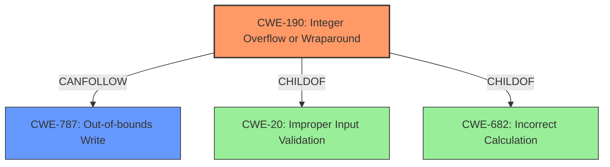

# Analysis for CVE-2021-0494

# Summary
| CWE ID | CWE Name | Confidence | CWE Abstraction Level | CWE Vulnerability Mapping Label | CWE-Vulnerability Mapping Notes |
|---|---|---|---|---|---|
| CWE-190 | Integer Overflow or Wraparound | 1.0 | Base | Allowed | Primary CWE |
| CWE-787 | Out-of-bounds Write | 1.0 | Base | Allowed | Secondary Candidate |

## Evidence and Confidence

*   **Confidence Score:** 1.0
*   **Evidence Strength:** HIGH

## Relationship Analysis
The primary CWE is CWE-190, Integer Overflow or Wraparound, which can directly lead to CWE-787, Out-of-bounds Write. CWE-190 is a child of CWE-20 (Improper Input Validation) and CWE-682 (Incorrect Calculation). CWE-787 can follow CWE-190 in a vulnerability chain. This hierarchical and chain relationship helps clarify the root cause and its direct consequence. The abstraction levels are both Base, which are preferred.

## Vulnerability Chain
The vulnerability chain starts with an **integer overflow** (CWE-190), which leads to an **out of bounds write** (CWE-787), eventually resulting in local escalation of privilege.

## Summary of Analysis
The vulnerability description clearly states the root cause as an **integer overflow** and the weakness as an **out of bounds write**. The CVE Reference Links Content Summary corroborates this by mentioning a vulnerability in the memory management driver that is exploitable.

The selection of CWE-190 is based on the explicit mention of "integer overflow" in both the vulnerability description and key phrases. This aligns perfectly with the CWE description, which states that the product performs a calculation that can produce an integer overflow or wraparound.

CWE-787 is chosen because the **integer overflow** directly leads to an **out of bounds write**, where data is written beyond the intended buffer.

The graph relationships influenced the final selection by reinforcing the understanding of how the integer overflow leads to the out-of-bounds write. The selected CWEs are at the optimal level of specificity, as they accurately represent the root cause and the resulting weakness.

Relevant CWE Information:
# Enhanced Context (25 CWEs)
The following CWEs were identified as potentially relevant to this vulnerability:

## CWE-190: Integer Overflow or Wraparound
**Abstraction Level**: Base
**Similarity Score**: 6478.03
**Source**: sparse

**Description**:
The product performs a calculation that can produce an integer overflow or wraparound when the logic assumes that the resulting value will always be larger than the original value. This occurs when an integer value is incremented to a value that is too large to store in the associated representation. When this occurs, the value may become a very small or negative number.

**Mapping Guidance**:
- Usage: Allowed

## CWE-787: Out-of-bounds Write
**Abstraction Level**: base
**Similarity Score**: 4.33
**Source**: graph

**Description**:
CWE-787: Out-of-bounds Write

**Mapping Guidance**:
- Usage: Allowed
- Rationale: This CWE entry is at the Base level of abstraction, which is a preferred level of abstraction for mapping to the root causes of vulnerabilities.

### CWE-190: Integer Overflow or Wraparound
The product performs a calculation that can produce an integer overflow or wraparound when the logic assumes that the resulting value will always be larger than the original value. This occurs when an integer value is incremented to a value that is too large to store in the associated representation. When this occurs, the value may become a very small or negative number.
   - **How the vulnerability's details match the CWE's characteristics.**
     - The vulnerability description mentions an **integer overflow** as the root cause, which aligns perfectly with the CWE description.
   - **The security implications and potential impact.**
     - An integer overflow can lead to unexpected behavior, such as incorrect memory allocation sizes, which can then lead to buffer overflows or other memory corruption issues. In this case, it leads to out of bounds write and escalation of privilege.
   - **Any parent-child relationships or chain patterns that influenced your mapping.**
     - CWE-190 is a child of CWE-20 (Improper Input Validation) and CWE-682 (Incorrect Calculation). It can also precede CWE-787 (Out-of-bounds Write) in a vulnerability chain.
   - **Whether the weakness is primary or secondary in the vulnerability.**
     - This is the primary weakness, as it is the root cause of the vulnerability.
   - **How the official MITRE mapping guidance influenced your decision.**
     - The MITRE mapping guidance allows the use of CWE-190, as it is at the Base level of abstraction.

### CWE-787: Out-of-bounds Write
The product writes data past the end, or before the beginning, of the intended buffer.
   - **How the vulnerability's details match the CWE's characteristics.**
     - The vulnerability description explicitly mentions an **out of bounds write**, which directly corresponds to the CWE's description.
   - **The security implications and potential impact.**
     - An out-of-bounds write can lead to memory corruption, potentially allowing an attacker to overwrite critical data or execute arbitrary code. In this case, it leads to local escalation of privilege.
   - **Any parent-child relationships or chain patterns that influenced your mapping.**
     - CWE-787 can follow CWE-190 (Integer Overflow or Wraparound) in a vulnerability chain, where the integer overflow leads to an incorrect calculation of buffer size, resulting in the out-of-bounds write.
   - **Whether the weakness is primary or secondary in the vulnerability.**
     - This is a secondary weakness, as it is a direct consequence of the integer overflow.
   - **How the official MITRE mapping guidance influenced your decision.**
     - The MITRE mapping guidance allows the use of CWE-787, as it is at the Base level of abstraction.

### Other CWEs Considered but Not Used
- CWE-131 (Incorrect Calculation of Buffer Size): While related, the description specifically identifies an integer overflow, making CWE-190 a more precise fit as the root cause.
- CWE-823 (Use of Out-of-range Pointer Offset): This is a more specific case of out-of-bounds access, but the description does not provide enough detail to determine if a pointer offset is involved. Therefore, CWE-787 is more appropriate.
- CWE-1284 (Improper Validation of Specified Quantity in Input): This could be related, but the description doesn't explicitly mention a failure to validate an input quantity. The core issue is the **integer overflow**.