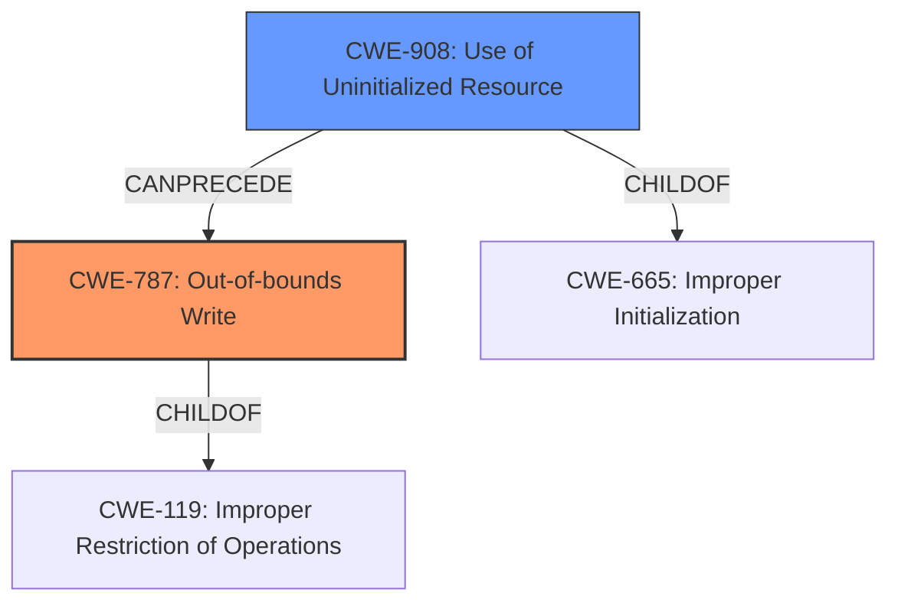

# Analysis for CVE-2021-0495

# Summary
| CWE ID | CWE Name | Confidence | CWE Abstraction Level | CWE Vulnerability Mapping Label | CWE-Vulnerability Mapping Notes |
|---|---|---|---|---|---|
| CWE-787 | Out-of-bounds Write | 1.0 | Base | Allowed | Primary CWE |
| CWE-908 | Use of Uninitialized Resource | 0.8 | Base | Allowed | Secondary CWE |

## Evidence and Confidence

*   **Confidence Score:** 0.9
*   **Evidence Strength:** HIGH

## Relationship Analysis
The primary weakness is **Out-of-bounds Write (CWE-787)**. This is caused by the **Use of Uninitialized Resource (CWE-908)**. CWE-787 is a child of CWE-119 (Improper Restriction of Operations Within the Bounds of a Memory Buffer). CWE-908 is a child of CWE-665 (Improper Initialization).

## Vulnerability Chain
The vulnerability chain starts with the **uninitialized data** (CWE-908), which leads to an **out-of-bounds write** (CWE-787), and finally results in local escalation of privilege.

## Summary of Analysis
The analysis indicates a clear chain of events leading to the vulnerability. The root cause is the **Use of Uninitialized Resource (CWE-908)**, which directly leads to the **Out-of-bounds Write (CWE-787)**. The primary CWE is CWE-787 because that is the direct weakness.

The vulnerability description explicitly states: "In memory management driver, there is a possible **out of bounds write** due to **uninitialized data**."

The graph relationships support this classification, with CWE-908 potentially preceding CWE-787.

Both CWEs are at the Base level of abstraction, providing the optimal level of specificity.

Relevant CWE Information:

# Enhanced Context (25 CWEs)

## CWE-226: Sensitive Information in Resource Not Removed Before Reuse
**Abstraction Level**: Base
**Similarity Score**: 0.80
**Source**: dense

**Description**:
The product releases a resource such as memory or a file so that it can be made available for reuse, but it does not clear or "zeroize" the information contained in the resource before the product performs a critical state transition or makes the resource available for reuse by other entities.

**Mapping Guidance**:
- Usage: Allowed
- Rationale: This CWE entry is at the Base level of abstraction, which is a preferred level of abstraction for mapping to the root causes of vulnerabilities.

**Why it was not selected:** This vulnerability is caused by uninitialized data and out-of-bounds write. While it is related to the re-use of memory, it is not the primary cause.

## CWE-404: Improper Resource Shutdown or Release
**Abstraction Level**: Class
**Similarity Score**: 0.80
**Source**: dense

**Description**:
The product does not release or incorrectly releases a resource before it is made available for re-use.

**Mapping Guidance**:
- Usage: Allowed-with-Review
- Rationale: This CWE entry is a Class and might have Base-level children that would be more appropriate

**Why it was not selected:** This vulnerability is caused by uninitialized data and out-of-bounds write and is not directly related to improper resource shutdown.

## CWE-667: Improper Locking
**Abstraction Level**: Class
**Similarity Score**: 0.80
**Source**: dense

**Description**:
The product does not properly acquire or release a lock on a resource, leading to unexpected resource state changes and behaviors.

**Mapping Guidance**:
- Usage: Allowed-with-Review
- Rationale: This CWE entry is a Class and might have Base-level children that would be more appropriate

**Why it was not selected:** There is no evidence of improper locking in the vulnerability description.

## CWE-665: Improper Initialization
**Abstraction Level**: Class
**Similarity Score**: 0.79
**Source**: dense

**Description**:
The product does not initialize or incorrectly initializes a resource, which might leave the resource in an unexpected state when it is accessed or used.

**Mapping Guidance**:
- Usage: Discouraged
- Rationale: This CWE entry is a level-1 Class (i.e., a child of a Pillar). It might have lower-level children that would be more appropriate

**Why it was not selected:** This is a Class level. CWE-908 is a better selection since it is more specific.

## CWE-909: Missing Initialization of Resource
**Abstraction Level**: Class
**Similarity Score**: 0.78
**Source**: dense

**Description**:
The product does not initialize a critical resource.

**Mapping Guidance**:
- Usage: Allowed-with-Review
- Rationale: This CWE entry is a Class and might have Base-level children that would be more appropriate

**Why it was not selected:** While the vulnerability involves **uninitialized data**, CWE-908 is a better fit, as it describes the **use** of the uninitialized resource. CWE-909 indicates only the **missing** initialization.

## CWE-754: Improper Check for Unusual or Exceptional Conditions
**Abstraction Level**: Class
**Similarity Score**: 0.78
**Source**: dense

**Description**:
The product does not check or incorrectly checks for unusual or exceptional conditions that are not expected to occur frequently during day to day operation of the product.

**Mapping Guidance**:
- Usage: Allowed-with-Review
- Rationale: This CWE entry is a Class and might have Base-level children that would be more appropriate

**Why it was not selected:** There is no evidence of improper checks for exceptional conditions.

## CWE-908: Use of Uninitialized Resource
**Abstraction Level**: Base
**Similarity Score**: 0.78
**Source**: dense

**Description**:
The product uses or accesses a resource that has not been initialized.

**Mapping Guidance**:
- Usage: Allowed
- Rationale: This CWE entry is at the Base level of abstraction, which is a preferred level of abstraction for mapping to the root causes of vulnerabilities.

**Why it was selected:** The vulnerability description indicates the presence of **uninitialized data** which leads to an **out of bounds write**. This maps directly to the description of CWE-908.

## CWE-191: Integer Underflow (Wrap or Wraparound)
**Abstraction Level**: Base
**Similarity Score**: 0.77
**Source**: dense

**Description**:
The product subtracts one value from another, such that the result is less than the minimum allowable integer value, which produces a value that is not equal to the correct result.

**Mapping Guidance**:
- Usage: Allowed
- Rationale: This CWE entry is at the Base level of abstraction, which is a preferred level of abstraction for mapping to the root causes of vulnerabilities.

**Why it was not selected:** There is no evidence of integer underflow in the vulnerability description.

## CWE-131: Incorrect Calculation of Buffer Size
**Abstraction Level**: Base
**Similarity Score**: 0.77
**Source**: dense

**Description**:
The product does not correctly calculate the size to be used when allocating a buffer, which could lead to a buffer overflow.

**Mapping Guidance**:
- Usage: Allowed
- Rationale: This CWE entry is at the Base level of abstraction, which is a preferred level of abstraction for mapping to the root causes of vulnerabilities.

**Why it was not selected:** While an **out of bounds write** is present, it stems from **uninitialized data** and is not directly related to incorrect buffer size calculation.

## CWE-703: Improper Check or Handling of Exceptional Conditions
**Abstraction Level**: Pillar
**Similarity Score**: 0.77
**Source**: dense

**Description**:
The product does not properly anticipate or handle exceptional conditions that rarely occur during normal operation of the product.

**Mapping Guidance**:
- Usage: Discouraged
- Rationale: This CWE entry is extremely high-level, a Pillar.

**Why it was not selected:** This is a high-level CWE and does not accurately represent the vulnerability.

## CWE-823: Use of Out-of-range Pointer Offset
**Abstraction Level**: Base
**Similarity Score**: 5205.87
**Source**: sparse