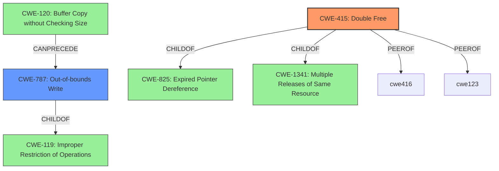

# Analysis for CVE-2021-0498

# Summary

| CWE ID  | CWE Name | Confidence | CWE Abstraction Level | CWE Vulnerability Mapping Label | CWE-Vulnerability Mapping Notes |
|-----------------|-----------------------------------------------------------------------------|-------------------|-------------------------|-----------------------------------|---------------------------------------------------------------------------------------------------------------------------------|
| CWE-415 | Double Free | 0.95 | Variant | Allowed | This is the primary CWE because the vulnerability description explicitly mentions "**double free**" as the root cause. |
| CWE-787 | Out-of-bounds Write | 0.75 | Base | Allowed | This is a secondary CWE because a double free can lead to **memory corruption** which can result in an out-of-bounds write. |

## Evidence and Confidence

*   **Confidence Score:** 0.90
*   **Evidence Strength:** HIGH

## Relationship Analysis
The primary CWE is CWE-415, Double Free, which is a variant.
CWE-415 is a ChildOf CWE-825 (Expired Pointer Dereference) and CWE-1341 (Multiple Releases of Same Resource or Handle). CWE-415 is a PeerOf CWE-416 (Use After Free) and CWE-123 (Write-what-where Condition).
CWE-787 is a Base level CWE, and a ChildOf CWE-119 (Improper Restriction of Operations Within the Bounds of a Memory Buffer). CWE-787 can follow CWE-120 (Buffer Copy without Checking Size of Input ('Classic Buffer Overflow')).

## Vulnerability Chain
The vulnerability chain starts with a **double free** (CWE-415) which leads to **memory corruption**. This **memory corruption** can lead to an out-of-bounds write (CWE-787), ultimately resulting in local escalation of privilege.

## Summary of Analysis
The primary weakness is CWE-415, Double Free, as explicitly stated in the vulnerability description: "there is a possible **memory corruption** due to a **double free**." The description directly mentions "**double free**" as the root cause, making CWE-415 the most appropriate primary mapping.

The secondary weakness, CWE-787, Out-of-bounds Write, is a potential consequence of the **memory corruption** caused by the **double free**. The "**memory corruption**" could lead to an out-of-bounds write, potentially allowing an attacker to overwrite critical data and escalate privileges.

The graph relationships show how CWE-415 can be related to other memory management issues like CWE-416 (Use After Free) and CWE-123 (Write-what-where Condition), but given the direct mention of "**double free**," CWE-415 remains the most specific and relevant primary CWE.

The selected CWEs are at the optimal level of specificity because CWE-415 is a Variant that directly matches the described root cause, and CWE-787 is a Base that describes a potential consequence of the **memory corruption**.

Relevant CWE Information:
The following CWEs were considered but not used:

*   CWE-908: Use of Uninitialized Resource - While possible, the description focuses on a double free, not the use of uninitialized resources.
*   CWE-667: Improper Locking & CWE-362: Concurrent Execution using Shared Resource with Improper Synchronization ('Race Condition') - Neither locking issues nor race conditions are explicitly mentioned in the vulnerability description.
*   CWE-123: Write-what-where Condition - While this could be a consequence of the **memory corruption**, it is not as directly related as CWE-787.
* CWE-416: Use After Free - While a double free can sometimes resemble a use-after-free, the description explicitly mentions the double free as the root cause, making CWE-415 more appropriate.