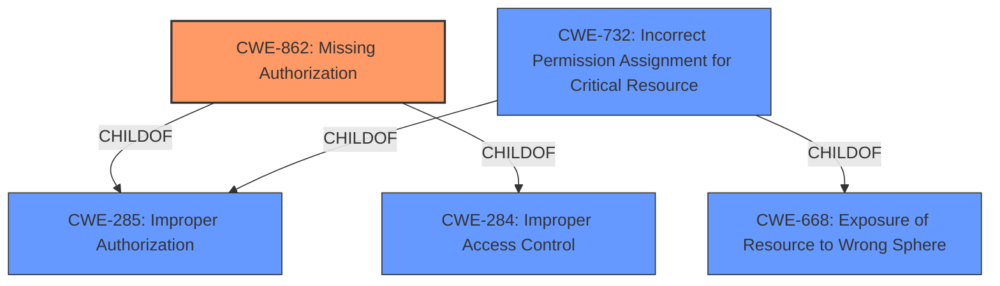

# Analysis for CVE-2021-0513

# Summary
| CWE ID | CWE Name | Confidence | CWE Abstraction Level | CWE Vulnerability Mapping Label | CWE-Vulnerability Mapping Notes |
|---|---|---|---|---|---|
| CWE-862 | Missing Authorization | 0.9 | Class | Primary | Allowed-with-Review |
| CWE-732 | Incorrect Permission Assignment for Critical Resource | 0.7 | Class | Secondary | Allowed-with-Review |

## Evidence and Confidence

*   **Confidence Score:** 0.9
*   **Evidence Strength:** HIGH

## Relationship Analysis
The primary CWE is CWE-862 (Missing Authorization), which is a Class-level CWE. It is a child of CWE-285 (Improper Authorization) and CWE-284 (Improper Access Control). CWE-732 (Incorrect Permission Assignment for Critical Resource) is a Class-level CWE and a secondary consideration. It is also a child of CWE-285 and CWE-668 (Exposure of Resource to Wrong Sphere). The relationship between these CWEs suggests a potential overlap in the area of authorization and access control issues. The selection of CWE-862 is based on the **improper state validation** which led to permission bypass. While CWE-732 deals with incorrect assignment, CWE-862 is broader and more fitting as it encompasses the lack of authorization checks.

## Vulnerability Chain
The vulnerability chain starts with **improper state validation** (root cause), leading to **missing authorization**, which results in a **permission bypass** (impact) that can be exploited via **hidden services**.

## Summary of Analysis
The initial analysis identified the **improper state validation** as a key factor. This maps well to **CWE-862 (Missing Authorization)** because the state validation is a prerequisite for proper authorization. The CVE description and summary further support this by indicating that a local malicious application can bypass user interaction requirements and gain additional permissions. This aligns with the "Missing Authorization" scenario where a check is absent, allowing unauthorized access. The retriever results also list CWE-862 as the top candidate. The relationship analysis showed that CWE-862 is a child of CWE-285 (Improper Authorization), further solidifying its relevance.

The selection of CWE-862 over CWE-732 (Incorrect Permission Assignment for Critical Resource) is due to the vulnerability description focusing on the **absence of a proper check** rather than a misconfigured permission setting. While CWE-732 could potentially apply, CWE-862 more accurately captures the root cause: the authorization check is missing altogether.

I considered CWE-732 due to the "permission bypass" impact, but ultimately decided against it as the primary CWE because the root cause is not about incorrect assignment, but about missing checks. My assessment is primarily based on the provided evidence, specifically the **rootcause** description of **improper state validation** and the CVE summary highlighting the bypass of user interaction requirements to gain permissions.

Relevant CWE Information:

# Enhanced Context (25 CWEs)
The following CWEs were identified as potentially relevant to this vulnerability:

## CWE-754: Improper Check for Unusual or Exceptional Conditions
**Abstraction Level**: Class
**Similarity Score**: 0.77
**Source**: dense

**Description**:
The product does not check or incorrectly checks for unusual or exceptional conditions that are not expected to occur frequently during day to day operation of the product.

**Mapping Guidance**:
- Usage: Allowed-with-Review
- Rationale: This CWE entry is a Class and might have Base-level children that would be more appropriate

## CWE-667: Improper Locking
**Abstraction Level**: Class
**Similarity Score**: 0.77
**Source**: dense

**Description**:
The product does not properly acquire or release a lock on a resource, leading to unexpected resource state changes and behaviors.

**Mapping Guidance**:
- Usage: Allowed-with-Review
- Rationale: This CWE entry is a Class and might have Base-level children that would be more appropriate

## CWE-404: Improper Resource Shutdown or Release
**Abstraction Level**: Class
**Similarity Score**: 0.76
**Source**: dense

**Description**:
The product does not release or incorrectly releases a resource before it is made available for re-use.

**Mapping Guidance**:
- Usage: Allowed-with-Review
- Rationale: This CWE entry is a Class and might have Base-level children that would be more appropriate

## CWE-362: Concurrent Execution using Shared Resource with Improper Synchronization ('Race Condition')
**Abstraction Level**: Class
**Similarity Score**: 0.75
**Source**: dense

**Description**:
The product contains a concurrent code sequence that requires temporary, exclusive access to a shared resource, but a timing window exists in which the shared resource can be modified by another code sequence operating concurrently.

**Mapping Guidance**:
- Usage: Allowed-with-Review
- Rationale: This CWE entry is a Class and might have Base-level children that would be more appropriate

## CWE-703: Improper Check or Handling of Exceptional Conditions
**Abstraction Level**: Pillar
**Similarity Score**: 0.75
**Source**: dense

**Description**:
The product does not properly anticipate or handle exceptional conditions that rarely occur during normal operation of the product.

**Mapping Guidance**:
- Usage: Discouraged
- Rationale: This CWE entry is extremely high-level, a Pillar.

## CWE-248: Uncaught Exception
**Abstraction Level**: Base
**Similarity Score**: 0.75
**Source**: dense

**Description**:
An exception is thrown from a function, but it is not caught.

**Mapping Guidance**:
- Usage: Allowed
- Rationale: This CWE entry is at the Base level of abstraction, which is a preferred level of abstraction for mapping to the root causes of vulnerabilities.

## CWE-226: Sensitive Information in Resource Not Removed Before Reuse
**Abstraction Level**: Base
**Similarity Score**: 0.75
**Source**: dense

**Description**:
The product releases a resource such as memory or a file so that it can be made available for reuse, but it does not clear or "zeroize" the information contained in the resource before the product performs a critical state transition or makes the resource available for reuse by other entities.

**Mapping Guidance**:
- Usage: Allowed
- Rationale: This CWE entry is at the Base level of abstraction, which is a preferred level of abstraction for mapping to the root causes of vulnerabilities.

## CWE-668: Exposure of Resource to Wrong Sphere
**Abstraction Level**: Class
**Similarity Score**: 0.74
**Source**: dense

**Description**:
The product exposes a resource to the wrong control sphere, providing unintended actors with inappropriate access to the resource.

**Mapping Guidance**:
- Usage: Discouraged
- Rationale: CWE-668 is high-level and is often misused as a catch-all when lower-level CWE IDs might be applicable. It is sometimes used for low-information vulnerability reports [REF-1287]. It is a level-1 Class (i.e., a child of a Pillar). It is not useful for trend analysis.

## CWE-755: Improper Handling of Exceptional Conditions
**Abstraction Level**: Class
**Similarity Score**: 0.74
**Source**: dense

**Description**:
The product does not handle or incorrectly handles an exceptional condition.

**Mapping Guidance**:
- Usage: Discouraged
- Rationale: This CWE entry is a level-1 Class (i.e., a child of a Pillar). It might have lower-level children that would be more appropriate

## CWE-662: Improper Synchronization
**Abstraction Level**: Class
**Similarity Score**: 0.74
**Source**: dense

**Description**:
The product utilizes multiple threads or processes to allow temporary access to a shared resource that can only be exclusive to one process at a time, but it does not properly synchronize these actions, which might cause simultaneous accesses of this resource by multiple threads or processes.

**Mapping Guidance**:
- Usage: Discouraged
- Rationale: This CWE entry is a level-1 Class (i.e., a child of