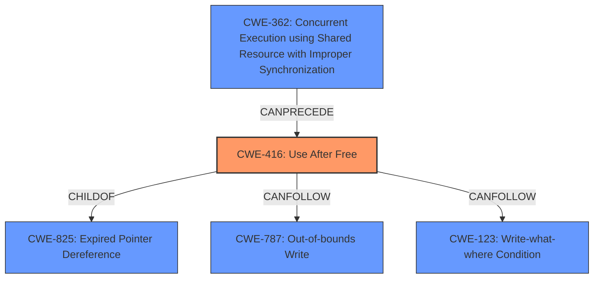

# Raw Analyzer Response for CVE-2021-0527

# Summary
| CWE ID  | CWE Name                                                                          | Confidence | CWE Abstraction Level | CWE Vulnerability Mapping Label | CWE-Vulnerability Mapping Notes |
| :-------- | :---------------------------------------------------------------------------------- | :--------- | :---------------------- | :------------------------------ | :------------------------------ |
| CWE-416   | Use After Free                                                                    | 0.9        | Variant               | Primary                         | Allowed                       |
| CWE-787   | Out-of-bounds Write                                                               | 0.6        | Base                  | Secondary                       | Allowed                       |

## Evidence and Confidence

*   **Confidence Score:** 0.9
*   **Evidence Strength:** HIGH

## Relationship Analysis
The primary CWE is CWE-416, which is a variant of CWE-825 (Expired Pointer Dereference). CWE-416 can also be a result of race conditions (CWE-362). The relationship analysis shows that the **use after free** (CWE-416) can lead to other issues like out-of-bounds write (CWE-787) or write-what-where condition (CWE-123). These relationships help to understand the potential impact and chain of events in the vulnerability.

## Vulnerability Chain
The vulnerability chain starts with **use after free** (CWE-416), which could lead to **memory corruption**. The **memory corruption** can then potentially lead to an out-of-bounds write (CWE-787) and ultimately to local escalation of privilege.

## Summary of Analysis
Initially, based on the **Vulnerability Description Key Phrases** and **CWE for similar CVE Descriptions**, CWE-787 (Out-of-bounds Write) seemed like the primary candidate. However, the key phrase "rootcause: **use after free**" and the vulnerability description mentioning "**memory corruption** due to a **use after free**" strongly indicate CWE-416 (Use After Free) as the more direct root cause. The CVE Reference Links Content Summary reinforces this by stating "A vulnerability exists in the memory management driver...".

CWE-416 is a Variant, which is a preferred level of abstraction. While CWE-787 is listed as the primary CWE match in the similar CVE descriptions, the more detailed analysis of the provided information points towards CWE-416 as the most accurate root cause.

The final assessment is based primarily on the explicit mention of "**use after free**" and the overall vulnerability chain described.

Relevant CWE Information:

# Enhanced Context (25 CWEs)

## CWE-667: Improper Locking
**Abstraction Level**: Class
**Similarity Score**: 0.80
**Source**: dense

**Description**:
The product does not properly acquire or release a lock on a resource, leading to unexpected resource state changes and behaviors.

**Mapping Guidance**:
- Usage: Allowed-with-Review
- Rationale: This CWE entry is a Class and might have Base-level children that would be more appropriate

*Not selected*: This is related to concurrency and synchronization issues, but the description focuses on **use after free** rather than locking issues.

## CWE-404: Improper Resource Shutdown or Release
**Abstraction Level**: Class
**Similarity Score**: 0.80
**Source**: dense

**Description**:
The product does not release or incorrectly releases a resource before it is made available for re-use.

**Mapping Guidance**:
- Usage: Allowed-with-Review
- Rationale: This CWE entry is a Class and might have Base-level children that would be more appropriate

*Not selected*: It describes resource release issues, but the vulnerability is more specific to a **use after free**, meaning the resource *was* released.

## CWE-226: Sensitive Information in Resource Not Removed Before Reuse
**Abstraction Level**: Base
**Similarity Score**: 0.79
**Source**: dense

**Description**:
The product releases a resource such as memory or a file so that it can be made available for reuse, but it does not clear or "zeroize" the information contained in the resource before the product performs a critical state transition or makes the resource available for reuse by other entities.

**Mapping Guidance**:
- Usage: Allowed
- Rationale: This CWE entry is at the Base level of abstraction, which is a preferred level of abstraction for mapping to the root causes of vulnerabilities.

*Not selected*: This CWE relates to sensitive information, which is not the primary concern in this vulnerability description.

## CWE-366: Race Condition within a Thread
**Abstraction Level**: Base
**Similarity Score**: 0.77
**Source**: dense

**Description**:
If two threads of execution use a resource simultaneously, there exists the possibility that resources may be used while invalid, in turn making the state of execution undefined.

**Mapping Guidance**:
- Usage: Allowed
- Rationale: This CWE entry is at the Base level of abstraction, which is a preferred level of abstraction for mapping to the root causes of vulnerabilities.

*Not selected*: A race condition *could* contribute to a **use after free**, but it's not explicitly stated in the description.

## CWE-665: Improper Initialization
**Abstraction Level**: Class
**Similarity Score**: 0.77
**Source**: dense

**Description**:
The product does not initialize or incorrectly initializes a resource, which might leave the resource in an unexpected state when it is accessed or used.

**Mapping Guidance**:
- Usage: Discouraged
- Rationale: This CWE entry is a level-1 Class (i.e., a child of a Pillar). It might have lower-level children that would be more appropriate

*Not selected*: Initialization issues aren't explicitly stated in the vulnerability.

## CWE-909: Missing Initialization of Resource
**Abstraction Level**: Class
**Similarity Score**: 0.77
**Source**: dense

**Description**:
The product does not initialize a critical resource.

**Mapping Guidance**:
- Usage: Allowed-with-Review
- Rationale: This CWE entry is a Class and might have Base-level children that would be more appropriate

*Not selected*: Similar to CWE-665, initialization is not the main issue.

## CWE-662: Improper Synchronization
**Abstraction Level**: Class
**Similarity Score**: 0.76
**Source**: dense

**Description**:
The product utilizes multiple threads or processes to allow temporary access to a shared resource that can only be exclusive to one process at a time, but it does not properly synchronize these actions, which might cause simultaneous accesses of this resource by multiple threads or processes.

**Mapping Guidance**:
- Usage: Discouraged
- Rationale: This CWE entry is a level-1 Class (i.e., a child of a Pillar). It might have lower-level children that would be more appropriate

*Not selected*: Synchronization issues aren't explicitly stated.

## CWE-908: Use of Uninitialized Resource
**Abstraction Level**: Base
**Similarity Score**: 0.76
**Source**: dense

**Description**:
The product uses or accesses a resource that has not been initialized.

**Mapping Guidance**:
- Usage: Allowed
- Rationale: This CWE entry is at the Base level of abstraction, which is a preferred level of abstraction for mapping to the root causes of vulnerabilities.

*Not selected*: This is the opposite of **use after free**; it's about using uninitialized resources.

## CWE-754: Improper Check for Unusual or Exceptional Conditions
**Abstraction Level**: Class
**Similarity Score**: 0.76
**Source**: dense

**Description**:
The product does not check or incorrectly checks for unusual or exceptional conditions that are not expected to occur frequently during day to day operation of the product.

**Mapping Guidance**:
- Usage: Allowed-with-Review
- Rationale: This CWE entry is a Class and might have Base-level children that would be more appropriate

*Not selected*: This CWE doesn't fit the **use after free** vulnerability.

## CWE-664: Improper Control of a Resource Through its Lifetime
**Abstraction Level**: Pillar
**Similarity Score**: