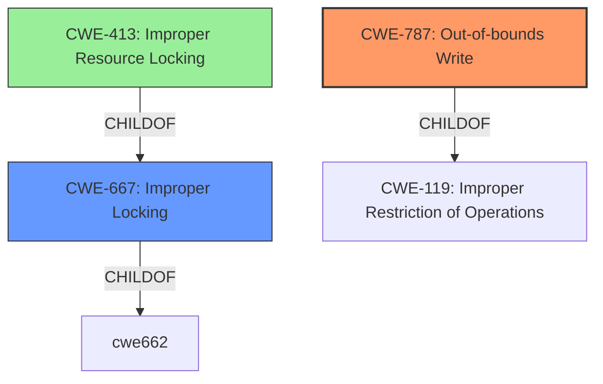

# Raw Analyzer Response for CVE-2021-0529

# Summary
| CWE ID | CWE Name | Confidence | CWE Abstraction Level | CWE Vulnerability Mapping Label | CWE-Vulnerability Mapping Notes |
|---|---|---|---|---|---|
| CWE-787 | Out-of-bounds Write | 0.7 | Base | Allowed | Primary CWE |
| CWE-667 | Improper Locking | 0.5 | Class | Allowed-with-Review | Secondary Candidate |
| CWE-413 | Improper Resource Locking | 0.4 | Base | Allowed | Secondary Candidate |

## Evidence and Confidence

*   **Confidence Score:** 0.6
*   **Evidence Strength:** MEDIUM

## Relationship Analysis
The primary CWE selected is CWE-787 (**Out-of-bounds Write**), which is a base-level CWE. The secondary CWEs considered are CWE-667 (**Improper Locking**) and CWE-413 (**Improper Resource Locking**). CWE-667 is a class-level CWE and a parent of CWE-413. The analysis considers the hierarchical relationship to choose the most specific and relevant CWE.

## Vulnerability Chain
The vulnerability chain starts with **improper locking** which leads to **memory corruption** and finally local escalation of privilege.

## Summary of Analysis
The initial analysis focused on the provided vulnerability description, which mentions **memory corruption** due to **improper locking**. The **CWE for similar CVE Descriptions** section suggests CWE-787 (**Out-of-bounds Write**) as the primary match. The Retriever Results also list CWE-787 as the top combined result.

The evidence for **improper locking** is clear from the "Vulnerability Description Key Phrases" section which lists "**improper locking**" as a root cause. The description states that "**memory corruption**" is a weakness. The "CVE Reference Links Content Summary" also supports this by stating "The vulnerability lies within the memory management driver of MediaTek components" and "Improper memory management". However, the description also explicitly states "**memory corruption**" as a weakness, and CWE-787 directly addresses out-of-bounds writes which lead to **memory corruption**.

While **improper locking** is the root cause, it is a higher-level abstraction. The resulting **memory corruption**, specifically an out-of-bounds write, is a more precise characterization of the actual vulnerability.

The relationship graph illustrates that CWE-787 is a child of CWE-119 (**Improper Restriction of Operations within the Bounds of a Memory Buffer**). This further supports the selection of CWE-787 as it provides a more specific description of the vulnerability.

The final decision to prioritize CWE-787 is based on the evidence of **memory corruption** due to an out-of-bounds write, the **CWE for similar CVE Descriptions** listing CWE-787 as the primary match, and the Retriever Results ranking CWE-787 as the top combined result. While **improper locking** is a contributing factor, the out-of-bounds write is the direct cause of the **memory corruption**.

Relevant CWE Information:

# Enhanced Context (25 CWEs)

## CWE-662: Improper Synchronization
**Abstraction Level**: Class
**Similarity Score**: 0.83
**Source**: dense

**Description**:
The product utilizes multiple threads or processes to allow temporary access to a shared resource that can only be exclusive to one process at a time, but it does not properly synchronize these actions, which might cause simultaneous accesses of this resource by multiple threads or processes.

**Mapping Guidance**:
- Usage: Discouraged
- Rationale: This CWE entry is a level-1 Class (i.e., a child of a Pillar). It might have lower-level children that would be more appropriate

## CWE-667: Improper Locking
**Abstraction Level**: Class
**Similarity Score**: 0.82
**Source**: dense

**Description**:
The product does not properly acquire or release a lock on a resource, leading to unexpected resource state changes and behaviors.

**Mapping Guidance**:
- Usage: Allowed-with-Review
- Rationale: This CWE entry is a Class and might have Base-level children that would be more appropriate

## CWE-404: Improper Resource Shutdown or Release
**Abstraction Level**: Class
**Similarity Score**: 0.81
**Source**: dense

**Description**:
The product does not release or incorrectly releases a resource before it is made available for re-use.

**Mapping Guidance**:
- Usage: Allowed-with-Review
- Rationale: This CWE entry is a Class and might have Base-level children that would be more appropriate

## CWE-366: Race Condition within a Thread
**Abstraction Level**: Base
**Similarity Score**: 0.80
**Source**: dense

**Description**:
If two threads of execution use a resource simultaneously, there exists the possibility that resources may be used while invalid, in turn making the state of execution undefined.

**Mapping Guidance**:
- Usage: Allowed
- Rationale: This CWE entry is at the Base level of abstraction, which is a preferred level of abstraction for mapping to the root causes of vulnerabilities.

## CWE-226: Sensitive Information in Resource Not Removed Before Reuse
**Abstraction Level**: Base
**Similarity Score**: 0.79
**Source**: dense

**Description**:
The product releases a resource such as memory or a file so that it can be made available for reuse, but it does not clear or "zeroize" the information contained in the resource before the product performs a critical state transition or makes the resource available for reuse by other entities.

**Mapping Guidance**:
- Usage: Allowed
- Rationale: This CWE entry is at the Base level of abstraction, which is a preferred level of abstraction for mapping to the root causes of vulnerabilities.

## CWE-665: Improper Initialization
**Abstraction Level**: Class
**Similarity Score**: 0.77
**Source**: dense

**Description**:
The product does not initialize or incorrectly initializes a resource, which might leave the resource in an unexpected state when it is accessed or used.

**Mapping Guidance**:
- Usage: Discouraged
- Rationale: This CWE entry is a level-1 Class (i.e., a child of a Pillar). It might have lower-level children that would be more appropriate

## CWE-362: Concurrent Execution using Shared Resource with Improper Synchronization ('Race Condition')
**Abstraction Level**: Class
**Similarity Score**: 0.77
**Source**: dense

**Description**:
The product contains a concurrent code sequence that requires temporary, exclusive access to a shared resource, but a timing window exists in which the shared resource can be modified by another code sequence operating concurrently.

**Mapping Guidance**:
- Usage: Allowed-with-Review
- Rationale: This CWE entry is a Class and might have Base-level children that would be more appropriate

## CWE-754: Improper Check for Unusual or Exceptional Conditions
**Abstraction Level**: Class
**Similarity Score**: 0.77
**Source**: dense

**Description**:
The product does not check or incorrectly checks for unusual or exceptional conditions that are not expected to occur frequently during day to day operation of the product.

**Mapping Guidance**:
- Usage: Allowed-with-Review
- Rationale: This CWE entry is a Class and might have Base-level children that would be more appropriate

## CWE-703: Improper Check or Handling of Exceptional Conditions
**Abstraction Level**: Pillar
**Similarity Score**: 0.77
**Source**: dense

**Description**:
The product does not properly anticipate or handle exceptional conditions that rarely occur during normal operation of the product.

**Mapping Guidance**:
- Usage: Discouraged
- Rationale: This CWE entry is extremely high-level, a Pillar.

## CWE-664: Improper Control of a Resource Through its Lifetime
**Abstraction Level**: Pillar
**Similarity Score**: 0.76
**Source**: dense

**Description**:
The product does not maintain or incorrectly maintains control over a resource throughout its lifetime of creation, use, and release.

**Mapping Guidance**:
- Usage: Discouraged
- Rationale: This CWE entry is high-level when lower-level children are available.

## CWE-667: Improper Locking
**Abstraction Level**: Class
**Similarity Score**: 5304.50
**Source**: sparse

**Description**:
The product does not properly acquire or release