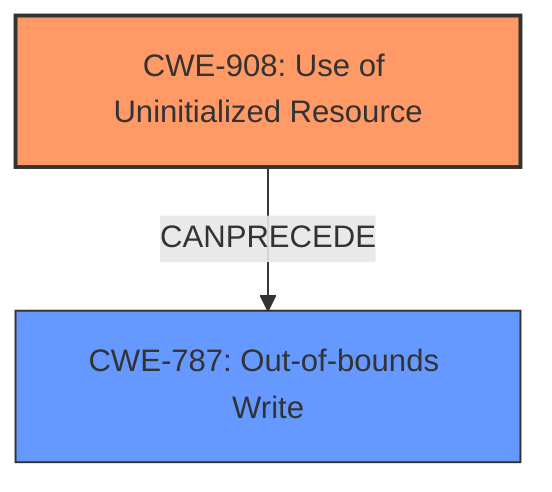

# Enhanced Analysis for CVE-2021-0530

# Summary
| CWE ID | CWE Name | Confidence | CWE Abstraction Level | CWE Vulnerability Mapping Label | CWE-Vulnerability Mapping Notes |
|---|---|---|---|---|---|
| CWE-908 | Use of Uninitialized Resource | 0.9 | Base | Allowed | Primary CWE |
| CWE-787 | Out-of-bounds Write | 0.7 | Base | Allowed | Secondary Candidate |

## Evidence and Confidence

*   **Confidence Score:** 0.8
*   **Evidence Strength:** HIGH

## Relationship Analysis
The primary relationship is between **CWE-908 (Use of Uninitialized Resource)** and its potential impact. The **uninitialized data** (CWE-908) can directly lead to an **out-of-bounds write** (CWE-787). While CWE-787 is a direct consequence, CWE-908 is the root cause.



## Vulnerability Chain
The chain of root cause and weakness is:

1.  **Root Cause:** **Uninitialized data** (CWE-908)
2.  **Weakness:** **Out-of-bounds write** (CWE-787)
3.  **Impact:** Local escalation of privilege

## Summary of Analysis
The initial analysis focused on identifying the root cause and the resulting weakness. The vulnerability description clearly states that there is a possible **out of bounds write** due to **uninitialized data**. The "Vulnerability Description Key Phrases" further reinforce this by explicitly listing **uninitialized data** as the root cause and **out of bounds write** as the weakness. The "CVE Reference Links Content Summary" confirms that the issue is within the memory management driver, further suggesting a low-level memory management problem.

The retriever results list CWE-908 as a top candidate. The description of CWE-908 (Use of Uninitialized Resource) aligns perfectly with the vulnerability description. The "Mapping Guidance" for CWE-908 states that it is at the Base level of abstraction, which is a preferred level for mapping to root causes.

CWE-787 (Out-of-bounds Write) is considered as a consequence of the root cause. While it is listed as the primary CWE match in the "CWE for similar CVE Descriptions", focusing solely on it would ignore the underlying problem of uninitialized data. Therefore, CWE-908 is the primary CWE, and CWE-787 is a secondary CWE representing the direct consequence.

Relevant CWE Information:

# Enhanced Context (25 CWEs)

## CWE-908: Use of Uninitialized Resource
**Abstraction:** Base
**Similarity Score**: 0.450

### Description
The product uses or accesses a resource that has not been initialized.

### Extended Description
When a resource has not been properly initialized, the product may behave unexpectedly. This may lead to a crash or invalid memory access, but the consequences vary depending on the type of resource and how it is used within the product.

### Mapping Guidance
**Usage:** Allowed
**Rationale:** This CWE entry is at the Base level of abstraction, which is a preferred level of abstraction for mapping to the root causes of vulnerabilities.
**Comments:** Carefully read both the name and description to ensure that this mapping is an appropriate fit. Do not try to 'force' a mapping to a lower-level Base/Variant simply to comply with this preferred level of abstraction.
**Reasons:**
- Acceptable-Use

### Observed Examples
- **CVE-2019-9805:** Chain: Creation of the packet client occurs before initialization is complete (CWE-696) resulting in a read from uninitialized memory (CWE-908), causing memory corruption.
- **CVE-2008-4197:** Use of uninitialized memory may allow code execution.
- **CVE-2008-2934:** Free of an uninitialized pointer leads to crash and possible code execution.

## CWE-787: Out-of-bounds Write
**Abstraction:** base
**Similarity Score**: 4.33

### Description
CWE-787: Out-of-bounds Write

### Mapping Guidance
**Usage:** Allowed
**Rationale:** This CWE entry is at the Base level of abstraction, which is a preferred level of abstraction for mapping to the root causes of vulnerabilities.

### Observed Examples
None

The decision to prioritize CWE-908 as the primary CWE is based on the clear statement in the vulnerability description that the **out of bounds write** is a direct result of **uninitialized data**. The relationship graph visualizes this dependency, emphasizing the importance of addressing the root cause to prevent the vulnerability.


## CWE Relationship Analysis

Current CWEs represent these abstraction levels: .


### Vulnerability Chain Analysis

**Chain starting from CWE-696:**
- 696 (Incorrect Behavior Order) - ROOT


**Chain starting from CWE-787:**
- 787 (Out-of-bounds Write) - ROOT


### CWE Relationship Diagram

```mermaid
graph TD
    classDef primary fill:#f96,stroke:#333,stroke-width:2px
    classDef secondary fill:#69f,stroke:#333
    classDef tertiary fill:#9e9,stroke:#333
```