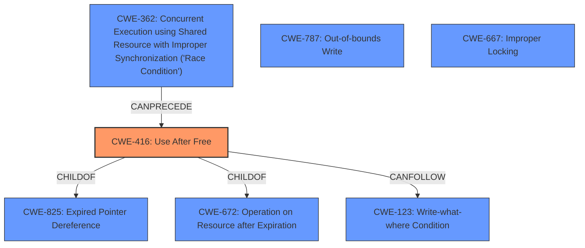

# Enhanced Analysis for CVE-2021-0531

# Summary
| CWE ID  | CWE Name                                                                                         | Confidence | CWE Abstraction Level | CWE Vulnerability Mapping Label | CWE-Vulnerability Mapping Notes |
| :-------- | :------------------------------------------------------------------------------------------------- | :--------- | :---------------------- | :-------------------------------- | :------------------------------ |
| CWE-416 | Use After Free                                                                                   | 0.95       | Variant               | Allowed                           | Primary CWE                     |
| CWE-787 | Out-of-bounds Write                                                                              | 0.75       | Base                  | Allowed                           | Secondary Candidate             |
| CWE-667 | Improper Locking                                                                                   | 0.60       | Class                 | Allowed-with-Review               | Secondary Candidate             |

## Evidence and Confidence

*   **Confidence Score:** 0.90
*   **Evidence Strength:** HIGH

## Relationship Analysis
The primary CWE is CWE-416, which is a Variant of CWE-825 (Expired Pointer Dereference) and CWE-672 (Operation on Resource after Expiration). CWE-416 can be caused by CWE-362 (Race Condition) or can lead to CWE-123 (Write-what-where Condition). Other CWEs like CWE-787 and CWE-667 were considered based on retriever results and similar CVE descriptions but deemed less specific.



## Vulnerability Chain
The vulnerability chain starts with a **use after free** condition, which leads to **memory corruption**, and ultimately results in local escalation of privilege.

## Summary of Analysis
The primary weakness is a **use after free**, which directly leads to memory corruption and privilege escalation. This is based on the vulnerability description mentioning "possible **memory corruption** due to a **use after free**." The CVE reference links confirm the component and the potential for local elevation of privilege (EoP).

The retriever results suggested several potential CWEs, including CWE-787, CWE-908, CWE-667, CWE-362, and CWE-416. Based on the description and the primary CWE match for similar CVE descriptions, CWE-416 is the most appropriate because it directly addresses the **use after free** condition.

CWE-787 (Out-of-bounds Write) was considered because the description mentions "memory corruption," which is often a consequence of out-of-bounds writes. However, the root cause is the **use after free**, making CWE-416 a more accurate representation of the vulnerability.

CWE-667 (Improper Locking) and CWE-362 (Race Condition) were also considered due to the potential for concurrency issues leading to the **use after free**. However, without more information on the concurrency aspects, these are less directly supported by the evidence.

The selection of CWE-416 is at the Variant level, which is the most specific level supported by the evidence.

Relevant CWE Information:

# Enhanced Context (25 CWEs)
The following CWEs were identified as potentially relevant to this vulnerability:

## CWE-667: Improper Locking
**Abstraction Level**: Class
**Similarity Score**: 0.80
**Source**: dense

**Description**:
The product does not properly acquire or release a lock on a resource, leading to unexpected resource state changes and behaviors.

**Mapping Guidance**:
- Usage: Allowed-with-Review
- Rationale: This CWE entry is a Class and might have Base-level children that would be more appropriate

*Justification for not choosing CWE-667:* While concurrency issues can lead to use-after-free conditions, there's no explicit mention of locking problems in the vulnerability description. Thus, it's a less direct match than CWE-416.

## CWE-404: Improper Resource Shutdown or Release
**Abstraction Level**: Class
**Similarity Score**: 0.80
**Source**: dense

**Description**:
The product does not release or incorrectly releases a resource before it is made available for re-use.

**Mapping Guidance**:
- Usage: Allowed-with-Review
- Rationale: This CWE entry is a Class and might have Base-level children that would be more appropriate

*Justification for not choosing CWE-404:* Although related to resource management, it is more general than CWE-416, which explicitly addresses the "use after free" condition, implying the resource *was* released (freed).

## CWE-226: Sensitive Information in Resource Not Removed Before Reuse
**Abstraction Level**: Base
**Similarity Score**: 0.79
**Source**: dense

**Description**:
The product releases a resource such as memory or a file so that it can be made available for reuse, but it does not clear or "zeroize" the information contained in the resource before the product performs a critical state transition or makes the resource available for reuse by other entities.

**Mapping Guidance**:
- Usage: Allowed
- Rationale: This CWE entry is at the Base level of abstraction, which is a preferred level of abstraction for mapping to the root causes of vulnerabilities.

*Justification for not choosing CWE-226:* This CWE focuses on the *content* of the resource being re-used, which isn't the primary concern in the described vulnerability.

## CWE-366: Race Condition within a Thread
**Abstraction Level**: Base
**Similarity Score**: 0.77
**Source**: dense

**Description**:
If two threads of execution use a resource simultaneously, there exists the possibility that resources may be used while invalid, in turn making the state of execution undefined.

**Mapping Guidance**:
- Usage: Allowed
- Rationale: This CWE entry is at the Base level of abstraction, which is a preferred level of abstraction for mapping to the root causes of vulnerabilities.

*Justification for not choosing CWE-366:* While a race condition could *lead* to a use-after-free, the description directly states "use after free" as the cause.

## CWE-909: Missing Initialization of Resource
**Abstraction Level**: Class
**Similarity Score**: 0.77
**Source**: dense

**Description**:
The product does not initialize a critical resource.

**Mapping Guidance**:
- Usage: Allowed-with-Review
- Rationale: This CWE entry is a Class and might have Base-level children that would be more appropriate

*Justification for not choosing CWE-909:* The vulnerability is related to using a resource *after* it has been freed, not that the resource was never initialized.

## CWE-665: Improper Initialization
**Abstraction Level**: Class
**Similarity Score**: 0.77
**Source**: dense

**Description**:
The product does not initialize or incorrectly initializes a resource, which might leave the resource in an unexpected state when it is accessed or used.

**Mapping Guidance**:
- Usage: Discouraged
- Rationale: This CWE entry is a level-1 Class (i.e., a child of a Pillar). It might have lower-level children that would be more appropriate

*Justification for not choosing CWE-665:* Similar to CWE-909, this CWE focuses on initialization issues, not the use of a freed resource.

## CWE-662: Improper Synchronization
**Abstraction Level**: Class
**Similarity Score**: 0.76
**Source**: dense

**Description**:
The product utilizes multiple threads or processes to allow temporary access to a shared resource that can only be exclusive to one process at a time, but it does not properly synchronize these actions, which might cause simultaneous accesses of this resource by multiple threads or processes.

**Mapping Guidance**:
- Usage: Discouraged
- Rationale: This CWE entry is a level-1 Class (i.e., a child of a Pillar). It might have lower-level children that would be more appropriate

*Justification for not choosing CWE-662:* While synchronization issues can


## CWE Relationship Analysis

Current CWEs represent these abstraction levels: .


### Vulnerability Chain Analysis

**Chain starting from CWE-667:**
- 667 (Improper Locking) - ROOT


**Chain starting from CWE-787:**
- 787 (Out-of-bounds Write) - ROOT


### CWE Relationship Diagram

```mermaid
graph TD
    classDef primary fill:#f96,stroke:#333,stroke-width:2px
    classDef secondary fill:#69f,stroke:#333
    classDef tertiary fill:#9e9,stroke:#333
```