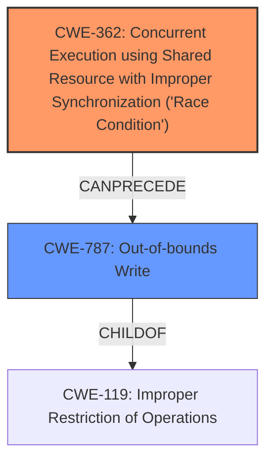

# Analysis Report for CVE-2021-0532

# Vulnerability Analysis Report: CVE-2021-0532

## Description


## Analysis (with Relationship Data)

# Summary
| CWE ID  | CWE Name                                                                                       | Confidence | CWE Abstraction Level | CWE Vulnerability Mapping Label | CWE-Vulnerability Mapping Notes |
| :-------- | :--------------------------------------------------------------------------------------------- | :---------- | :---------------------- | :------------------------------ | :------------------------------ |
| CWE-362   | Concurrent Execution using Shared Resource with Improper Synchronization ('**Race Condition**') | 0.9         | Class                   | Primary                         | Allowed-with-Review             |
| CWE-787   | **Out-of-bounds Write**                                                                      | 0.7         | Base                    | Secondary                       | Allowed                       |

## Evidence and Confidence

*   **Confidence Score:** 0.8
*   **Evidence Strength:** HIGH

## Relationship Analysis
The primary weakness is identified as CWE-362 (**Race Condition**), which can lead to other weaknesses. The **Vulnerability Description** clearly states the presence of a **race condition**. The secondary weakness, CWE-787 (**Out-of-bounds Write**), is a potential consequence of the **race condition** and **memory corruption**.



## Vulnerability Chain
The vulnerability chain starts with a **race condition** (CWE-362) which leads to **memory corruption** (CWE-787).

## Summary of Analysis
The initial analysis identified the **race condition** as the primary issue, leading to potential **memory corruption**. The evidence from the **Vulnerability Description** and "CVE Reference Links Content Summary" confirms this: "there is a possible **memory corruption** due to a **race condition**."

CWE-362 is selected because the vulnerability description explicitly mentions a **race condition** in the memory management driver. CWE-787 is considered a consequence of the **race condition** leading to **memory corruption**.

CWE-362 is a Class-level CWE, and while it has Base-level children, none of them are a more precise fit for the provided description. CWE-787 is a Base-level CWE, providing a more specific description of the **memory corruption** that can result from the **race condition**.

Relevant CWE Information:

# Enhanced Context (25 CWEs)

## CWE-667: Improper Locking
**Abstraction Level**: Class
**Similarity Score**: 0.80
**Source**: dense

**Description**:
The product does not properly acquire or release a lock on a resource, leading to unexpected resource state changes and behaviors.

**Mapping Guidance**:
- Usage: Allowed-with-Review
- Rationale: This CWE entry is a Class and might have Base-level children that would be more appropriate

**Why Not Selected:** While locking issues can contribute to race conditions, the description doesn't specifically mention locking.

## CWE-662: Improper Synchronization
**Abstraction Level**: Class
**Similarity Score**: 0.80
**Source**: dense

**Description**:
The product utilizes multiple threads or processes to allow temporary access to a shared resource that can only be exclusive to one process at a time, but it does not properly synchronize these actions, which might cause simultaneous accesses of this resource by multiple threads or processes.

**Mapping Guidance**:
- Usage: Discouraged
- Rationale: This CWE entry is a level-1 Class (i.e., a child of a Pillar). It might have lower-level children that would be more appropriate

**Why Not Selected:** CWE-362 is a more specific child of this CWE and more applicable.

## CWE-404: Improper Resource Shutdown or Release
**Abstraction Level**: Class
**Similarity Score**: 0.79
**Source**: dense

**Description**:
The product does not release or incorrectly releases a resource before it is made available for re-use.

**Mapping Guidance**:
- Usage: Allowed-with-Review
- Rationale: This CWE entry is a Class and might have Base-level children that would be more appropriate

**Why Not Selected:** This doesn't directly relate to the described vulnerability.

## CWE-226: Sensitive Information in Resource Not Removed Before Reuse
**Abstraction Level**: Base
**Similarity Score**: 0.79
**Source**: dense

**Description**:
The product releases a resource such as memory or a file so that it can be made available for reuse, but it does not clear or "zeroize" the information contained in the resource before the product performs a critical state transition or makes the resource available for reuse by other entities.

**Mapping Guidance**:
- Usage: Allowed
- Rationale: This CWE entry is at the Base level of abstraction, which is a preferred level of abstraction for mapping to the root causes of vulnerabilities.

**Why Not Selected:** This vulnerability is not about sensitive information.

## CWE-665: Improper Initialization
**Abstraction Level**: Class
**Similarity Score**: 0.78
**Source**: dense

**Description**:
The product does not initialize or incorrectly initializes a resource, which might leave the resource in an unexpected state when it is accessed or used.

**Mapping Guidance**:
- Usage: Discouraged
- Rationale: This CWE entry is a level-1 Class (i.e., a child of a Pillar). It might have lower-level children that would be more appropriate

**Why Not Selected:** The description doesn't mention initialization issues.

## CWE-366: Race Condition within a Thread
**Abstraction Level**: Base
**Similarity Score**: 0.77
**Source**: dense

**Description**:
If two threads of execution use a resource simultaneously, there exists the possibility that resources may be used while invalid, in turn making the state of execution undefined.

**Mapping Guidance**:
- Usage: Allowed
- Rationale: This CWE entry is at the Base level of abstraction, which is a preferred level of abstraction for mapping to the root causes of vulnerabilities.

**Why Not Selected**: CWE-362 is more general and more closely matches the description.

## CWE-909: Missing Initialization of Resource
**Abstraction Level**: Class
**Similarity Score**: 0.77
**Source**: dense

**Description**:
The product does not initialize a critical resource.

**Mapping Guidance**:
- Usage: Allowed-with-Review
- Rationale: This CWE entry is a Class and might have Base-level children that would be more appropriate

**Why Not Selected:** The description doesn't mention initialization issues.

## CWE-664: Improper Control of a Resource Through its Lifetime
**Abstraction Level**: Pillar
**Similarity Score**: 0.76
**Source**: dense

**Description**:
The product does not maintain or incorrectly maintains control over a resource throughout its lifetime of creation, use, and release.

**Mapping Guidance**:
- Usage: Discouraged
- Rationale: This CWE entry is high-level when lower-level children are available.

**Why Not Selected**: Too abstract.

## CWE-1419: Incorrect Initialization of Resource
**Abstraction Level**: Class
**Similarity Score**: 0.76
**Source**: dense

**Description**:
The product attempts to initialize a resource but does not correctly do so, which might leave the resource in an unexpected, incorrect, or insecure state when it is accessed.

**Mapping Guidance**:
- Usage: Allowed-with-Review
- Rationale: This CWE entry is a Class and might have Base-level children that would be more appropriate

**Why Not Selected:** The description doesn't mention initialization issues.

## CWE-413: Improper Resource Locking
**Abstraction Level**: Base
**Similarity Score**: 0.76
**Source**: dense

**Description**:
The product does not lock or does not correctly lock a resource when the product must have exclusive access to the resource.

**Mapping Guidance**:
- Usage: Allowed
- Rationale: This CWE entry is at the Base level of abstraction, which is a preferred level of abstraction for mapping to the root causes of vulnerabilities.

**Why Not Selected:** While locking issues can contribute to race conditions, the description doesn't specifically mention locking.

## CWE-667: Improper Locking
**Abstraction Level**: Class
**Similarity Score**: 5182.42
**Source**: sparse

**Description**:
The product does not properly acquire or release a lock on a resource, leading to unexpected resource state changes and behaviors.

**Mapping Guidance**:
- Usage: Allowed-with-Review
- Rationale: This CWE entry is a Class and might have Base-level children that would be more appropriate

**Why Not Selected:** While locking issues can contribute to race conditions, the description doesn't specifically mention locking.

## CWE-662: Improper Synchronization
**Abstraction Level**:


## CWE Relationship Analysis

Current CWEs represent these abstraction levels: .


### Vulnerability Chain Analysis

**Chain starting from CWE-667:**
- 667 (Improper Locking) - ROOT


**Chain starting from CWE-787:**
- 787 (Out-of-bounds Write) - ROOT


### CWE Relationship Diagram

```mermaid
graph TD
    classDef primary fill:#f96,stroke:#333,stroke-width:2px
    classDef secondary fill:#69f,stroke:#333
    classDef tertiary fill:#9e9,stroke:#333
```


*Report generated on 2025-04-02 10:59:00*
