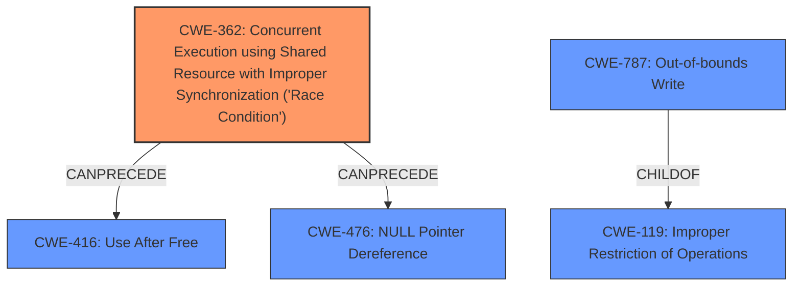

# Analysis Report for CVE-2021-0533

# Vulnerability Analysis Report: CVE-2021-0533

## Description


## Analysis (with Relationship Data)

# Summary
| CWE ID  | CWE Name                                                                                              | Confidence | CWE Abstraction Level | CWE Vulnerability Mapping Label | CWE-Vulnerability Mapping Notes |
| :-------- | :---------------------------------------------------------------------------------------------------- | :---------- | :---------------------- | :------------------------------ | :------------------------------ |
| CWE-362   | Concurrent Execution using Shared Resource with Improper Synchronization ('Race Condition') | 1.0        | Class                   | Primary                         | Allowed-with-Review            |
| CWE-787   | Out-of-bounds Write                                                                                 | 0.7         | Base                    | Secondary                       | Allowed                       |

## Evidence and Confidence

*   **Confidence Score:** 0.85
*   **Evidence Strength:** HIGH

## Relationship Analysis
The primary CWE identified is CWE-362, which is a Class-level CWE. The vulnerability description explicitly mentions a **race condition** as the root cause, making CWE-362 a strong candidate. The description also mentions **memory corruption**, which is often a consequence of a **race condition**, suggesting a potential chain relationship.

CWE-787 (Out-of-bounds Write) is considered as a secondary CWE because **memory corruption** can often manifest as an out-of-bounds write, but the primary driver here is the concurrency issue. CWE-787 is a child of CWE-119 (Improper Restriction of Operations within the Bounds of a Memory Buffer), indicating a broader category of memory safety issues. CWE-362 can precede CWE-416 (Use After Free) and CWE-476 (NULL Pointer Dereference).



## Vulnerability Chain
The vulnerability chain starts with a **race condition** (CWE-362) in the memory management driver. This leads to **memory corruption**, which can manifest as an out-of-bounds write (CWE-787). The ultimate impact is local escalation of privilege.

CWE-362 (Race Condition) -> CWE-787 (Out-of-bounds Write) -> Local Escalation of Privilege.

## Summary of Analysis
The initial assessment strongly points towards CWE-362 as the primary weakness, given the explicit mention of a **race condition** in the vulnerability description and the CVE Reference Links Content Summary. The **memory corruption** is considered a consequence of the **race condition**. The high retriever score for CWE-362 supports this decision.

The relationship analysis indicates that CWE-362 can lead to other memory-related issues like CWE-416 or CWE-476, but CWE-787 (Out-of-bounds Write) is included as a secondary candidate because it directly aligns with the described **memory corruption**. The "CWE for similar CVE Descriptions" also lists CWE-787 as the Primary CWE Match, but given the explicit root cause in the description, CWE-362 is chosen as the primary.

The selection of CWE-362 is at the Class level, as it accurately captures the nature of the concurrency issue. While it's encouraged to map to Base or Variant levels, the available information doesn't provide sufficient detail to pinpoint a more specific type of **race condition**. The evidence focuses on the general concurrency problem rather than a specific locking or synchronization mechanism failure.

The decision to include CWE-787 is based on the fact that the **memory corruption** is a direct consequence of the **race condition**.
The final confidence score is 0.85 due to the strong evidence of the **race condition** and its resulting **memory corruption**.

Relevant CWE Information:
- "In memory management driver, there is a possible **memory corruption** due to a **race condition**."
- ""rootcause": "A vulnerability in the memory management driver within MediaTek components."
- ""weaknesses": ["Memory management issue."]"


## CWE Relationship Analysis

Current CWEs represent these abstraction levels: .


### Vulnerability Chain Analysis

**Chain starting from CWE-476:**
- 476 (NULL Pointer Dereference) - ROOT


**Chain starting from CWE-787:**
- 787 (Out-of-bounds Write) - ROOT


### CWE Relationship Diagram

```mermaid
graph TD
    classDef primary fill:#f96,stroke:#333,stroke-width:2px
    classDef secondary fill:#69f,stroke:#333
    classDef tertiary fill:#9e9,stroke:#333
```


*Report generated on 2025-04-02 12:24:44*
