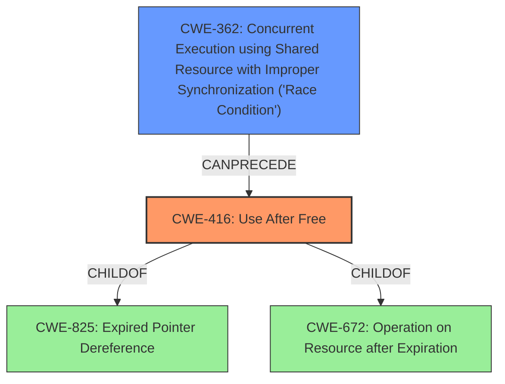

# Enhanced Analysis for CVE-2021-0535

# Summary
| CWE ID | CWE Name | Confidence | CWE Abstraction Level | CWE Vulnerability Mapping Label | CWE-Vulnerability Mapping Notes |
|---|---|---|---|---|---|
| CWE-416 | Use After Free | 1.0 | Variant | Allowed | Primary CWE |
| CWE-362 | Concurrent Execution using Shared Resource with Improper Synchronization ('Race Condition') | 0.7 | Class | Allowed-with-Review | Secondary CWE |

## Evidence and Confidence

*   **Confidence Score:** 0.85
*   **Evidence Strength:** HIGH

## Relationship Analysis
The primary CWE is CWE-416 (Use After Free), which is a Variant of CWE-825 (Expired Pointer Dereference) and CWE-672 (Operation on Resource after Expiration). CWE-416 can be preceded by CWE-362 (Concurrent Execution using Shared Resource with Improper Synchronization ('Race Condition')), which suggests a potential race condition leading to the use-after-free vulnerability. These relationships helped clarify the nature of the vulnerability and confirm the selection of CWE-416.



## Vulnerability Chain
The vulnerability chain starts with a potential **race condition** (CWE-362), possibly triggered during the deinitialization of the control interface in `wpa_supplicant`. If the driver initialization fails, dangling references can lead to a **use-after-free** (CWE-416) condition when the freed memory is accessed again.

## Summary of Analysis
The initial assessment, based on the "Vulnerability Description Key Phrases", strongly pointed to a **use after free** vulnerability, which led to the primary selection of CWE-416. Further analysis of the "CVE Reference Links Content Summary" confirmed this assessment, highlighting the dangling pointer issue due to the race condition in the deinitialization of the control interface. The retriever results also showed that CWE-416 was among the top candidates.

The relationship graph shows that CWE-416 is a variant of CWE-825 and CWE-672, which are more general classes. CWE-362 can precede CWE-416, indicating a potential race condition leading to the **use after free**.

The selection of CWE-416 is at the optimal level of specificity because it directly reflects the **rootcause** identified in the vulnerability description and the CVE summary. It represents a concrete coding error rather than a more abstract concept.

Relevant CWE Information:

# Enhanced Context (25 CWEs)
The following CWEs were identified as potentially relevant to this vulnerability:

## CWE-662: Improper Synchronization
**Abstraction Level**: Class
**Similarity Score**: 0.81
**Source**: dense

**Description**:
The product utilizes multiple threads or processes to allow temporary access to a shared resource that can only be exclusive to one process at a time, but it does not properly synchronize these actions, which might cause simultaneous accesses of this resource by multiple threads or processes.

**Mapping Guidance**:
- Usage: Discouraged
- Rationale: This CWE entry is a level-1 Class (i.e., a child of a Pillar). It might have lower-level children that would be more appropriate

*This CWE was considered but not selected as the description leans more towards a race condition due to timing issues in deinitialization, which is a specific case of improper synchronization. While synchronization issues may be present, the race condition leading to the use-after-free is more prominent.*

## CWE-667: Improper Locking
**Abstraction Level**: Class
**Similarity Score**: 0.80
**Source**: dense

**Description**:
The product does not properly acquire or release a lock on a resource, leading to unexpected resource state changes and behaviors.

**Mapping Guidance**:
- Usage: Allowed-with-Review
- Rationale: This CWE entry is a Class and might have Base-level children that would be more appropriate

*This CWE was considered but not selected. While locking issues could be a contributing factor, the primary issue identified is the race condition and the subsequent use-after-free. Improper locking may exacerbate the problem, but it is not the direct **rootcause**.*

## CWE-366: Race Condition within a Thread
**Abstraction Level**: Base
**Similarity Score**: 0.79
**Source**: dense

**Description**:
If two threads of execution use a resource simultaneously, there exists the possibility that resources may be used while invalid, in turn making the state of execution undefined.

**Mapping Guidance**:
- Usage: Allowed
- Rationale: This CWE entry is at the Base level of abstraction, which is a preferred level of abstraction for mapping to the root causes of vulnerabilities.

*This CWE was considered but not selected as the summary of the CVE did not suggest this was happening within a thread. The issue of **use after free** was cross thread.*

## CWE-404: Improper Resource Shutdown or Release
**Abstraction Level**: Class
**Similarity Score**: 0.79
**Source**: dense

**Description**:
The product does not release or incorrectly releases a resource before it is made available for re-use.

**Mapping Guidance**:
- Usage: Allowed-with-Review
- Rationale: This CWE entry is a Class and might have Base-level children that would be more appropriate

*This CWE was considered but not selected because the core issue is not about incorrect release *per se*, but rather the use of a resource *after* it has been correctly released, but a dangling pointer persists. It can be argued that resources was not properly shutdown, but it is not the primary weakness.*

## CWE-226: Sensitive Information in Resource Not Removed Before Reuse
**Abstraction Level**: Base
**Similarity Score**: 0.77
**Source**: dense

**Description**:
The product releases a resource such as memory or a file so that it can be made available for reuse, but it does not clear or "zeroize" the information contained in the resource before the product performs a critical state transition or makes the resource available for reuse by other entities.

**Mapping Guidance**:
- Usage: Allowed
- Rationale: This CWE entry is at the Base level of abstraction, which is a preferred level of abstraction for mapping to the root causes of vulnerabilities.

*This CWE was considered but not selected as the issue is not about the presence of sensitive information, but about the memory being accessed after it has been freed and potentially reallocated.*

## CWE-362: Concurrent Execution using Shared Resource with Improper Synchronization ('Race Condition')
**Abstraction Level**: Class
**Similarity Score**: 0.76
**Source**: dense

**Description**:
The product contains a concurrent code sequence that requires temporary, exclusive access to a shared resource, but a timing window exists in which the shared resource can be modified by another code sequence operating concurrently.

**Mapping Guidance**:
- Usage: Allowed-with-Review
- Rationale: This CWE entry is a Class and might have Base-level children that would be more appropriate

*This CWE was selected as a secondary CWE because the CVE Reference Links Content Summary mentions a race condition during the deinitialization of the control interface that leads to dangling pointers and ultimately to the **use after free**.*

## CWE-754: Improper Check for Unusual or Exceptional Conditions
**Abstraction Level**: Class
**Similarity Score**: 0.76
**Source**: dense

**Description**:
The product does not check or incorrectly checks for unusual or exceptional conditions that are not expected to occur frequently during day to day operation of the product.

**Mapping Guidance**:
- Usage: Allowed-with-Review
- Rationale: This CWE entry is a Class and might have Base-level children that would be more appropriate

*This CWE was considered but not selected as the primary issue is not the absence of checks, but the presence of a race condition and dangling pointers.*

## CWE-664: Improper Control of a Resource Through its Lifetime
**Abstraction Level**: Pillar
**Similarity Score**: 0.75
**Source**: dense

**Description**:
The product does not maintain or incorrectly maintains control over a resource throughout its lifetime of creation, use, and release.

**Mapping Guidance**:
- Usage: Discouraged
- Rationale: This CWE entry is high-level when lower-level children are available.

*This CWE was considered but not selected as it is too broad. The specific issue is the **use after free**, not the overall control of


## CWE Relationship Analysis

Current CWEs represent these abstraction levels: .


### Vulnerability Chain Analysis

**Chain starting from CWE-667:**
- 667 (Improper Locking) - ROOT


**Chain starting from CWE-662:**
- 662 (Improper Synchronization) - ROOT


### CWE Relationship Diagram

```mermaid
graph TD
    classDef primary fill:#f96,stroke:#333,stroke-width:2px
    classDef secondary fill:#69f,stroke:#333
    classDef tertiary fill:#9e9,stroke:#333
```