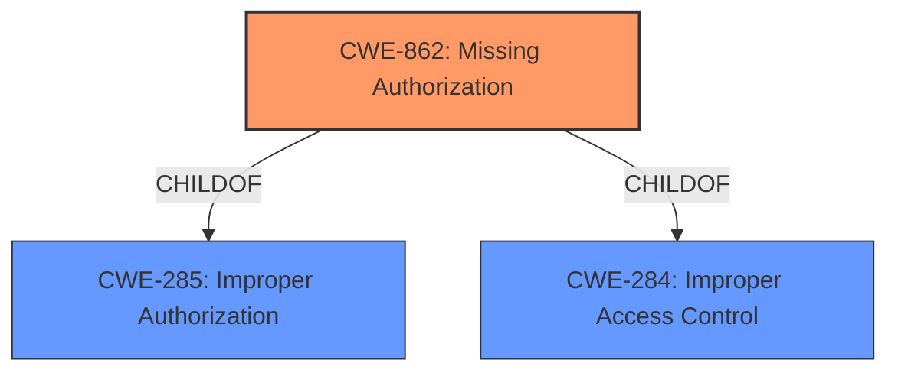

# Enhanced Analysis for CVE-2021-0554

# Summary
| CWE ID | CWE Name | Confidence | CWE Abstraction Level | CWE Vulnerability Mapping Label | CWE-Vulnerability Mapping Notes |
|---|---|---|---|---|---|
| CWE-862 | Missing Authorization | 1.0 | Class | Allowed-with-Review | Primary CWE |

## Evidence and Confidence

*   **Confidence Score:** 1.0
*   **Evidence Strength:** HIGH

## Relationship Analysis
The primary relationship influencing the decision is the ChildOf relationship between CWE-862 and its parents, CWE-285 (Improper Authorization) and CWE-284 (Improper Access Control). While CWE-285 and CWE-284 are more general, CWE-862 directly addresses the specific issue of a missing authorization check. The Class abstraction level is appropriate because while the description specifies a **missing permission check**, it does not provide the detail to select a lower level Base.



## Vulnerability Chain
The vulnerability chain is as follows:
1.  **Root Cause:** **Missing permission check** (CWE-862) in the `isBackupServiceActive` function.
2.  **Impact:** Local information disclosure.

## Summary of Analysis
The analysis is based on the provided evidence. The **Vulnerability Description Key Phrases** section explicitly states the **rootcause** as a **missing permission check**. This directly aligns with the definition of CWE-862 (Missing Authorization), where the product does not perform an authorization check when an actor attempts to access a resource or perform an action.

The provided evidence strongly supports the selection of CWE-862.
The description explicitly states a **missing permission check**, and CWE-862 directly addresses this. The impact, local information disclosure, is a common consequence of missing authorization.

The retriever results also suggest CWE-862 as the best candidate.
Based on the evidence, CWE-862 is the optimal level of specificity. Other more specific CWEs were considered but not used. Specifically, looking at retriever results.
*   CWE-927 (Use of Implicit Intent for Sensitive Communication): While related to Android vulnerabilities, this CWE is not appropriate because the vulnerability is not related to implicit intents.
*   CWE-926 (Improper Export of Android Application Components): While this is related to android this vulnerability does not stem from an exported component.
*   CWE-1021 (Improper Restriction of Rendered UI Layers or Frames): This vulnerability has nothing to do with UI rendering.
*   CWE-223 (Omission of Security-relevant Information): While information is being disclosed, the root cause is not an omission of security relevant information.
*   CWE-941 (Incorrectly Specified Destination in a Communication Channel): This has nothing to do with destinations for communications.
*   CWE-908 (Use of Uninitialized Resource): This has nothing to do with uninitialized resources.

Relevant CWE Information:
*   CWE-862 (Missing Authorization): The product does not perform an authorization check when an actor attempts to access a resource or perform an action. The vulnerability description states a **missing permission check**. This is a direct match. The security implication is unauthorized access to resources, which aligns with the stated impact of local information disclosure.


## CWE Relationship Analysis

Current CWEs represent these abstraction levels: .


### Vulnerability Chain Analysis

**Chain starting from CWE-862:**
- 862 (Missing Authorization) - ROOT


**Chain starting from CWE-284:**
- 284 (Improper Access Control) - ROOT


### CWE Relationship Diagram

```mermaid
graph TD
    classDef primary fill:#f96,stroke:#333,stroke-width:2px
    classDef secondary fill:#69f,stroke:#333
    classDef tertiary fill:#9e9,stroke:#333
```