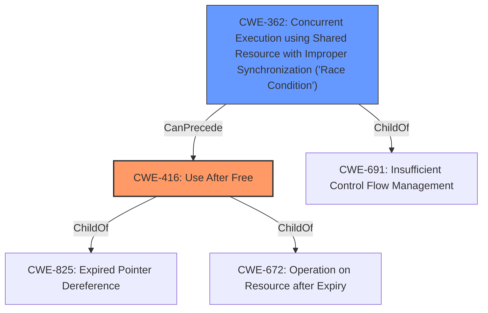

# Analysis for CVE-2021-0564

# Summary
| CWE ID | CWE Name | Confidence | CWE Abstraction Level | CWE Vulnerability Mapping Label | CWE-Vulnerability Mapping Notes |
|---|---|---|---|---|---|
| CWE-416 | Use After Free | 1.0 | Variant | Allowed | Primary CWE. The vulnerability description clearly states "**use-after-free** due to a **race condition**" |
| CWE-362 | Concurrent Execution using Shared Resource with Improper Synchronization ('Race Condition') | 1.0 | Class | Allowed-with-Review | Secondary CWE. The vulnerability description clearly indicates a **race condition**.  |

## Evidence and Confidence

*   **Confidence Score:** 1.0
*   **Evidence Strength:** HIGH

## Relationship Analysis
The primary weakness is a Use-After-Free (CWE-416), which is triggered by a Race Condition (CWE-362). The CWE relationships indicate that CWE-362 can precede CWE-416, aligning with the vulnerability description where the race condition leads to the use-after-free. CWE-416 is a variant and a child of CWE-825 (Expired Pointer Dereference) and CWE-672 (Operation on Resource after Expiry). CWE-362 is a Class and a child of CWE-691 (Insufficient Control Flow Management). The abstraction levels were considered to select the most specific CWEs applicable.

## Vulnerability Chain
The vulnerability chain starts with the **race condition** (CWE-362) where multiple threads access a shared resource without proper synchronization. This leads to a **use-after-free** (CWE-416), where memory is accessed after it has been freed. The impact is a local escalation of privilege.

## Summary of Analysis
The initial assessment identified a **use-after-free** vulnerability caused by a **race condition**. The detailed analysis of the vulnerability description and the CVE reference links content summary provided strong evidence for this assessment. The **race condition** allows memory to be freed by one thread while another thread is still accessing it, leading to the **use-after-free**.

The relationship graph supports the selection of CWE-416 and CWE-362, as CWE-362 can precede CWE-416.

The selected CWEs are at the optimal level of specificity. CWE-416 is a Variant, and CWE-362 is a Class which adequately describes the specific nature of the weakness.

The evidence from the vulnerability description includes: "**use-after-free** due to a **race condition**" and from the CVE Reference Links Content Summary: "The root cause is a **race condition** that leads to a **use-after-free** vulnerability.".
Relevant CWE Information:

# Enhanced Context (25 CWEs)
The following CWEs were identified as potentially relevant to this vulnerability:

## CWE-667: Improper Locking
**Abstraction Level**: Class
**Similarity Score**: 0.79
**Source**: dense

**Description**:
The product does not properly acquire or release a lock on a resource, leading to unexpected resource state changes and behaviors.

**Mapping Guidance**:
- Usage: Allowed-with-Review
- Rationale: This CWE entry is a Class and might have Base-level children that would be more appropriate

Considered but not used. While **improper locking** could be related to the **race condition**, the description doesn't explicitly state locking issues but instead emphasizes the concurrency problem leading directly to the **use-after-free**.

## CWE-366: Race Condition within a Thread
**Abstraction Level**: Base
**Similarity Score**: 0.78
**Source**: dense

**Description**:
If two threads of execution use a resource simultaneously, there exists the possibility that resources may be used while invalid, in turn making the state of execution undefined.

**Mapping Guidance**:
- Usage: Allowed
- Rationale: This CWE entry is at the Base level of abstraction, which is a preferred level of abstraction for mapping to the root causes of vulnerabilities.

Considered but not used. CWE-366 is more specific than CWE-362 (the Class), but the reference links state a lack of Mutex protection and given the shared resource, it is better to use CWE-362 to describe the race condition.