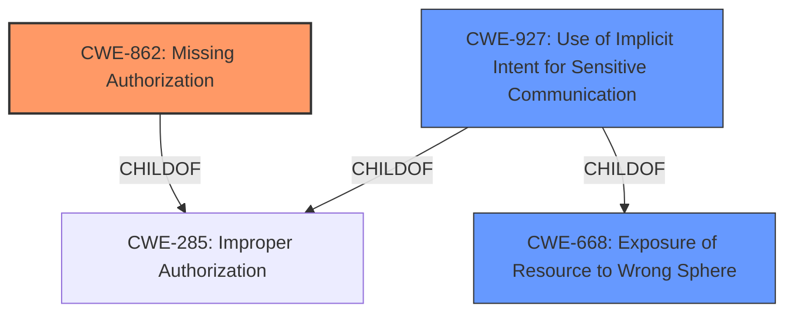

# Analysis for CVE-2021-0571

# Summary
| CWE ID | CWE Name | Confidence | CWE Abstraction Level | CWE Vulnerability Mapping Label | CWE-Vulnerability Mapping Notes |
|---|---|---|---|---|---|
| CWE-862 | Missing Authorization | 0.9 | Class | Primary | Allowed-with-Review |
| CWE-927 | Use of Implicit Intent for Sensitive Communication | 0.6 | Variant | Secondary | Allowed |

## Evidence and Confidence

*   **Confidence Score:** 0.8
*   **Evidence Strength:** HIGH

## Relationship Analysis
The primary relationship that influenced my decision was the hierarchical relationship, specifically the ChildOf relationship. CWE-862 (Missing Authorization) is a class-level CWE and a child of CWE-284 (Improper Access Control) and CWE-285 (Improper Authorization). The retriever also identified CWE-927 (Use of Implicit Intent for Sensitive Communication) which is a variant of CWE-285 and CWE-668 (Exposure of Resource to Wrong Sphere). I considered if either one of these were more specific. Since Android intents are used for inter-process communication and the vulnerability involved a **permissions bypass** allowing access to restricted activities, I considered CWE-927 as a secondary.

## Vulnerability Chain
The vulnerability chain starts with the **permissions bypass** in ActivityTaskManagerService.startActivity() and AppTaskImpl.startActivity(). This leads to access to restricted activities and a local escalation of privilege.

## Summary of Analysis
The initial analysis focused on the **permissions bypass** as the root cause, leading to the consideration of authorization-related CWEs. The retriever results highlighted CWE-862 (Missing Authorization) as a potential candidate, with a usage of "Allowed-with-Review" and a note to examine its children for a better fit. I reviewed the description of the vulnerability: "In ActivityTaskManagerService.startActivity() and AppTaskImpl.startActivity() of ActivityTaskManagerService.java and AppTaskImpl.java, there is possible access to restricted activities due to a **permissions bypass**." The CVE reference links content summary provided more details: "The vulnerability stems from a lack of proper validation of the `callingPackage` parameter in certain methods within `ActivityTaskManagerService` and `AppTaskImpl`. These methods were not verifying if the provided package name from binder calls actually belonged to the calling UID...By providing a false `callingPackage`, apps were able to bypass these checks."

Based on this evidence, I selected CWE-862 (Missing Authorization) as the primary CWE because the core issue is the lack of authorization checks, specifically the failure to validate the `callingPackage` parameter. The impact is that a malicious application can gain unauthorized access or perform actions it should not be permitted to do, leading to privilege escalation. I also considered CWE-927 (Use of Implicit Intent for Sensitive Communication) as a secondary CWE, given that Android intents are involved in inter-process communication and the vulnerability involves a **permissions bypass**. While not a perfect fit, it captures an aspect of the vulnerability related to inter-application communication. I am confident that CWE-862 is the best fit given the available information.

Relevant CWE Information:

# Enhanced Context (25 CWEs)

## CWE-667: Improper Locking
**Abstraction Level**: Class
**Similarity Score**: 0.75
**Source**: dense

**Description**:
The product does not properly acquire or release a lock on a resource, leading to unexpected resource state changes and behaviors.

**Mapping Guidance**:
- Usage: Allowed-with-Review
- Rationale: This CWE entry is a Class and might have Base-level children that would be more appropriate

*Rationale for not using CWE-667*: This vulnerability isn't related to improper locking mechanisms.

## CWE-662: Improper Synchronization
**Abstraction Level**: Class
**Similarity Score**: 0.74
**Source**: dense

**Description**:
The product utilizes multiple threads or processes to allow temporary access to a shared resource that can only be exclusive to one process at a time, but it does not properly synchronize these actions, which might cause simultaneous accesses of this resource by multiple threads or processes.

**Mapping Guidance**:
- Usage: Discouraged
- Rationale: This CWE entry is a level-1 Class (i.e., a child of a Pillar). It might have lower-level children that would be more appropriate

*Rationale for not using CWE-662*: This vulnerability isn't related to improper synchronization.

## CWE-404: Improper Resource Shutdown or Release
**Abstraction Level**: Class
**Similarity Score**: 0.74
**Source**: dense

**Description**:
The product does not release or incorrectly releases a resource before it is made available for re-use.

**Mapping Guidance**:
- Usage: Allowed-with-Review
- Rationale: This CWE entry is a Class and might have Base-level children that would be more appropriate

*Rationale for not using CWE-404*: This vulnerability isn't related to resource shutdown or release.

## CWE-226: Sensitive Information in Resource Not Removed Before Reuse
**Abstraction Level**: Base
**Similarity Score**: 0.74
**Source**: dense

**Description**:
The product releases a resource such as memory or a file so that it can be made available for reuse, but it does not clear or "zeroize" the information contained in the resource before the product performs a critical state transition or makes the resource available for reuse by other entities.

**Mapping Guidance**:
- Usage: Allowed
- Rationale: This CWE entry is at the Base level of abstraction, which is a preferred level of abstraction for mapping to the root causes of vulnerabilities.

*Rationale for not using CWE-226*: This vulnerability isn't related to sensitive information not being removed before reuse.

## CWE-653: Improper Isolation or Compartmentalization
**Abstraction Level**: Class
**Similarity Score**: 0.73
**Source**: dense

**Description**:
The product does not properly compartmentalize or isolate functionality, processes, or resources that require different privilege levels, rights, or permissions.

**Mapping Guidance**:
- Usage: Allowed
- Rationale: This CWE entry is at the Base level of abstraction, which is a preferred level of abstraction for mapping to the root causes of vulnerabilities.

*Rationale for not using CWE-653*: Although related to privilege levels, the core issue is the lack of authorization.

## CWE-754: Improper Check for Unusual or Exceptional Conditions
**Abstraction Level**: Class
**Similarity Score**: 0.73
**Source**: dense

**Description**:
The product does not check or incorrectly checks for unusual or exceptional conditions that are not expected to occur frequently during day to day operation of the product.

**Mapping Guidance**:
- Usage: Allowed-with-Review
- Rationale: This CWE entry is a Class and might have Base-level children that would be more appropriate

*Rationale for not using CWE-754*: This vulnerability is not about unusual or exceptional conditions.

## CWE-203: Observable Discrepancy
**Abstraction Level**: Base
**Similarity Score**: 0.73
**Source**: dense

**Description**:
The product behaves differently or sends different responses under different circumstances in a way that is observable to an unauthorized actor, which exposes security-relevant information about the state of the product, such as whether a particular operation was successful or not.

**Mapping Guidance**:
- Usage: Allowed
- Rationale: This CWE entry is at the Base level of abstraction, which is a preferred level of abstraction for mapping to the root causes of vulnerabilities.

*Rationale for not using CWE-203*: This vulnerability isn't about observable discrepancies.

## CWE-668: Exposure of Resource to Wrong Sphere
**Abstraction Level**: Class
**Similarity Score**: 0.73
**Source**: dense

**Description**:
The product exposes a resource to the wrong control sphere, providing unintended actors with inappropriate access to the resource.

**Mapping Guidance**:
- Usage: Discouraged
- Rationale: CWE-668 is high-level and is often misused as a catch-all when lower-level CWE IDs might be applicable. It is sometimes used for low-information vulnerability reports [REF-1287]. It is a level-1 Class (i.e., a child of a Pillar). It is not useful for trend analysis.

*Rationale for not using CWE-668*: While relevant, it's a higher-level CWE and CWE-862 is more