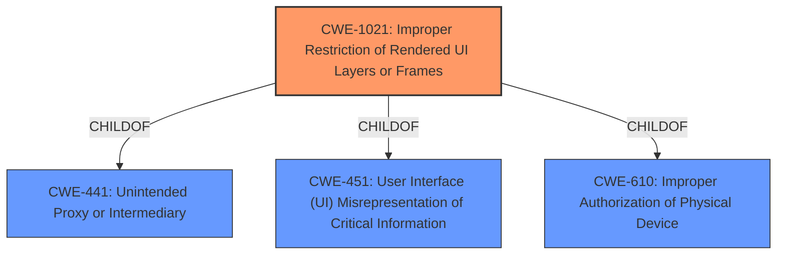

# Analysis for CVE-2021-0583

# Summary
| CWE ID | CWE Name | Confidence | CWE Abstraction Level | CWE Vulnerability Mapping Label | CWE-Vulnerability Mapping Notes |
|---|---|---|---|---|---|
| CWE-1021 | Improper Restriction of Rendered UI Layers or Frames | 0.9 | Base | Allowed | Primary CWE |
| CWE-451 | User Interface (UI) Misrepresentation of Critical Information | 0.7 | Class | Allowed-with-Review | Secondary CWE |

## Evidence and Confidence

*   **Confidence Score:** 0.8
*   **Evidence Strength:** MEDIUM

## Relationship Analysis
The primary CWE, CWE-1021, is a Base level CWE that is a child of both CWE-441 (Unintended Proxy or Intermediary) and CWE-451 (User Interface (UI) Misrepresentation of Critical Information). This indicates that UI redress attacks like tapjacking can be seen as a specific type of unintended proxy or intermediary issue, as well as a form of UI misrepresentation. Selecting CWE-1021 provides a more specific classification than the higher-level class CWE-451.

## Vulnerability Chain
The vulnerability chain starts with the **tapjacking/overlay attack** (CWE-1021). The **improper restriction of UI layers** allows an attacker to overlay a malicious UI element on top of a legitimate one, tricking the user into performing unintended actions. This leads to enabling Bluetooth without user consent, which constitutes an **escalation of privilege**.

## Summary of Analysis
The initial assessment identified **tapjacking/overlay attack** as the root cause, aligning with CWE-1021 (Improper Restriction of Rendered UI Layers or Frames). The vulnerability description clearly states a **tapjacking/overlay attack** allowing Bluetooth to be enabled without user consent.

The evidence supporting CWE-1021 is found in the "**Vulnerability Description Key Phrases**" section, where the **rootcause** is explicitly listed as "**tapjacking/overlay attack**." This, combined with the description of the attack leading to unintended actions, strongly suggests CWE-1021.

The retriever results also strongly support CWE-1021, giving it a score of 1.000.

CWE-451 (User Interface (UI) Misrepresentation of Critical Information) was considered as a broader class of vulnerability that encompasses tapjacking. However, CWE-1021 is a more specific Base level vulnerability and is the more precise match.

The selected CWEs are at the optimal level of specificity, with CWE-1021 providing a direct mapping to the tapjacking attack.

Relevant CWE Information:

# Enhanced Context (25 CWEs)

## CWE-1021: Improper Restriction of Rendered UI Layers or Frames
**Abstraction Level**: Base
**Similarity Score**: 0.78
**Source**: dense

**Description**:
The web application does not restrict or incorrectly restricts frame objects or UI layers that belong to another application or domain, which can lead to user confusion about which interface the user is interacting with.

**Mapping Guidance**:
- Usage: Allowed
- Rationale: This CWE entry is at the Base level of abstraction, which is a preferred level of abstraction for mapping to the root causes of vulnerabilities.

## CWE-451: User Interface (UI) Misrepresentation of Critical Information
**Abstraction Level**: Class
**Similarity Score**: 0.80
**Source**: dense

**Description**:
The user interface (UI) does not properly represent critical information to the user, allowing the information - or its source - to be obscured or spoofed. This is often a component in phishing attacks.

**Mapping Guidance**:
- Usage: Allowed-with-Review
- Rationale: This CWE entry is a Class and might have Base-level children that would be more appropriate

The vulnerability description indicates a **tapjacking/overlay attack** which directly aligns with the description of CWE-1021. The user is tricked into interacting with the application when they were not intending to. This is a type of UI redress attack. Therefore, CWE-1021 is the primary CWE.

CWE-451 is a more general class of weakness that encompasses UI misrepresentation. While relevant, it's not as specific as CWE-1021 for this scenario.