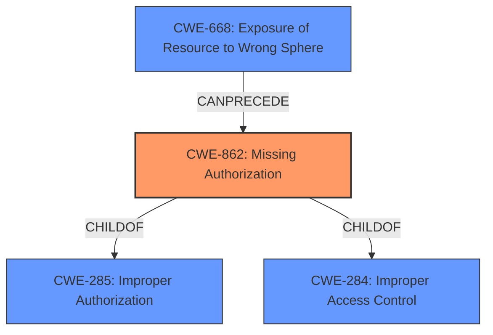

# Analysis for CVE-2021-0590

# Summary
| CWE ID | CWE Name | Confidence | CWE Abstraction Level | CWE Vulnerability Mapping Label | CWE-Vulnerability Mapping Notes |
|---|---|---|---|---|---|
| CWE-862 | Missing Authorization | 1.0 | Class | Allowed-with-Review | Primary CWE |
| CWE-668 | Exposure of Resource to Wrong Sphere | 0.7 | Class | Discouraged | Secondary Candidate |

## Evidence and Confidence

*   **Confidence Score:** 1.0
*   **Evidence Strength:** HIGH

## Relationship Analysis
The primary relationship influencing the decision is that CWE-862 **(Missing Authorization)** is a child of CWE-285 **(Improper Authorization)** and CWE-284 **(Improper Access Control)**. While the description indicates a **missing permission check**, the broader context of authorization is more fitting.

## Vulnerability Chain
The vulnerability chain starts with the **missing permission check**, which leads to the unintended exposure of WiFi BSSID and SSID to a privileged app, resulting in local information disclosure.

## Summary of Analysis
The initial assessment pointed towards CWE-862 due to the **missing permission check**. The analysis of the provided vulnerability description and CVE reference links content summary provides sufficient evidence to support this classification. The "**missing permission check**" (root cause) allows a privileged app (attacker) to receive WiFi BSSID and SSID without location permissions (impact).

The selection of CWE-862 is at the appropriate level of specificity because it directly addresses the core issue of a **missing authorization** check, which is a class-level weakness.

Relevant CWE Information:

# Enhanced Context (25 CWEs)

## CWE-941: Incorrectly Specified Destination in a Communication Channel
**Abstraction Level**: Base
**Similarity Score**: 0.78
**Source**: dense

**Description**:
The product creates a communication channel to initiate an outgoing request to an actor, but it does not correctly specify the intended destination for that actor.
*Not Selected:* While communication is involved, the core issue isn't the destination, but the lack of authorization.

## CWE-203: Observable Discrepancy
**Abstraction Level**: Base
**Similarity Score**: 0.77
**Source**: dense

**Description**:
The product behaves differently or sends different responses under different circumstances in a way that is observable to an unauthorized actor, which exposes security-relevant information about the state of the product, such as whether a particular operation was successful or not.
*Not Selected:* The issue is not an observable discrepancy in behavior, but a direct lack of authorization.

## CWE-223: Omission of Security-relevant Information
**Abstraction Level**: Base
**Similarity Score**: 0.77
**Source**: dense

**Description**:
The product does not record or display information that would be important for identifying the source or nature of an attack, or determining if an action is safe.
*Not Selected:* The issue is not about the omission of security-relevant information for auditing purposes.

## CWE-754: Improper Check for Unusual or Exceptional Conditions
**Abstraction Level**: Class
**Similarity Score**: 0.76
**Source**: dense

**Description**:
The product does not check or incorrectly checks for unusual or exceptional conditions that are not expected to occur frequently during day to day operation of the product.
*Not Selected:* The issue is not about failing to check for unusual conditions.

## CWE-668: Exposure of Resource to Wrong Sphere
**Abstraction Level**: Class
**Similarity Score**: 0.76
**Source**: dense

**Description**:
The product exposes a resource to the wrong control sphere, providing unintended actors with inappropriate access to the resource.
*Potentially Selected:* This is a higher-level classification but could apply since the WiFi information is exposed to an app without proper authorization. The **missing permission check** allows a privileged app to access information it shouldn't. The mapping guidance discourages this CWE as it can be used as a catch-all. I am adding it as a secondary candidate with a lower confidence.

## CWE-451: User Interface (UI) Misrepresentation of Critical Information
**Abstraction Level**: Class
**Similarity Score**: 0.75
**Source**: dense

**Description**:
The user interface (UI) does not properly represent critical information to the user, allowing the information - or its source - to be obscured or spoofed. This is often a component in phishing attacks.
*Not Selected:* The issue doesn't involve UI misrepresentation.

## CWE-345: Insufficient Verification of Data Authenticity
**Abstraction Level**: Class
**Similarity Score**: 0.75
**Source**: dense

**Description**:
The product does not sufficiently verify the origin or authenticity of data, in a way that causes it to accept invalid data.
*Not Selected:* The issue is not about verifying data authenticity.

## CWE-755: Improper Handling of Exceptional Conditions
**Abstraction Level**: Class
**Similarity Score**: 0.74
**Source**: dense

**Description**:
The product does not handle or incorrectly handles an exceptional condition.
*Not Selected:* The issue is not about exceptional conditions.

## CWE-280: Improper Handling of Insufficient Permissions or Privileges
**Abstraction Level**: Base
**Similarity Score**: 0.74
**Source**: dense

**Description**:
The product does not handle or incorrectly handles when it has insufficient privileges to access resources or functionality as specified by their permissions. This may cause it to follow unexpected code paths that may leave the product in an invalid state.
*Not Selected:* While permissions are involved, the primary issue is the **missing** check, not improper handling when permissions are insufficient.

## CWE-807: Reliance on Untrusted Inputs in a Security Decision
**Abstraction Level**: Base
**Similarity Score**: 0.74
**Source**: dense

**Description**:
The product uses a protection mechanism that relies on the existence or values of an input, but the input can be modified by an untrusted actor in a way that bypasses the protection mechanism.
*Not Selected:* The vulnerability doesn't hinge on reliance on untrusted inputs.

## CWE-941: Incorrectly Specified Destination in a Communication Channel
**Abstraction Level**: Base
**Similarity Score**: 5904.64
**Source**: sparse

**Description**:
The product creates a communication channel to initiate an outgoing request to an actor, but it does not correctly specify the intended destination for that actor.
*Not Selected:* While communication is involved, the core issue isn't the destination, but the lack of authorization.

## CWE-927: Use of Implicit Intent for Sensitive Communication
**Abstraction Level**: Variant
**Similarity Score**: 5634.49
**Source**: sparse

**Description**:
The Android application uses an implicit intent for transmitting sensitive data to other applications.
*Not Selected:* The specific vulnerability doesn't involve the use of implicit intents.

## CWE-863: Incorrect Authorization
**Abstraction Level**: Class
**Similarity Score**: 5095.66
**Source**: sparse

**Description**:
The product performs an authorization check when an actor attempts to access a resource or perform an action, but it does not correctly perform the check.
*Not Selected:* The provided information specifies a **missing** check, not an incorrect one.

## CWE-285: Improper Authorization
**Abstraction Level**: Class
**Similarity Score**: 4966.12
**Source**: sparse

**Description**:
The product does not perform or incorrectly performs an authorization check when an actor attempts to access a resource or perform an action.
*Not Selected:* The provided information specifies a **missing** check, not an incorrect one.

## CWE-203: Observable Discrepancy
**Abstraction Level**: Base
**Similarity Score**: 4912.35
**Source**: sparse

**Description**:
The product behaves differently or sends different responses under different circumstances in a way that is observable to an unauthorized actor, which exposes security-relevant information about the state of the product, such as whether a particular operation was successful or not.
*Not Selected:* The issue is not an observable discrepancy in behavior, but a direct lack of authorization.

## CWE-205: Observable Behavioral Discrepancy
**Abstraction Level**: base
**Similarity Score**: 4.33
**Source