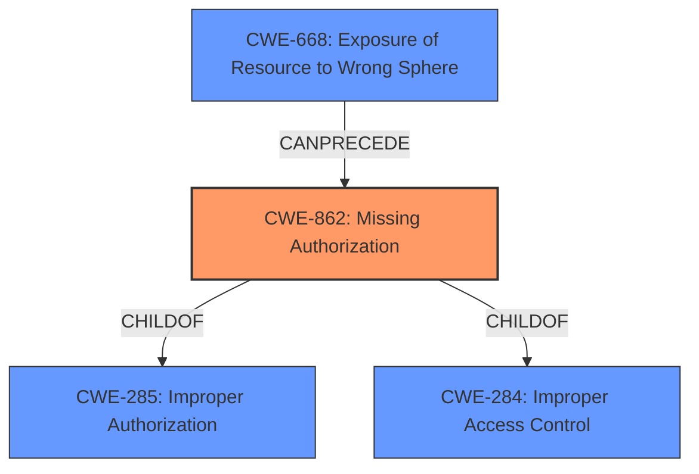

# Analysis for CVE-2021-0590

# Summary
| CWE ID | CWE Name | Confidence | CWE Abstraction Level | CWE Vulnerability Mapping Label | CWE-Vulnerability Mapping Notes |
|---|---|---|---|---|---|
| CWE-862 | Missing Authorization | 1.0 | Class | Allowed-with-Review | Primary CWE |
| CWE-668 | Exposure of Resource to Wrong Sphere | 0.7 | Class | Discouraged | Secondary Candidate |

## Evidence and Confidence

*   **Confidence Score:** 1.0
*   **Evidence Strength:** HIGH

## Relationship Analysis
The primary relationship influencing the decision is that CWE-862 **(Missing Authorization)** is a child of CWE-285 **(Improper Authorization)** and CWE-284 **(Improper Access Control)**. While the description indicates a **missing permission check**, the broader context of authorization is more fitting.

## Vulnerability Chain
The vulnerability chain starts with the **missing permission check**, which leads to the unintended exposure of WiFi BSSID and SSID to a privileged app, resulting in local information disclosure.

## Summary of Analysis
The initial assessment pointed towards CWE-862 due to the **missing permission check**. The analysis of the provided vulnerability description and CVE reference links content summary provides sufficient evidence to support this classification. The "**missing permission check**" (root cause) allows a privileged app (attacker) to receive WiFi BSSID and SSID without location permissions (impact).

The selection of CWE-862 is at the appropriate level of specificity because it directly addresses the core issue of a **missing authorization** check, which is a class-level weakness.

Relevant CWE Information:

# Enhanced Context (25 CWEs)

## CWE-941: Incorrectly Specified Destination in a Communication Channel
**Abstraction Level**: Base
**Similarity Score**: 0.78
**Source**: dense

**Description**:
The product creates a communication channel to initiate an outgoing request to an actor, but it does not correctly specify the intended destination for that actor.
*Not Selected:* While communication is involved, the core issue isn't the destination, but the lack of authorization.

## CWE-203: Observable Discrepancy
**Abstraction Level**: Base
**Similarity Score**: 0.77
**Source**: dense

**Description**:
The product behaves differently or sends different responses under different circumstances in a way that is observable to an unauthorized actor, which exposes security-relevant information about the state of the product, such as whether a particular operation was successful or not.
*Not Selected:* The issue is not an observable discrepancy in behavior, but a direct lack of authorization.

## CWE-223: Omission of Security-relevant Information
**Abstraction Level**: Base
**Similarity Score**: 0.77
**Source**: dense

**Description**:
The product does not record or display information that would be important for identifying the source or nature of an attack, or determining if an action is safe.
*Not Selected:* The issue is not about the omission of security-relevant information for auditing purposes.

## CWE-754: Improper Check for Unusual or Exceptional Conditions
**Abstraction Level**: Class
**Similarity Score**: 0.76
**Source**: dense

**Description**:
The product does not check or incorrectly checks for unusual or exceptional conditions that are not expected to occur frequently during day to day operation of the product.
*Not Selected:* The issue is not about failing to check for unusual conditions.

## CWE-668: Exposure of Resource to Wrong Sphere
**Abstraction Level**: Class
**Similarity Score**: 0.76
**Source**: dense

**Description**:
The product exposes a resource to the wrong control sphere, providing unintended actors with inappropriate access to the resource.
*Potentially Selected:* This is a higher-level classification but could apply since the WiFi information is exposed to an app without proper authorization. The **missing permission check** allows a privileged app to access information it shouldn't. The mapping guidance discourages this CWE as it can be used as a catch-all. I am adding it as a secondary candidate with a lower confidence.

## CWE-451: User Interface (UI) Misrepresentation of Critical Information
**Abstraction Level**: Class
**Similarity Score**: 0.75
**Source**: dense

**Description**:
The user interface (UI) does not properly represent critical information to the user, allowing the information - or its source - to be obscured or spoofed. This is often a component in phishing attacks.
*Not Selected:* The issue doesn't involve UI misrepresentation.

## CWE-345: Insufficient Verification of Data Authenticity
**Abstraction Level**: Class
**Similarity Score**: 0.75
**Source**: dense

**Description**:
The product does not sufficiently verify the origin or authenticity of data, in a way that causes it to accept invalid data.
*Not Selected:* The issue is not about verifying data authenticity.

## CWE-755: Improper Handling of Exceptional Conditions
**Abstraction Level**: Class
**Similarity Score**: 0.74
**Source**: dense

**Description**:
The product does not handle or incorrectly handles an exceptional condition.
*Not Selected:* The issue is not about exceptional conditions.

## CWE-280: Improper Handling of Insufficient Permissions or Privileges
**Abstraction Level**: Base
**Similarity Score**: 0.74
**Source**: dense

**Description**:
The product does not handle or incorrectly handles when it has insufficient privileges to access resources or functionality as specified by their permissions. This may cause it to follow unexpected code paths that may leave the product in an invalid state.
*Not Selected:* While permissions are involved, the primary issue is the **missing** check, not improper handling when permissions are insufficient.

## CWE-807: Reliance on Untrusted Inputs in a Security Decision
**Abstraction Level**: Base
**Similarity Score**: 0.74
**Source**: dense

**Description**:
The product uses a protection mechanism that relies on the existence or values of an input, but the input can be modified by an untrusted actor in a way that bypasses the protection mechanism.
*Not Selected:* The vulnerability doesn't hinge on reliance on untrusted inputs.

## CWE-941: Incorrectly Specified Destination in a Communication Channel
**Abstraction Level**: Base
**Similarity Score**: 5904.64
**Source**: sparse

**Description**:
The product creates a communication channel to initiate an outgoing request to an actor, but it does not correctly specify the intended destination for that actor.
*Not Selected:* While communication is involved, the core issue isn't the destination, but the lack of authorization.

## CWE-927: Use of Implicit Intent for Sensitive Communication
**Abstraction Level**: Variant
**Similarity Score**: 5634.49
**Source**: sparse

**Description**:
The Android application uses an implicit intent for transmitting sensitive data to other applications.
*Not Selected:* The specific vulnerability doesn't involve the use of implicit intents.

## CWE-863: Incorrect Authorization
**Abstraction Level**: Class
**Similarity Score**: 5095.66
**Source**: sparse

**Description**:
The product performs an authorization check when an actor attempts to access a resource or perform an action, but it does not correctly perform the check.
*Not Selected:* The provided information specifies a **missing** check, not an incorrect one.

## CWE-285: Improper Authorization
**Abstraction Level**: Class
**Similarity Score**: 4966.12
**Source**: sparse

**Description**:
The product does not perform or incorrectly performs an authorization check when an actor attempts to access a resource or perform an action.
*Not Selected:* The provided information specifies a **missing** check, not an incorrect one.

## CWE-203: Observable Discrepancy
**Abstraction Level**: Base
**Similarity Score**: 4912.35
**Source**: sparse

**Description**:
The product behaves differently or sends different responses under different circumstances in a way that is observable to an unauthorized actor, which exposes security-relevant information about the state of the product, such as whether a particular operation was successful or not.
*Not Selected:* The issue is not an observable discrepancy in behavior, but a direct lack of authorization.

## CWE-205: Observable Behavioral Discrepancy
**Abstraction Level**: base
**Similarity Score**: 4.33
**Source

# Enhanced Query for CVE-2021-0590

## Vulnerability Description
In sendNetworkConditionsBroadcast of NetworkMonitor.java, there is a possible way for a privileged app to receive WiFi BSSID and SSID without location permissions due to a **missing permission check**. This could lead to local information disclosure with System execution privileges needed. User interaction is not needed for exploitation.Product AndroidVersions Android-10 Android-11 Android-8.1 Android-9Android ID A-175213041

### Vulnerability Description Key Phrases
- **rootcause:** **missing permission check**
- **impact:** receive WiFi BSSID and SSID without location permissions
- **attacker:** privileged app
- **product:** Android
- **version:** 10, 11, 8.1, 9
- **component:** sendNetworkConditionsBroadcast of NetworkMonitor.java

## CVE Reference Links Content Summary
Based on the provided information, here's an analysis of CVE-2021-0590:

**1. Verification of CVE Relevance:**

The provided content directly references CVE-2021-0590 within the Android Security Bulletin for July 2021 and contains commit messages related to the fix. The commit message mentions "Fix the security issue that preloaded apps can get SSID & BSSID". This vulnerability is related to the broadcast of network conditions containing sensitive information. Therefore, the content is relevant to CVE-2021-0590.

**2. Root Cause of Vulnerability:**

The root cause is the insecure broadcasting of the `NETWORK_CONDITIONS_MEASURED` intent, which included WiFi SSID and BSSID information. This broadcast only required the `ACCESS_NETWORK_CONDITIONS` permission, and not the more restrictive `ACCESS_FINE_LOCATION` permission. This allowed preloaded apps to access this sensitive information without user consent.

**3. Weaknesses/Vulnerabilities Present:**

*   **Information Disclosure:** The primary vulnerability is the disclosure of sensitive network information (SSID and BSSID) to applications that should not have access to it.
*   **Insufficient Permission Check:** The broadcast was protected by an insufficient permission, allowing applications to obtain data without the user's consent.

**4. Impact of Exploitation:**

*   **Privacy Violation:** Exploitation could allow malicious or unauthorized pre-loaded apps to collect users' WiFi network information without explicit consent.
*   **Potential Location Tracking:** Access to BSSID and SSID information could be used for device tracking.

**5. Attack Vectors:**

*   **Broadcast Interception:** An attacker could install a pre-loaded application, or convince a user to install an application with the required permissions, and register a broadcast receiver to intercept the `NETWORK_CONDITIONS_MEASURED` broadcast.

**6. Required Attacker Capabilities/Position:**

*   The attacker needs to have an application with the `android.permission.ACCESS_NETWORK_CONDITIONS` permission installed on the device.
*   The attacker's application must register a broadcast receiver for the `android.net.conn.NETWORK_CONDITIONS_MEASURED` intent.

**Additional Information:**
The provided commit logs indicate that the vulnerability was resolved by removing the broadcast entirely because it was no longer used, and the related code was also deleted.

**Summary:**

CVE-2021-0590 was an information disclosure vulnerability that allowed pre-loaded apps to obtain WiFi SSID and BSSID information via a broadcast intent, without requiring the `ACCESS_FINE_LOCATION` permission. This was resolved by removing the vulnerable broadcast and the associated code.

## Retriever Results

### Top Combined Results

| Rank | CWE ID | Name | Abstraction | Usage  | Retrievers | Individual Scores |
|------|--------|------|-------------|-------|------------|-------------------|
| 1 | 941 | Incorrectly Specified Destination in a Communication Channel | Base | Allowed | sparse | 0.563 |
| 2 | 862 | Missing Authorization | Class | Allowed-with-Review | sparse | 0.533 |
| 3 | 927 | Use of Implicit Intent for Sensitive Communication | Variant | Allowed | sparse | 0.478 |
| 4 | 1021 | Improper Restriction of Rendered UI Layers or Frames | Base | Allowed | sparse | 0.448 |
| 5 | 514 | Covert Channel | Class | Allowed-with-Review | sparse | 0.433 |
| 6 | 925 | Improper Verification of Intent by Broadcast Receiver | Variant | Allowed | dense | 0.622 |
| 7 | 205 | Observable Behavioral Discrepancy | Base | Allowed | graph | 0.002 |
| 8 | 732 | Incorrect Permission Assignment for Critical Resource | Class | Allowed-with-Review | sparse | 0.431 |
| 9 | 248 | Uncaught Exception | Base | Allowed | sparse | 0.424 |
| 10 | 223 | Omission of Security-relevant Information | Base | Allowed | sparse | 0.419 |

# Complete CWE Specifications

## CWE-941: Incorrectly Specified Destination in a Communication Channel
**Abstraction:** Base
**Status:** Incomplete

### Description
The product creates a communication channel to initiate an outgoing request to an actor, but it does not correctly specify the intended destination for that actor.

### Extended Description

Attackers at the destination may be able to spoof trusted servers to steal data or cause a denial of service.

There are at least two distinct weaknesses that can cause the product to communicate with an unintended destination:

  - If the product allows an attacker to control which destination is specified, then the attacker can cause it to connect to an untrusted or malicious destination. For example, because UDP is a connectionless protocol, UDP packets can be spoofed by specifying a false source address in the packet; when the server receives the packet and sends a reply, it will specify a destination by using the source of the incoming packet - i.e., the false source. The server can then be tricked into sending traffic to the wrong host, which is effective for hiding the real source of an attack and for conducting a distributed denial of service (DDoS). As another example, server-side request forgery (SSRF) and XML External Entity (XXE) can be used to trick a server into making outgoing requests to hosts that cannot be directly accessed by the attacker due to firewall restrictions.

  - If the product incorrectly specifies the destination, then an attacker who can control this destination might be able to spoof trusted servers. While the most common occurrence is likely due to misconfiguration by an administrator, this can be resultant from other weaknesses. For example, the product might incorrectly parse an e-mail or IP address and send sensitive data to an unintended destination. As another example, an Android application may use a "sticky broadcast" to communicate with a receiver for a particular application, but since sticky broadcasts can be processed by *any* receiver, this can allow a malicious application to access restricted data that was only intended for a different application.

### Alternative Terms
None

### Relationships
ChildOf -> CWE-923
CanPrecede -> CWE-406

### Mapping Guidance
**Usage:** Allowed
**Rationale:** This CWE entry is at the Base level of abstraction, which is a preferred level of abstraction for mapping to the root causes of vulnerabilities.
**Comments:** Carefully read both the name and description to ensure that this mapping is an appropriate fit. Do not try to 'force' a mapping to a lower-level Base/Variant simply to comply with this preferred level of abstraction.
**Reasons:**
- Acceptable-Use

### Observed Examples
- **CVE-2013-5211:** composite: NTP feature generates large responses (high amplification factor) with spoofed UDP source addresses.
- **CVE-1999-0513:** Classic "Smurf" attack, using spoofed ICMP packets to broadcast addresses.
- **CVE-1999-1379:** DNS query with spoofed source address causes more traffic to be returned to spoofed address than was sent by the attacker.

## CWE-862: Missing Authorization
**Abstraction:** Class
**Status:** Incomplete

### Description
The product does not perform an authorization check when an actor attempts to access a resource or perform an action.

### Extended Description
Not provided

### Alternative Terms
AuthZ: "AuthZ" is typically used as an abbreviation of "authorization" within the web application security community. It is distinct from "AuthN" (or, sometimes, "AuthC") which is an abbreviation of "authentication." The use of "Auth" as an abbreviation is discouraged, since it could be used for either authentication or authorization.

### Relationships
ChildOf -> CWE-285
ChildOf -> CWE-284

### Mapping Guidance
**Usage:** Allowed-with-Review
**Rationale:** This CWE entry is a Class and might have Base-level children that would be more appropriate
**Comments:** Examine children of this entry to see if there is a better fit
**Reasons:**
- Abstraction

### Additional Notes
**[Terminology]** Assuming a user with a given identity, authorization is the process of determining whether that user can access a given resource, based on the user's privileges and any permissions or other access-control specifications that apply to the resource.

### Observed Examples
- **CVE-2022-24730:** Go-based continuous deployment product does not check that a user has certain privileges to update or create an app, allowing adversaries to read sensitive repository information
- **CVE-2009-3168:** Web application does not restrict access to admin scripts, allowing authenticated users to reset administrative passwords.
- **CVE-2009-3597:** Web application stores database file under the web root with insufficient access control (CWE-219), allowing direct request.

## CWE-927: Use of Implicit Intent for Sensitive Communication
**Abstraction:** Variant
**Status:** Incomplete

### Description
The Android application uses an implicit intent for transmitting sensitive data to other applications.

### Extended Description

Since an implicit intent does not specify a particular application to receive the data, any application can process the intent by using an Intent Filter for that intent. This can allow untrusted applications to obtain sensitive data. There are two variations on the standard broadcast intent, ordered and sticky.

Ordered broadcast intents are delivered to a series of registered receivers in order of priority as declared by the Receivers. A malicious receiver can give itself a high priority and cause a denial of service by stopping the broadcast from propagating further down the chain. There is also the possibility of malicious data modification, as a receiver may also alter the data within the Intent before passing it on to the next receiver. The downstream components have no way of asserting that the data has not been altered earlier in the chain.

Sticky broadcast intents remain accessible after the initial broadcast. An old sticky intent will be broadcast again to any new receivers that register for it in the future, greatly increasing the chances of information exposure over time. Also, sticky broadcasts cannot be protected by permissions that may apply to other kinds of intents.

In addition, any broadcast intent may include a URI that references data that the receiving component does not normally have the privileges to access. The sender of the intent can include special privileges that grant the receiver read or write access to the specific URI included in the intent. A malicious receiver that intercepts this intent will also gain those privileges and be able to read or write the resource at the specified URI.

### Alternative Terms
None

### Relationships
ChildOf -> CWE-285
ChildOf -> CWE-668

### Mapping Guidance
**Usage:** Allowed
**Rationale:** This CWE entry is at the Variant level of abstraction, which is a preferred level of abstraction for mapping to the root causes of vulnerabilities.
**Comments:** Carefully read both the name and description to ensure that this mapping is an appropriate fit. Do not try to 'force' a mapping to a lower-level Base/Variant simply to comply with this preferred level of abstraction.
**Reasons:**
- Acceptable-Use

### Observed Examples
- **CVE-2022-4903:** An Android application does not use FLAG_IMMUTABLE when creating a PendingIntent.

## CWE-1021: Improper Restriction of Rendered UI Layers or Frames
**Abstraction:** Base
**Status:** Incomplete

### Description
The web application does not restrict or incorrectly restricts frame objects or UI layers that belong to another application or domain, which can lead to user confusion about which interface the user is interacting with.

### Extended Description
A web application is expected to place restrictions on whether it is allowed to be rendered within frames, iframes, objects, embed or applet elements. Without the restrictions, users can be tricked into interacting with the application when they were not intending to.

### Alternative Terms
Clickjacking
UI Redress Attack
Tapjacking: "Tapjacking" is similar to clickjacking, except it is used for mobile applications in which the user "taps" the application instead of performing a mouse click.

### Relationships
ChildOf -> CWE-441
ChildOf -> CWE-610
ChildOf -> CWE-451

### Mapping Guidance
**Usage:** Allowed
**Rationale:** This CWE entry is at the Base level of abstraction, which is a preferred level of abstraction for mapping to the root causes of vulnerabilities.
**Comments:** Carefully read both the name and description to ensure that this mapping is an appropriate fit. Do not try to 'force' a mapping to a lower-level Base/Variant simply to comply with this preferred level of abstraction.
**Reasons:**
- Acceptable-Use

### Observed Examples
- **CVE-2017-7440:** E-mail preview feature in a desktop application allows clickjacking attacks via a crafted e-mail message
- **CVE-2017-5697:** Hardware/firmware product has insufficient clickjacking protection in its web user interface
- **CVE-2017-4015:** Clickjacking in data-loss prevention product via HTTP response header.

## CWE-514: Covert Channel
**Abstraction:** Class
**Status:** Incomplete

### Description
A covert channel is a path that can be used to transfer information in a way not intended by the system's designers.

### Extended Description
Typically the system has not given authorization for the transmission and has no knowledge of its occurrence.

### Alternative Terms
None

### Relationships
ChildOf -> CWE-1229

### Mapping Guidance
**Usage:** Allowed-with-Review
**Rationale:** This CWE entry is a Class and might have Base-level children that would be more appropriate
**Comments:** Examine children of this entry to see if there is a better fit
**Reasons:**
- Abstraction

### Additional Notes
**[Theoretical]** A covert channel can be thought of as an emergent resource, meaning that it was not an originally intended resource, however it exists due the application's behaviors.

**[Maintenance]** As of CWE 4.9, members of the CWE Hardware SIG are working to improve CWE's coverage of transient execution weaknesses, which include issues related to Spectre, Meltdown, and other attacks that create or exploit covert channels. As a result of that work, this entry might change in CWE 4.10.

## CWE-925: Improper Verification of Intent by Broadcast Receiver
**Abstraction:** Variant
**Status:** Incomplete

### Description
The Android application uses a Broadcast Receiver that receives an Intent but does not properly verify that the Intent came from an authorized source.

### Extended Description
Certain types of Intents, identified by action string, can only be broadcast by the operating system itself, not by third-party applications. However, when an application registers to receive these implicit system intents, it is also registered to receive any explicit intents. While a malicious application cannot send an implicit system intent, it can send an explicit intent to the target application, which may assume that any received intent is a valid implicit system intent and not an explicit intent from another application. This may lead to unintended behavior.

### Alternative Terms
Intent Spoofing

### Relationships
ChildOf -> CWE-940

### Mapping Guidance
**Usage:** Allowed
**Rationale:** This CWE entry is at the Variant level of abstraction, which is a preferred level of abstraction for mapping to the root causes of vulnerabilities.
**Comments:** Carefully read both the name and description to ensure that this mapping is an appropriate fit. Do not try to 'force' a mapping to a lower-level Base/Variant simply to comply with this preferred level of abstraction.
**Reasons:**
- Acceptable-Use

### Additional Notes
**[Maintenance]** This entry will be made more comprehensive in later CWE versions.

## CWE-205: Observable Behavioral Discrepancy
**Abstraction:** Base
**Status:** Incomplete

### Description
The product's behaviors indicate important differences that may be observed by unauthorized actors in a way that reveals (1) its internal state or decision process, or (2) differences from other products with equivalent functionality.

### Extended Description
Ideally, a product should provide as little information about its internal operations as possible. Otherwise, attackers could use knowledge of these internal operations to simplify or optimize their attack. In some cases, behavioral discrepancies can be used by attackers to form a side channel.

### Alternative Terms
None

### Relationships
ChildOf -> CWE-203
CanPrecede -> CWE-514

### Mapping Guidance
**Usage:** Allowed
**Rationale:** This CWE entry is at the Base level of abstraction, which is a preferred level of abstraction for mapping to the root causes of vulnerabilities.
**Comments:** Carefully read both the name and description to ensure that this mapping is an appropriate fit. Do not try to 'force' a mapping to a lower-level Base/Variant simply to comply with this preferred level of abstraction.
**Reasons:**
- Acceptable-Use

### Observed Examples
- **CVE-2002-0208:** Product modifies TCP/IP stack and ICMP error messages in unusual ways that show the product is in use.
- **CVE-2004-2252:** Behavioral infoleak by responding to SYN-FIN packets.

## CWE-732: Incorrect Permission Assignment for Critical Resource
**Abstraction:** Class
**Status:** Draft

### Description
The product specifies permissions for a security-critical resource in a way that allows that resource to be read or modified by unintended actors.

### Extended Description
When a resource is given a permission setting that provides access to a wider range of actors than required, it could lead to the exposure of sensitive information, or the modification of that resource by unintended parties. This is especially dangerous when the resource is related to program configuration, execution, or sensitive user data. For example, consider a misconfigured storage account for the cloud that can be read or written by a public or anonymous user.

### Alternative Terms
None

### Relationships
ChildOf -> CWE-285
ChildOf -> CWE-668

### Mapping Guidance
**Usage:** Allowed-with-Review
**Rationale:** While the name itself indicates an assignment of permissions for resources, this is often misused for vulnerabilities in which "permissions" are not checked, which is an "authorization" weakness (CWE-285 or descendants) within CWE's model [REF-1287].
**Comments:** Closely analyze the specific mistake that is allowing the resource to be exposed, and perform a CWE mapping for that mistake.
**Reasons:**
- Frequent Misuse

### Additional Notes
**[Maintenance]** The relationships between privileges, permissions, and actors (e.g. users and groups) need further refinement within the Research view. One complication is that these concepts apply to two different pillars, related to control of resources (CWE-664) and protection mechanism failures (CWE-693).

### Observed Examples
- **CVE-2022-29527:** Go application for cloud management creates a world-writable sudoers file that allows local attackers to inject sudo rules and escalate privileges to root by winning a race condition.
- **CVE-2009-3482:** Anti-virus product sets insecure "Everyone: Full Control" permissions for files under the "Program Files" folder, allowing attackers to replace executables with Trojan horses.
- **CVE-2009-3897:** Product creates directories with 0777 permissions at installation, allowing users to gain privileges and access a socket used for authentication.

## CWE-248: Uncaught Exception
**Abstraction:** Base
**Status:** Draft

### Description
An exception is thrown from a function, but it is not caught.

### Extended Description
When an exception is not caught, it may cause the program to crash or expose sensitive information.

### Alternative Terms
None

### Relationships
ChildOf -> CWE-705
ChildOf -> CWE-755
ChildOf -> CWE-703
ChildOf -> CWE-703

### Mapping Guidance
**Usage:** Allowed
**Rationale:** This CWE entry is at the Base level of abstraction, which is a preferred level of abstraction for mapping to the root causes of vulnerabilities.
**Comments:** Carefully read both the name and description to ensure that this mapping is an appropriate fit. Do not try to 'force' a mapping to a lower-level Base/Variant simply to comply with this preferred level of abstraction.
**Reasons:**
- Acceptable-Use

### Observed Examples
- **CVE-2023-41151:** SDK for OPC Unified Architecture (OPC UA) server has uncaught exception when a socket is blocked for writing but the server tries to send an error
- **CVE-2023-21087:** Java code in a smartphone OS can encounter a "boot loop" due to an uncaught exception

## CWE-223: Omission of Security-relevant Information
**Abstraction:** Base
**Status:** Draft

### Description
The product does not record or display information that would be important for identifying the source or nature of an attack, or determining if an action is safe.

### Extended Description
Not provided

### Alternative Terms
None

### Relationships
ChildOf -> CWE-221

### Mapping Guidance
**Usage:** Allowed
**Rationale:** This CWE entry is at the Base level of abstraction, which is a preferred level of abstraction for mapping to the root causes of vulnerabilities.
**Comments:** Carefully read both the name and description to ensure that this mapping is an appropriate fit. Do not try to 'force' a mapping to a lower-level Base/Variant simply to comply with this preferred level of abstraction.
**Reasons:**
- Acceptable-Use

### Observed Examples
- **CVE-1999-1029:** Login attempts are not recorded if the user disconnects before the maximum number of tries.
- **CVE-2002-1839:** Sender's IP address not recorded in outgoing e-mail.
- **CVE-2000-0542:** Failed authentication attempts are not recorded if later attempt succeeds.

