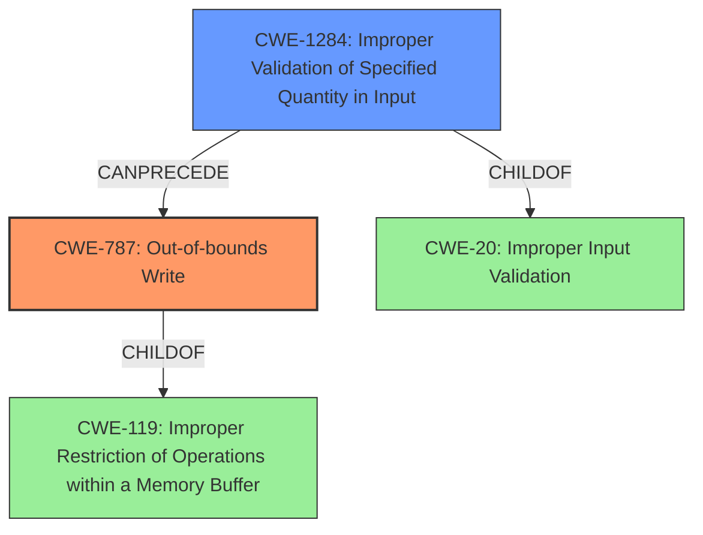

# Analysis Report for CVE-2021-0592

# Vulnerability Analysis Report: CVE-2021-0592

## Description


## Analysis (with Relationship Data)

# Summary
| CWE ID    | CWE Name                                                                                             | Confidence | CWE Abstraction Level | CWE Vulnerability Mapping Label | CWE-Vulnerability Mapping Notes |
| :---------- | :----------------------------------------------------------------------------------------------------- | :--------- | :---------------------- | :------------------------------ | :-------------------------------- |
| CWE-787   | Out-of-bounds Write                                                                                  | 1.0        | Base                    | Primary                         | Allowed                           |
| CWE-1284 | Improper Validation of Specified Quantity in Input                                                      | 0.7        | Base                    | Secondary                       | Allowed                           |

## Evidence and Confidence

*   **Confidence Score:** 0.85
*   **Evidence Strength:** HIGH

## Relationship Analysis

The primary CWE is CWE-787, Out-of-bounds Write, which is a Base level CWE. CWE-787 is child of CWE-119, Improper Restriction of Operations within a Memory Buffer.
CWE-1284, Improper Validation of Specified Quantity in Input, is included as a secondary CWE because **improper input validation** leads to the out-of-bounds write. It is also a Base level CWE, and a child of CWE-20, Improper Input Validation.



## Vulnerability Chain

The vulnerability chain starts with **improper input validation** (CWE-1284) which leads to **out of bounds writes** (CWE-787), ultimately leading to remote code execution.

## Summary of Analysis

The vulnerability description clearly states that there are possible **out of bounds writes** due to **improper input validation** in WideVine. The **rootcause** is **improper input validation** and the **weakness** is **out of bounds writes**. This leads to remote code execution.

CWE-787 (Out-of-bounds Write) is the primary CWE because the vulnerability description explicitly mentions **out of bounds writes**. CWE-1284 (Improper Validation of Specified Quantity in Input) is included as a secondary CWE because the **improper input validation** is the root cause and is a prerequisite for the **out-of-bounds write** to occur.

The retriever results also list relevant CWEs such as CWE-823 (Use of Out-of-range Pointer Offset), CWE-1284 (Improper Validation of Specified Quantity in Input), CWE-125 (Out-of-bounds Read), and CWE-20 (Improper Input Validation).

The selection of CWE-787 and CWE-1284 is at the optimal level of specificity because they are both Base level CWEs that directly address the **weakness** and **rootcause** described in the vulnerability description.

Relevant CWE Information:

# Enhanced Context (25 CWEs)

## CWE-366: Race Condition within a Thread
**Abstraction Level**: Base
**Similarity Score**: 0.78
**Source**: dense

**Description**:
If two threads of execution use a resource simultaneously, there exists the possibility that resources may be used while invalid, in turn making the state of execution undefined.

**Mapping Guidance**:
- Usage: Allowed
- Rationale: This CWE entry is at the Base level of abstraction, which is a preferred level of abstraction for mapping to the root causes of vulnerabilities.

*Not Selected*: There is no evidence of race conditions in the vulnerability description.

## CWE-662: Improper Synchronization
**Abstraction Level**: Class
**Similarity Score**: 0.78
**Source**: dense

**Description**:
The product utilizes multiple threads or processes to allow temporary access to a shared resource that can only be exclusive to one process at a time, but it does not properly synchronize these actions, which might cause simultaneous accesses of this resource by multiple threads or processes.

**Mapping Guidance**:
- Usage: Discouraged
- Rationale: This CWE entry is a level-1 Class (i.e., a child of a Pillar). It might have lower-level children that would be more appropriate

*Not Selected*: There is no evidence of synchronization issues in the vulnerability description.

## CWE-667: Improper Locking
**Abstraction Level**: Class
**Similarity Score**: 0.77
**Source**: dense

**Description**:
The product does not properly acquire or release a lock on a resource, leading to unexpected resource state changes and behaviors.

**Mapping Guidance**:
- Usage: Allowed-with-Review
- Rationale: This CWE entry is a Class and might have Base-level children that would be more appropriate

*Not Selected*: There is no evidence of locking issues in the vulnerability description.

## CWE-362: Concurrent Execution using Shared Resource with Improper Synchronization ('Race Condition')
**Abstraction Level**: Class
**Similarity Score**: 0.77
**Source**: dense

**Description**:
The product contains a concurrent code sequence that requires temporary, exclusive access to a shared resource, but a timing window exists in which the shared resource can be modified by another code sequence operating concurrently.

**Mapping Guidance**:
- Usage: Allowed-with-Review
- Rationale: This CWE entry is a Class and might have Base-level children that would be more appropriate

*Not Selected*: There is no evidence of race conditions in the vulnerability description.

## CWE-367: Time-of-check Time-of-use (TOCTOU) Race Condition
**Abstraction Level**: Base
**Similarity Score**: 0.76
**Source**: dense

**Description**:
The product checks the state of a resource before using that resource, but the resource's state can change between the check and the use in a way that invalidates the results of the check. This can cause the product to perform invalid actions when the resource is in an unexpected state.

**Mapping Guidance**:
- Usage: Allowed
- Rationale: This CWE entry is at the Base level of abstraction, which is a preferred level of abstraction for mapping to the root causes of vulnerabilities.

*Not Selected*: There is no evidence of TOCTOU race conditions in the vulnerability description.

## CWE-1289: Improper Validation of Unsafe Equivalence in Input
**Abstraction Level**: Base
**Similarity Score**: 0.75
**Source**: dense

**Description**:
The product receives an input value that is used as a resource identifier or other type of reference, but it does not validate or incorrectly validates that the input is equivalent to a potentially-unsafe value.

**Mapping Guidance**:
- Usage: Allowed
- Rationale: This CWE entry is at the Base level of abstraction, which is a preferred level of abstraction for mapping to the root causes of vulnerabilities.

*Not Selected*: There is no evidence of unsafe equivalence issues in the vulnerability description.

## CWE-404: Improper Resource Shutdown or Release
**Abstraction Level**: Class
**Similarity Score**: 0.75
**Source**: dense

**Description**:
The product does not release or incorrectly releases a resource before it is made available for re-use.

**Mapping Guidance**:
- Usage: Allowed-with-Review
- Rationale: This CWE entry is a Class and might have Base-level children that would be more appropriate

*Not Selected*: There is no evidence of resource shutdown or release issues in the vulnerability description.

## CWE-606: Unchecked Input for Loop Condition
**Abstraction Level**: Base
**Similarity Score**: 0.73
**Source**: dense

**Description**:
The product does not properly check inputs that are used for loop conditions, potentially leading to a denial of service or other consequences because of excessive looping.

**Mapping Guidance**:
- Usage: Allowed
- Rationale: This CWE entry is at the Base level of abstraction, which is a preferred level of abstraction for mapping to the root causes of vulnerabilities.

*Not Selected*: There is no evidence of loop condition issues in the vulnerability description.

## CWE-754: Improper Check for Unusual or Exceptional Conditions
**Abstraction Level**: Class
**Similarity Score**: 0.73
**Source**: dense

**Description**:
The product does not check or incorrectly checks for unusual or exceptional conditions that are not expected to occur frequently during day to day operation of the product.

**Mapping Guidance**:
- Usage: Allowed-with-Review
- Rationale: This CWE entry is a Class and might have Base-level children that would be more appropriate

*Not Selected*: There is no evidence of unusual or exceptional conditions


## CWE Relationship Analysis

Current CWEs represent these abstraction levels: .


### Vulnerability Chain Analysis

**Chain starting from CWE-823:**
- 823 (Use of Out-of-range Pointer Offset) - ROOT


**Chain starting from CWE-787:**
- 787 (Out-of-bounds Write) - ROOT


### CWE Relationship Diagram

```mermaid
graph TD
    classDef primary fill:#f96,stroke:#333,stroke-width:2px
    classDef secondary fill:#69f,stroke:#333
    classDef tertiary fill:#9e9,stroke:#333
```


*Report generated on 2025-04-01 17:21:17*
