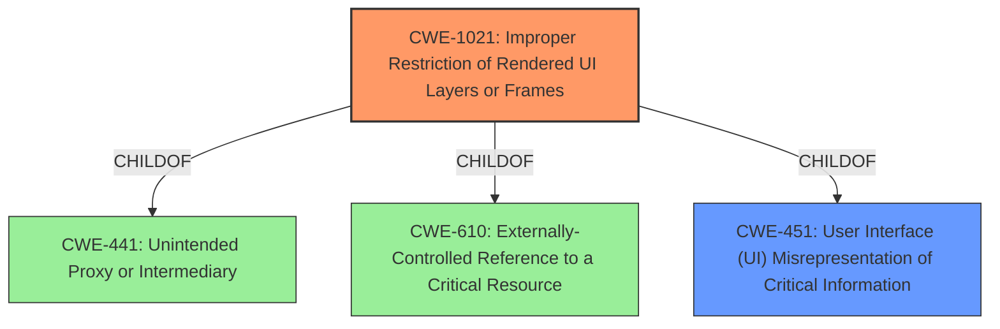

# Enhanced Analysis for CVE-2021-0603

# Summary
| CWE ID  | CWE Name                                                 | Confidence | CWE Abstraction Level | CWE Vulnerability Mapping Label | CWE-Vulnerability Mapping Notes |
| :-------- | :------------------------------------------------------- | :--------- | :---------------------- | :------------------------------ | :------------------------------ |
| CWE-1021 | Improper Restriction of Rendered UI Layers or Frames  | 0.9        | Base                    | Allowed                         | Primary CWE                     |
| CWE-451 | User Interface (UI) Misrepresentation of Critical Information | 0.6        | Class                     | Allowed-with-Review            | Secondary CWE                    |

## Evidence and Confidence

*   **Confidence Score:** 0.9
*   **Evidence Strength:** HIGH

## Relationship Analysis
The primary CWE, CWE-1021, is a Base level CWE which is ideal. It is a child of CWE-441 (Unintended Proxy or Intermediary), CWE-610 (Externally-Controlled Reference to a Critical Resource), and CWE-451 (User Interface (UI) Misrepresentation of Critical Information). CWE-451 is also considered as a secondary CWE. This shows how a UI Misrepresentation can lead to the exploitation of UI layers.



## Vulnerability Chain
The vulnerability chain starts with the **tapjacking/overlay attack** (**rootcause**), which then leads to access to contacts without permission (**impact**).
- **Tapjacking/overlay attack** -> Access to contacts without permission

## Summary of Analysis
The primary weakness is that the application does not properly restrict frame objects or UI layers that belong to another application or domain, leading to user confusion.
The **rootcause** of the vulnerability is a **tapjacking/overlay attack** that allows unauthorized access to contacts.

The vulnerability description states: "In onCreate of ContactSelectionActivity.java, there is a possible way to get access to contacts without permission due to a **tapjacking/overlay attack**. This could lead to local escalation of privilege with User execution privileges needed. User interaction is needed for exploitation."

The CVE Reference Links Content Summary states: "*   **Root Cause:** The vulnerability lies within the Contacts app. The specific code change within the provided link indicates that the vulnerability is related to the handling of contact selection overlays. The commit message "Hide non system overlays in ContactSelectionActivity" gives more context." and "*   **Weaknesses/Vulnerabilities:** The weakness here is an improper handling of system overlays within the `ContactSelectionActivity`. This could allow malicious, non-system applications to inject or display their own overlay which could mislead or interfere with the contact selection process."

Based on this information, the most accurate CWE is CWE-1021 (Improper Restriction of Rendered UI Layers or Frames). This CWE directly addresses the **tapjacking/overlay attack** by highlighting the failure to restrict frame objects or UI layers. The commit message "Hide non system overlays in ContactSelectionActivity" confirms this. CWE-1021 is a Base level CWE, which is preferable.

CWE-451 (User Interface (UI) Misrepresentation of Critical Information) is also relevant because the **tapjacking/overlay attack** involves misrepresenting the UI to the user, tricking them into performing unintended actions. However, CWE-1021 is more specific to the **rootcause** of the vulnerability, while CWE-451 describes the general impact.

I considered CWE-862 (Missing Authorization), but it is not as applicable because the vulnerability is not due to a missing authorization check but rather due to the improper handling of UI layers. The tapjacking attack bypasses the intended user interaction.

I also considered CWE-927 (Use of Implicit Intent for Sensitive Communication) and CWE-926 (Improper Export of Android Application Components), but these are more relevant to vulnerabilities related to improper intent handling and component export, respectively, which are not the primary issues in this case.

CWE-1021 is at the optimal level of specificity because it directly addresses the **rootcause** of the vulnerability, which is the improper restriction of rendered UI layers or frames. It is also a Base level CWE, which is the preferred level of abstraction.


## CWE Relationship Analysis

Current CWEs represent these abstraction levels: .


### Vulnerability Chain Analysis

**Chain starting from CWE-862:**
- 862 (Missing Authorization) - ROOT


**Chain starting from CWE-1021:**
- 1021 (Improper Restriction of Rendered UI Layers or Frames) - ROOT


### CWE Relationship Diagram

```mermaid
graph TD
    classDef primary fill:#f96,stroke:#333,stroke-width:2px
    classDef secondary fill:#69f,stroke:#333
    classDef tertiary fill:#9e9,stroke:#333
```