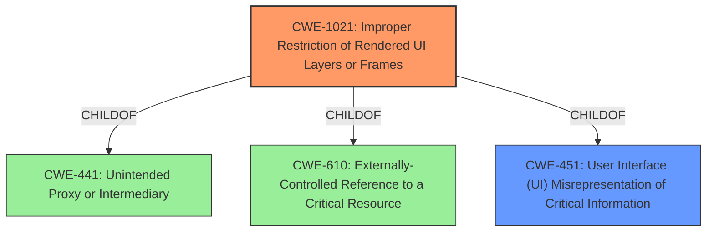

# Analysis for CVE-2021-0603

# Summary
| CWE ID  | CWE Name                                                 | Confidence | CWE Abstraction Level | CWE Vulnerability Mapping Label | CWE-Vulnerability Mapping Notes |
| :-------- | :------------------------------------------------------- | :--------- | :---------------------- | :------------------------------ | :------------------------------ |
| CWE-1021 | Improper Restriction of Rendered UI Layers or Frames  | 0.9        | Base                    | Allowed                         | Primary CWE                     |
| CWE-451 | User Interface (UI) Misrepresentation of Critical Information | 0.6        | Class                     | Allowed-with-Review            | Secondary CWE                    |

## Evidence and Confidence

*   **Confidence Score:** 0.9
*   **Evidence Strength:** HIGH

## Relationship Analysis
The primary CWE, CWE-1021, is a Base level CWE which is ideal. It is a child of CWE-441 (Unintended Proxy or Intermediary), CWE-610 (Externally-Controlled Reference to a Critical Resource), and CWE-451 (User Interface (UI) Misrepresentation of Critical Information). CWE-451 is also considered as a secondary CWE. This shows how a UI Misrepresentation can lead to the exploitation of UI layers.

## Vulnerability Chain
The vulnerability chain starts with the **tapjacking/overlay attack** (**rootcause**), which then leads to access to contacts without permission (**impact**).
- **Tapjacking/overlay attack** -> Access to contacts without permission

## Summary of Analysis
The primary weakness is that the application does not properly restrict frame objects or UI layers that belong to another application or domain, leading to user confusion.
The **rootcause** of the vulnerability is a **tapjacking/overlay attack** that allows unauthorized access to contacts.

The vulnerability description states: "In onCreate of ContactSelectionActivity.java, there is a possible way to get access to contacts without permission due to a **tapjacking/overlay attack**. This could lead to local escalation of privilege with User execution privileges needed. User interaction is needed for exploitation."

The CVE Reference Links Content Summary states: "*   **Root Cause:** The vulnerability lies within the Contacts app. The specific code change within the provided link indicates that the vulnerability is related to the handling of contact selection overlays. The commit message "Hide non system overlays in ContactSelectionActivity" gives more context." and "*   **Weaknesses/Vulnerabilities:** The weakness here is an improper handling of system overlays within the `ContactSelectionActivity`. This could allow malicious, non-system applications to inject or display their own overlay which could mislead or interfere with the contact selection process."

Based on this information, the most accurate CWE is CWE-1021 (Improper Restriction of Rendered UI Layers or Frames). This CWE directly addresses the **tapjacking/overlay attack** by highlighting the failure to restrict frame objects or UI layers. The commit message "Hide non system overlays in ContactSelectionActivity" confirms this. CWE-1021 is a Base level CWE, which is preferable.

CWE-451 (User Interface (UI) Misrepresentation of Critical Information) is also relevant because the **tapjacking/overlay attack** involves misrepresenting the UI to the user, tricking them into performing unintended actions. However, CWE-1021 is more specific to the **rootcause** of the vulnerability, while CWE-451 describes the general impact.

I considered CWE-862 (Missing Authorization), but it is not as applicable because the vulnerability is not due to a missing authorization check but rather due to the improper handling of UI layers. The tapjacking attack bypasses the intended user interaction.

I also considered CWE-927 (Use of Implicit Intent for Sensitive Communication) and CWE-926 (Improper Export of Android Application Components), but these are more relevant to vulnerabilities related to improper intent handling and component export, respectively, which are not the primary issues in this case.

CWE-1021 is at the optimal level of specificity because it directly addresses the **rootcause** of the vulnerability, which is the improper restriction of rendered UI layers or frames. It is also a Base level CWE, which is the preferred level of abstraction.

# Enhanced Query for CVE-2021-0603

## Vulnerability Description
In onCreate of ContactSelectionActivity.java, there is a possible way to get access to contacts without permission due to a **tapjacking/overlay attack**. This could lead to local escalation of privilege with User execution privileges needed. User interaction is needed for exploitation.Product AndroidVersions Android-11Android ID A-182809425

### Vulnerability Description Key Phrases
- **rootcause:** **tapjacking/overlay attack**
- **impact:** get access to contacts without permission
- **product:** Android
- **version:** Android-11
- **component:** onCreate of ContactSelectionActivity.java

## CVE Reference Links Content Summary
Based on the provided information, here's an analysis of CVE-2021-0603:

**Verification:**

The provided content includes a reference to `CVE-2021-0603` and `A-182809425`. The CVE description mentions a vulnerability in the `Contacts` app, which aligns with the AOSP link provided: `https://android.googlesource.com/platform/packages/apps/Contacts/%2B/19ff4ed838d4ec83cd10eeac80878205f8817e69`. Therefore, the content is related to the specified CVE.

**Vulnerability Details:**

*   **Root Cause:** The vulnerability lies within the Contacts app. The specific code change within the provided link indicates that the vulnerability is related to the handling of contact selection overlays. The commit message "Hide non system overlays in ContactSelectionActivity" gives more context. 

*   **Weaknesses/Vulnerabilities:** The weakness here is an improper handling of system overlays within the `ContactSelectionActivity`. This could allow malicious, non-system applications to inject or display their own overlay which could mislead or interfere with the contact selection process.

*  **Impact of Exploitation:** An attacker can potentially bypass user interaction requirements in order to gain access to additional permissions. A malicious app could inject an overlay during contact selection to mislead the user to select a contact they didn't intend to, which could lead to data exposure or other malicious actions depending on the permissions of the app.

*   **Attack Vectors:** A local attacker with a malicious application installed on the device could exploit this vulnerability.

*   **Required Attacker Capabilities/Position:** The attacker would need to have a malicious application installed on the device with the ability to inject system overlays.

**Additional Notes:**
* The commit message and code diff from the provided link on android.googlesource.com reveals the vulnerability was due to the fact that non-system overlays were being displayed in the `ContactSelectionActivity`. This was addressed by hiding the non-system overlays.
* This vulnerability is classified as an Elevation of Privilege (EoP) and has a high severity rating.

## Retriever Results

### Top Combined Results

| Rank | CWE ID | Name | Abstraction | Usage  | Retrievers | Individual Scores |
|------|--------|------|-------------|-------|------------|-------------------|
| 1 | 1021 | Improper Restriction of Rendered UI Layers or Frames | Base | Allowed | alternate_terms | 1.000 |
| 2 | 862 | Missing Authorization | Class | Allowed-with-Review | sparse | 0.399 |
| 3 | 223 | Omission of Security-relevant Information | Base | Allowed | sparse | 0.367 |
| 4 | 514 | Covert Channel | Class | Allowed-with-Review | sparse | 0.352 |
| 5 | 927 | Use of Implicit Intent for Sensitive Communication | Variant | Allowed | sparse | 0.347 |
| 6 | 926 | Improper Export of Android Application Components | Variant | Allowed | dense | 0.523 |
| 7 | 205 | Observable Behavioral Discrepancy | Base | Allowed | graph | 0.002 |
| 8 | 732 | Incorrect Permission Assignment for Critical Resource | Class | Allowed-with-Review | sparse | 0.346 |
| 9 | 451 | User Interface (UI) Misrepresentation of Critical Information | Class | Allowed-with-Review | sparse | 0.340 |
| 10 | 667 | Improper Locking | Class | Allowed-with-Review | sparse | 0.337 |

# Complete CWE Specifications

## CWE-1021: Improper Restriction of Rendered UI Layers or Frames
**Abstraction:** Base
**Status:** Incomplete

### Description
The web application does not restrict or incorrectly restricts frame objects or UI layers that belong to another application or domain, which can lead to user confusion about which interface the user is interacting with.

### Extended Description
A web application is expected to place restrictions on whether it is allowed to be rendered within frames, iframes, objects, embed or applet elements. Without the restrictions, users can be tricked into interacting with the application when they were not intending to.

### Alternative Terms
Clickjacking
UI Redress Attack
Tapjacking: "Tapjacking" is similar to clickjacking, except it is used for mobile applications in which the user "taps" the application instead of performing a mouse click.

### Relationships
ChildOf -> CWE-441
ChildOf -> CWE-610
ChildOf -> CWE-451

### Mapping Guidance
**Usage:** Allowed
**Rationale:** This CWE entry is at the Base level of abstraction, which is a preferred level of abstraction for mapping to the root causes of vulnerabilities.
**Comments:** Carefully read both the name and description to ensure that this mapping is an appropriate fit. Do not try to 'force' a mapping to a lower-level Base/Variant simply to comply with this preferred level of abstraction.
**Reasons:**
- Acceptable-Use

### Observed Examples
- **CVE-2017-7440:** E-mail preview feature in a desktop application allows clickjacking attacks via a crafted e-mail message
- **CVE-2017-5697:** Hardware/firmware product has insufficient clickjacking protection in its web user interface
- **CVE-2017-4015:** Clickjacking in data-loss prevention product via HTTP response header.

## CWE-862: Missing Authorization
**Abstraction:** Class
**Status:** Incomplete

### Description
The product does not perform an authorization check when an actor attempts to access a resource or perform an action.

### Extended Description
Not provided

### Alternative Terms
AuthZ: "AuthZ" is typically used as an abbreviation of "authorization" within the web application security community. It is distinct from "AuthN" (or, sometimes, "AuthC") which is an abbreviation of "authentication." The use of "Auth" as an abbreviation is discouraged, since it could be used for either authentication or authorization.

### Relationships
ChildOf -> CWE-285
ChildOf -> CWE-284

### Mapping Guidance
**Usage:** Allowed-with-Review
**Rationale:** This CWE entry is a Class and might have Base-level children that would be more appropriate
**Comments:** Examine children of this entry to see if there is a better fit
**Reasons:**
- Abstraction

### Additional Notes
**[Terminology]** Assuming a user with a given identity, authorization is the process of determining whether that user can access a given resource, based on the user's privileges and any permissions or other access-control specifications that apply to the resource.

### Observed Examples
- **CVE-2022-24730:** Go-based continuous deployment product does not check that a user has certain privileges to update or create an app, allowing adversaries to read sensitive repository information
- **CVE-2009-3168:** Web application does not restrict access to admin scripts, allowing authenticated users to reset administrative passwords.
- **CVE-2009-3597:** Web application stores database file under the web root with insufficient access control (CWE-219), allowing direct request.

## CWE-223: Omission of Security-relevant Information
**Abstraction:** Base
**Status:** Draft

### Description
The product does not record or display information that would be important for identifying the source or nature of an attack, or determining if an action is safe.

### Extended Description
Not provided

### Alternative Terms
None

### Relationships
ChildOf -> CWE-221

### Mapping Guidance
**Usage:** Allowed
**Rationale:** This CWE entry is at the Base level of abstraction, which is a preferred level of abstraction for mapping to the root causes of vulnerabilities.
**Comments:** Carefully read both the name and description to ensure that this mapping is an appropriate fit. Do not try to 'force' a mapping to a lower-level Base/Variant simply to comply with this preferred level of abstraction.
**Reasons:**
- Acceptable-Use

### Observed Examples
- **CVE-1999-1029:** Login attempts are not recorded if the user disconnects before the maximum number of tries.
- **CVE-2002-1839:** Sender's IP address not recorded in outgoing e-mail.
- **CVE-2000-0542:** Failed authentication attempts are not recorded if later attempt succeeds.

## CWE-514: Covert Channel
**Abstraction:** Class
**Status:** Incomplete

### Description
A covert channel is a path that can be used to transfer information in a way not intended by the system's designers.

### Extended Description
Typically the system has not given authorization for the transmission and has no knowledge of its occurrence.

### Alternative Terms
None

### Relationships
ChildOf -> CWE-1229

### Mapping Guidance
**Usage:** Allowed-with-Review
**Rationale:** This CWE entry is a Class and might have Base-level children that would be more appropriate
**Comments:** Examine children of this entry to see if there is a better fit
**Reasons:**
- Abstraction

### Additional Notes
**[Theoretical]** A covert channel can be thought of as an emergent resource, meaning that it was not an originally intended resource, however it exists due the application's behaviors.

**[Maintenance]** As of CWE 4.9, members of the CWE Hardware SIG are working to improve CWE's coverage of transient execution weaknesses, which include issues related to Spectre, Meltdown, and other attacks that create or exploit covert channels. As a result of that work, this entry might change in CWE 4.10.

## CWE-927: Use of Implicit Intent for Sensitive Communication
**Abstraction:** Variant
**Status:** Incomplete

### Description
The Android application uses an implicit intent for transmitting sensitive data to other applications.

### Extended Description

Since an implicit intent does not specify a particular application to receive the data, any application can process the intent by using an Intent Filter for that intent. This can allow untrusted applications to obtain sensitive data. There are two variations on the standard broadcast intent, ordered and sticky.

Ordered broadcast intents are delivered to a series of registered receivers in order of priority as declared by the Receivers. A malicious receiver can give itself a high priority and cause a denial of service by stopping the broadcast from propagating further down the chain. There is also the possibility of malicious data modification, as a receiver may also alter the data within the Intent before passing it on to the next receiver. The downstream components have no way of asserting that the data has not been altered earlier in the chain.

Sticky broadcast intents remain accessible after the initial broadcast. An old sticky intent will be broadcast again to any new receivers that register for it in the future, greatly increasing the chances of information exposure over time. Also, sticky broadcasts cannot be protected by permissions that may apply to other kinds of intents.

In addition, any broadcast intent may include a URI that references data that the receiving component does not normally have the privileges to access. The sender of the intent can include special privileges that grant the receiver read or write access to the specific URI included in the intent. A malicious receiver that intercepts this intent will also gain those privileges and be able to read or write the resource at the specified URI.

### Alternative Terms
None

### Relationships
ChildOf -> CWE-285
ChildOf -> CWE-668

### Mapping Guidance
**Usage:** Allowed
**Rationale:** This CWE entry is at the Variant level of abstraction, which is a preferred level of abstraction for mapping to the root causes of vulnerabilities.
**Comments:** Carefully read both the name and description to ensure that this mapping is an appropriate fit. Do not try to 'force' a mapping to a lower-level Base/Variant simply to comply with this preferred level of abstraction.
**Reasons:**
- Acceptable-Use

### Observed Examples
- **CVE-2022-4903:** An Android application does not use FLAG_IMMUTABLE when creating a PendingIntent.

## CWE-926: Improper Export of Android Application Components
**Abstraction:** Variant
**Status:** Incomplete

### Description
The Android application exports a component for use by other applications, but does not properly restrict which applications can launch the component or access the data it contains.

### Extended Description

The attacks and consequences of improperly exporting a component may depend on the exported component:

  - If access to an exported Activity is not restricted, any application will be able to launch the activity. This may allow a malicious application to gain access to sensitive information, modify the internal state of the application, or trick a user into interacting with the victim application while believing they are still interacting with the malicious application.

  - If access to an exported Service is not restricted, any application may start and bind to the Service. Depending on the exposed functionality, this may allow a malicious application to perform unauthorized actions, gain access to sensitive information, or corrupt the internal state of the application.

  - If access to a Content Provider is not restricted to only the expected applications, then malicious applications might be able to access the sensitive data. Note that in Android before 4.2, the Content Provider is automatically exported unless it has been explicitly declared as NOT exported.

### Alternative Terms
None

### Relationships
ChildOf -> CWE-285

### Mapping Guidance
**Usage:** Allowed
**Rationale:** This CWE entry is at the Variant level of abstraction, which is a preferred level of abstraction for mapping to the root causes of vulnerabilities.
**Comments:** Carefully read both the name and description to ensure that this mapping is an appropriate fit. Do not try to 'force' a mapping to a lower-level Base/Variant simply to comply with this preferred level of abstraction.
**Reasons:**
- Acceptable-Use

## CWE-205: Observable Behavioral Discrepancy
**Abstraction:** Base
**Status:** Incomplete

### Description
The product's behaviors indicate important differences that may be observed by unauthorized actors in a way that reveals (1) its internal state or decision process, or (2) differences from other products with equivalent functionality.

### Extended Description
Ideally, a product should provide as little information about its internal operations as possible. Otherwise, attackers could use knowledge of these internal operations to simplify or optimize their attack. In some cases, behavioral discrepancies can be used by attackers to form a side channel.

### Alternative Terms
None

### Relationships
ChildOf -> CWE-203
CanPrecede -> CWE-514

### Mapping Guidance
**Usage:** Allowed
**Rationale:** This CWE entry is at the Base level of abstraction, which is a preferred level of abstraction for mapping to the root causes of vulnerabilities.
**Comments:** Carefully read both the name and description to ensure that this mapping is an appropriate fit. Do not try to 'force' a mapping to a lower-level Base/Variant simply to comply with this preferred level of abstraction.
**Reasons:**
- Acceptable-Use

### Observed Examples
- **CVE-2002-0208:** Product modifies TCP/IP stack and ICMP error messages in unusual ways that show the product is in use.
- **CVE-2004-2252:** Behavioral infoleak by responding to SYN-FIN packets.

## CWE-732: Incorrect Permission Assignment for Critical Resource
**Abstraction:** Class
**Status:** Draft

### Description
The product specifies permissions for a security-critical resource in a way that allows that resource to be read or modified by unintended actors.

### Extended Description
When a resource is given a permission setting that provides access to a wider range of actors than required, it could lead to the exposure of sensitive information, or the modification of that resource by unintended parties. This is especially dangerous when the resource is related to program configuration, execution, or sensitive user data. For example, consider a misconfigured storage account for the cloud that can be read or written by a public or anonymous user.

### Alternative Terms
None

### Relationships
ChildOf -> CWE-285
ChildOf -> CWE-668

### Mapping Guidance
**Usage:** Allowed-with-Review
**Rationale:** While the name itself indicates an assignment of permissions for resources, this is often misused for vulnerabilities in which "permissions" are not checked, which is an "authorization" weakness (CWE-285 or descendants) within CWE's model [REF-1287].
**Comments:** Closely analyze the specific mistake that is allowing the resource to be exposed, and perform a CWE mapping for that mistake.
**Reasons:**
- Frequent Misuse

### Additional Notes
**[Maintenance]** The relationships between privileges, permissions, and actors (e.g. users and groups) need further refinement within the Research view. One complication is that these concepts apply to two different pillars, related to control of resources (CWE-664) and protection mechanism failures (CWE-693).

### Observed Examples
- **CVE-2022-29527:** Go application for cloud management creates a world-writable sudoers file that allows local attackers to inject sudo rules and escalate privileges to root by winning a race condition.
- **CVE-2009-3482:** Anti-virus product sets insecure "Everyone: Full Control" permissions for files under the "Program Files" folder, allowing attackers to replace executables with Trojan horses.
- **CVE-2009-3897:** Product creates directories with 0777 permissions at installation, allowing users to gain privileges and access a socket used for authentication.

## CWE-451: User Interface (UI) Misrepresentation of Critical Information
**Abstraction:** Class
**Status:** Draft

### Description
The user interface (UI) does not properly represent critical information to the user, allowing the information - or its source - to be obscured or spoofed. This is often a component in phishing attacks.

### Extended Description

If an attacker can cause the UI to display erroneous data, or to otherwise convince the user to display information that appears to come from a trusted source, then the attacker could trick the user into performing the wrong action. This is often a component in phishing attacks, but other kinds of problems exist. For example, if the UI is used to monitor the security state of a system or network, then omitting or obscuring an important indicator could prevent the user from detecting and reacting to a security-critical event.

UI misrepresentation can take many forms:

  - Incorrect indicator: incorrect information is displayed, which prevents the user from understanding the true state of the product or the environment the product is monitoring, especially of potentially-dangerous conditions or operations. This can be broken down into several different subtypes.

  - Overlay: an area of the display is intended to give critical information, but another process can modify the display by overlaying another element on top of it. The user is not interacting with the expected portion of the user interface. This is the problem that enables clickjacking attacks, although many other types of attacks exist that involve overlay.

  - Icon manipulation: the wrong icon, or the wrong color indicator, can be influenced (such as making a dangerous .EXE executable look like a harmless .GIF)

  - Timing: the product is performing a state transition or context switch that is presented to the user with an indicator, but a race condition can cause the wrong indicator to be used before the product has fully switched context. The race window could be extended indefinitely if the attacker can trigger an error.

  - Visual truncation: important information could be truncated from the display, such as a long filename with a dangerous extension that is not displayed in the GUI because the malicious portion is truncated. The use of excessive whitespace can also cause truncation, or place the potentially-dangerous indicator outside of the user's field of view (e.g. "filename.txt .exe"). A different type of truncation can occur when a portion of the information is removed due to reasons other than length, such as the accidental insertion of an end-of-input marker in the middle of an input, such as a NUL byte in a C-style string.

  - Visual distinction: visual information might be presented in a way that makes it difficult for the user to quickly and correctly distinguish between critical and unimportant segments of the display.

  - Homographs: letters from different character sets, fonts, or languages can appear very similar (i.e. may be visually equivalent) in a way that causes the human user to misread the text (for example, to conduct phishing attacks to trick a user into visiting a malicious web site with a visually-similar name as a trusted site). This can be regarded as a type of visual distinction issue.

### Alternative Terms
None

### Relationships
ChildOf -> CWE-684
ChildOf -> CWE-221
PeerOf -> CWE-346

### Mapping Guidance
**Usage:** Allowed-with-Review
**Rationale:** This CWE entry is a Class and might have Base-level children that would be more appropriate
**Comments:** Examine children of this entry to see if there is a better fit
**Reasons:**
- Abstraction

### Additional Notes
**[Maintenance]** This entry should be broken down into more precise entries. See extended description.

**[Research Gap]** Misrepresentation problems are frequently studied in web browsers, but there are no known efforts for classifying these kinds of problems in terms of the shortcomings of the interface. In addition, many misrepresentation issues are resultant.

### Observed Examples
- **CVE-2004-2227:** Web browser's filename selection dialog only shows the beginning portion of long filenames, which can trick users into launching executables with dangerous extensions.
- **CVE-2001-0398:** Attachment with many spaces in filename bypasses "dangerous content" warning and uses different icon. Likely resultant.
- **CVE-2001-0643:** Misrepresentation and equivalence issue.

## CWE-667: Improper Locking
**Abstraction:** Class
**Status:** Draft

### Description
The product does not properly acquire or release a lock on a resource, leading to unexpected resource state changes and behaviors.

### Extended Description

Locking is a type of synchronization behavior that ensures that multiple independently-operating processes or threads do not interfere with each other when accessing the same resource. All processes/threads are expected to follow the same steps for locking. If these steps are not followed precisely - or if no locking is done at all - then another process/thread could modify the shared resource in a way that is not visible or predictable to the original process. This can lead to data or memory corruption, denial of service, etc.

### Alternative Terms
None

### Relationships
ChildOf -> CWE-662
ChildOf -> CWE-662
ChildOf -> CWE-662
ChildOf -> CWE-662

### Mapping Guidance
**Usage:** Allowed-with-Review
**Rationale:** This CWE entry is a Class and might have Base-level children that would be more appropriate
**Comments:** Examine children of this entry to see if there is a better fit
**Reasons:**
- Abstraction

### Additional Notes
**[Maintenance]** Deeper research is necessary for synchronization and related mechanisms, including locks, mutexes, semaphores, and other mechanisms. Multiple entries are dependent on this research, which includes relationships to concurrency, race conditions, reentrant functions, etc. CWE-662 and its children - including CWE-667, CWE-820, CWE-821, and others - may need to be modified significantly, along with their relationships.

### Observed Examples
- **CVE-2021-1782:** Chain: improper locking (CWE-667) leads to race condition (CWE-362), as exploited in the wild per CISA KEV.
- **CVE-2009-0935:** Attacker provides invalid address to a memory-reading function, causing a mutex to be unlocked twice
- **CVE-2010-4210:** function in OS kernel unlocks a mutex that was not previously locked, causing a panic or overwrite of arbitrary memory.

