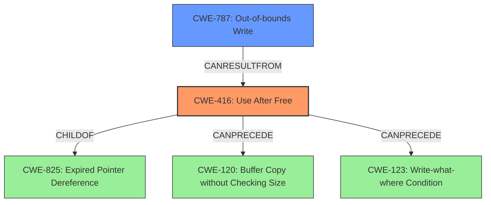

# Analysis for CVE-2021-0611

# Summary
| CWE ID | CWE Name | Confidence | CWE Abstraction Level | CWE Vulnerability Mapping Label | CWE-Vulnerability Mapping Notes |
|---|---|---|---|---|---|
| CWE-416 | Use After Free | 1.0 | Variant | Allowed | Primary CWE |
| CWE-787 | Out-of-bounds Write | 0.7 | Base | Allowed | Secondary Candidate |

## Evidence and Confidence

*   **Confidence Score:** 0.9
*   **Evidence Strength:** HIGH

## Relationship Analysis
The primary CWE is CWE-416, which is a Variant of CWE-825 (Expired Pointer Dereference). CWE-416 can also precede CWE-120 (Buffer Copy without Checking Size) and CWE-123 (Write-what-where Condition). CWE-787 is a base CWE that can result from CWE-416.

## Vulnerability Chain
The vulnerability chain starts with a **use after free** (CWE-416), which can lead to **memory corruption**. This **memory corruption** can then potentially lead to an out-of-bounds write (CWE-787) if the freed memory is reallocated and subsequently overwritten.

## Summary of Analysis
The vulnerability description clearly indicates a **use after free** condition in the m4u component, which leads to **memory corruption** and local escalation of privilege. The primary CWE is therefore CWE-416 (Use After Free), as it directly reflects the **root cause** of the vulnerability. The description from the "CVE Reference Links Content Summary" states: "**Root cause of vulnerability:** A use-after-free vulnerability exists in the m4u (memory management unit) component." and "**Weaknesses/vulnerabilities present:** Use-after-free (CWE-416)."

CWE-787 (Out-of-bounds Write) is considered as a secondary candidate because a use-after-free can lead to memory corruption by overwriting the freed memory. While the vulnerability description mentions **memory corruption**, it does not explicitly state an out-of-bounds write. Thus, CWE-787 is a potential consequence of the use-after-free, but not the primary weakness.

The choice of CWE-416 is based on the explicit mention of "use after free" in both the vulnerability description and the CVE reference summary. The retriever results also list CWE-416 as a relevant CWE. The mapping guidance for CWE-416 allows its use at the Variant level of abstraction.

Other CWEs were considered but ultimately not selected as primary candidates. CWE-662 and CWE-667 (Improper Synchronization and Locking) were considered due to the concurrent nature of memory management, but the primary issue is the use of freed memory, not a synchronization problem. CWE-1260 (Improper Handling of Overlap Between Protected Memory Ranges) was considered, but the description does not indicate any issues with overlapping memory regions. CWE-123 (Write-what-where Condition) and CWE-131 (Incorrect Calculation of Buffer Size) were also considered, but the description does not provide enough evidence to support these. CWE-908 (Use of Uninitialized Resource) and CWE-665 (Improper Initialization) are not applicable because the memory was freed, not uninitialized.