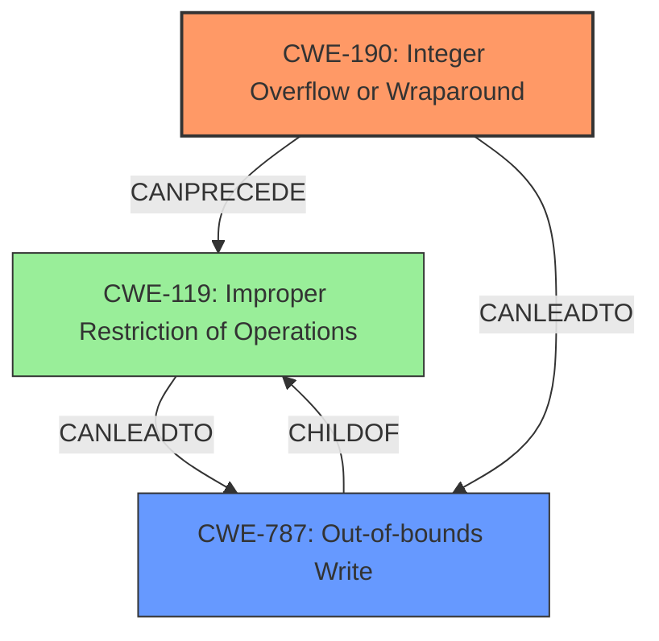

# Analysis Report for CVE-2021-0627

# Vulnerability Analysis Report: CVE-2021-0627

## Description


## Analysis (with Relationship Data)

# Summary
| CWE ID | CWE Name | Confidence | CWE Abstraction Level | CWE Vulnerability Mapping Label | CWE-Vulnerability Mapping Notes |
|---|---|---|---|---|---|
| CWE-190 | Integer Overflow or Wraparound | 1.0 | Base | Primary | Allowed |
| CWE-787 | Out-of-bounds Write | 0.7 | Base | Secondary | Allowed |

## Evidence and Confidence

*   **Confidence Score:** 0.85
*   **Evidence Strength:** HIGH

## Relationship Analysis
The primary CWE is CWE-190, which can lead to other issues like buffer overflows (CWE-119) and out-of-bounds writes (CWE-787). CWE-190 is a base-level CWE, making it a good fit for the **root cause**. CWE-787 is a consequence of the overflow, leading to **memory corruption**.



## Vulnerability Chain
The vulnerability chain starts with an **integer overflow** (CWE-190), which then leads to **memory corruption**, specifically an out-of-bounds write (CWE-787).

## Summary of Analysis
The analysis indicates that the **root cause** of the vulnerability is an **integer overflow** (CWE-190) that results in **memory corruption** via an out-of-bounds write (CWE-787). The description mentions, "In OMA DRM, there is a possible **memory corruption** due to an **integer overflow**." The CVE Reference Links Content Summary also confirms this: "Root cause: Integer overflow in OMA DRM" and "Weaknesses: CWE-190 Integer Overflow or Wraparound".

CWE-190 is selected as the primary CWE because it represents the **root cause** of the vulnerability. CWE-787 is included as a secondary CWE because it is the direct consequence of the **integer overflow**, leading to **memory corruption**.

Other CWEs considered but not chosen:

*   CWE-131 (Incorrect Calculation of Buffer Size): While an **integer overflow** could lead to an incorrect buffer size calculation, the description doesn't explicitly state this. Therefore, it's not as directly supported by the evidence as CWE-190 and CWE-787.
*   CWE-704 (Incorrect Type Conversion or Cast): This is not the primary issue, although type conversion could be a factor leading to the overflow, the description focuses on the overflow itself.
*   CWE-191 (Integer Underflow): The description mentions an overflow, not an underflow.
*   CWE-1260 (Improper Handling of Overlap Between Protected Memory Ranges): This is not directly related to the vulnerability description.
*   CWE-128 (Wrap-around Error): This is closely related to CWE-190, but CWE-190 is more specific to the **integer overflow** condition described.
*   CWE-662 (Improper Synchronization) and CWE-667 (Improper Locking): These are related to concurrent access and locking, which are not mentioned in the vulnerability description.
*   CWE-908 (Use of Uninitialized Resource): This is not related to the vulnerability description.

The chosen CWEs are at the optimal level of specificity because they directly address the **root cause** (**integer overflow**) and its immediate consequence (**memory corruption** via out-of-bounds write). The evidence strongly supports these classifications, and the relationship analysis helps to understand the chain of events.


## CWE Relationship Analysis

Current CWEs represent these abstraction levels: .


### Vulnerability Chain Analysis

**Chain starting from CWE-667:**
- 667 (Improper Locking) - ROOT


**Chain starting from CWE-787:**
- 787 (Out-of-bounds Write) - ROOT


### CWE Relationship Diagram

```mermaid
graph TD
    classDef primary fill:#f96,stroke:#333,stroke-width:2px
    classDef secondary fill:#69f,stroke:#333
    classDef tertiary fill:#9e9,stroke:#333
```


*Report generated on 2025-04-02 03:04:32*
