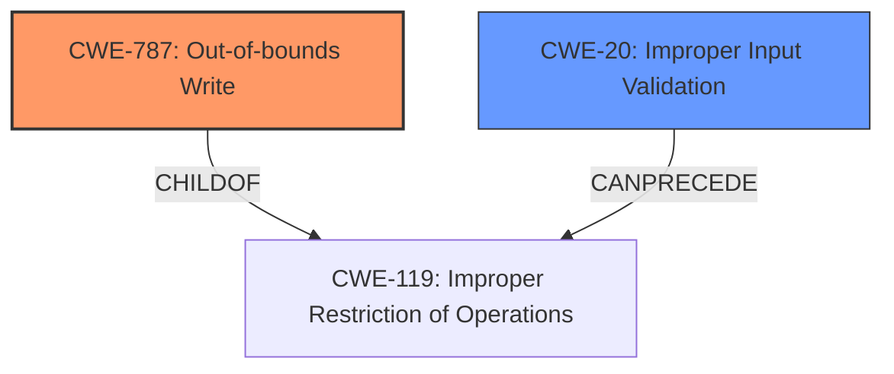

# Raw Analyzer Response for CVE-2021-0628

# Summary
| CWE ID | CWE Name | Confidence | CWE Abstraction Level | CWE Vulnerability Mapping Label | CWE-Vulnerability Mapping Notes |
|---|---|---|---|---|---|
| CWE-787 | Out-of-bounds Write | 0.9 | Base | Allowed | Primary CWE. Matches the **memory corruption** weakness. |
| CWE-20 | Improper Input Validation | 0.7 | Class | Discouraged | Secondary CWE. Matches the **improper input validation** root cause. |

## Evidence and Confidence

*   **Confidence Score:** 0.8
*   **Evidence Strength:** HIGH

## Relationship Analysis
The primary CWE is CWE-787, which is a base-level CWE indicating an out-of-bounds write. This is directly related to the reported **memory corruption**. CWE-787 is a child of CWE-119 (Improper Restriction of Operations within the Bounds of a Memory Buffer). The root cause, **improper input validation**, is mapped to CWE-20, which is a class-level CWE. CWE-20 can precede CWE-119, indicating that the **improper input validation** could lead to an out-of-bounds write.

## Vulnerability Chain
The vulnerability chain starts with **improper input validation** (CWE-20), leading to a **memory corruption** due to an out-of-bounds write (CWE-787). This can then lead to local escalation of privilege.

## Summary of Analysis
The vulnerability description clearly states **memory corruption** due to **improper input validation**. The CVE reference links content summary further reinforces this by stating the root cause as **improper input validation** leading to memory corruption.

The primary weakness is **memory corruption**, best represented by CWE-787 (Out-of-bounds Write), which has a high retriever score and is a base-level CWE. The root cause, **improper input validation**, is mapped to CWE-20. While CWE-20 is discouraged, it accurately reflects the root cause as stated in the vulnerability description and CVE summary.

The relationship graph shows that CWE-20 can precede CWE-119, a parent of CWE-787. This supports the chain of events where **improper input validation** leads to out-of-bounds write and **memory corruption**.

The selection of CWE-787 and CWE-20 is based on the provided evidence and their relationships. CWE-787 accurately represents the **memory corruption** weakness, while CWE-20 represents the **improper input validation** root cause. While CWE-20 is a class-level CWE and is discouraged, it's important to include the root cause in this case, as it is explicitly mentioned in the vulnerability description and CVE summary.

Relevant CWE Information:

# Enhanced Context (25 CWEs)
The following CWEs were identified as potentially relevant to this vulnerability:

## CWE-131: Incorrect Calculation of Buffer Size
**Abstraction Level**: Base
The **improper input validation** could cause this but the root cause is still the input validation and the effect is the out-of-bounds write.

## CWE-667: Improper Locking
**Abstraction Level**: Class
This is not relevant because there is no mention of locking issues.

## CWE-662: Improper Synchronization
**Abstraction Level**: Class
This is not relevant because there is no mention of synchronization issues.

## CWE-404: Improper Resource Shutdown or Release
**Abstraction Level**: Class
This is not relevant because there is no mention of resource shutdown/release issues.

## CWE-682: Incorrect Calculation
**Abstraction Level**: Pillar
This could be related to the size calculation based on the input, but the description does not directly state it.

## CWE-1289: Improper Validation of Unsafe Equivalence in Input
**Abstraction Level**: Base
This is a possible variant of CWE-20 since the **improper input validation** could be related to unsafe equivalence. However, without specific details, CWE-20 is more appropriate.

## CWE-665: Improper Initialization
**Abstraction Level**: Class
This is not relevant as there is no mention of initialization issues.

## CWE-226: Sensitive Information in Resource Not Removed Before Reuse
**Abstraction Level**: Base
This is not relevant as there is no mention of resource reuse without removing sensitive information.

## CWE-191: Integer Underflow (Wrap or Wraparound)
**Abstraction Level**: Base
This is not directly indicated in the description, although it could be a contributing factor to the **memory corruption** if the input validation is not correctly checking the sizes.

## CWE-805: Buffer Access with Incorrect Length Value
**Abstraction Level**: Base
This could be a consequence of the **improper input validation**, but CWE-787 (Out-of-bounds Write) is more direct and appropriate.

## CWE-667: Improper Locking
**Abstraction Level**: Class
This is not relevant.

## CWE-662: Improper Synchronization
**Abstraction Level**: Class
This is not relevant.

## CWE-362: Concurrent Execution using Shared Resource with Improper Synchronization ('Race Condition')
**Abstraction Level**: Class
This is not relevant as concurrency is not mentioned.

## CWE-367: Time-of-check Time-of-use (TOCTOU) Race Condition
**Abstraction Level**: Base
This is not relevant.

## CWE-190: Integer Overflow or Wraparound
**Abstraction Level**: Base
This is not directly indicated in the description, although it could be a contributing factor to the **memory corruption** if the input validation is not correctly checking the sizes.

## CWE-41: Improper Resolution of Path Equivalence
**Abstraction Level**: base
Not Relevant

## CWE-787: Out-of-bounds Write
**Abstraction Level**: base
This is the primary weakness.

## CWE-822: Untrusted Pointer Dereference
**Abstraction Level**: base
Not Relevant

## CWE-1260: Improper Handling of Overlap Between Protected Memory Ranges
**Abstraction Level**: base
Not Relevant

## CWE-190: Integer Overflow or Wraparound
**Abstraction Level**: base
This is not directly indicated in the description, although it could be a contributing factor to the **memory corruption** if the input validation is not correctly checking the sizes.

## CWE-22: Improper Limitation of a Pathname to a Restricted Directory ('Path Traversal')
**Abstraction Level**: base
Not Relevant

## CWE-770: Allocation of Resources Without Limits or Throttling
**Abstraction Level**: base
Not Relevant

## CWE-73: External Control of File Name or Path
**Abstraction Level**: base
Not Relevant

## CWE-1284: Improper Validation of Specified Quantity in Input
**Abstraction Level**: base
A more specific CWE for input validation but still requires more details.

## CWE-476: NULL Pointer Dereference
**Abstraction Level**: base
Not Relevant