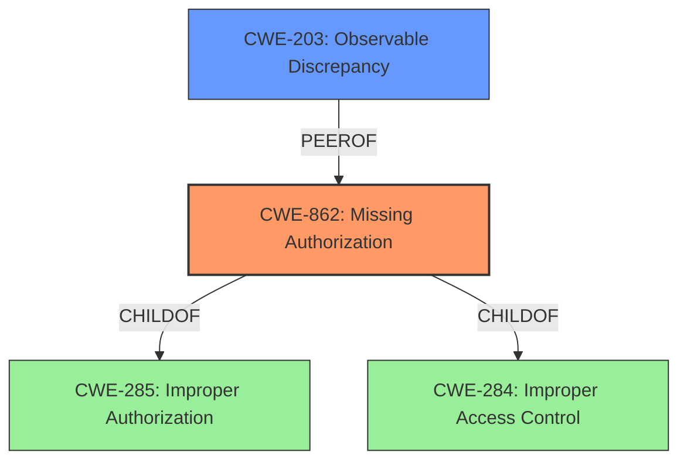

# Analysis Report for CVE-2021-0643

# Vulnerability Analysis Report: CVE-2021-0643

## Description


## Analysis (with Relationship Data)

# Summary
| CWE ID | CWE Name | Confidence | CWE Abstraction Level | CWE Vulnerability Mapping Label | CWE-Vulnerability Mapping Notes |
|---|---|---|---|---|---|
| CWE-862 | Missing Authorization | 0.9 | Class | Allowed-with-Review | Primary CWE. The product does not perform an authorization check when an actor attempts to access a resource or perform an action. |
| CWE-203 | Observable Discrepancy | 0.5 | Base | Allowed | Secondary CWE. The product behaves differently or sends different responses under different circumstances in a way that is observable to an unauthorized actor, which exposes security-relevant information about the state of the product, such as whether a particular operation was successful or not. |

## Evidence and Confidence

*   **Confidence Score:** 0.9
*   **Evidence Strength:** HIGH

## Relationship Analysis
The primary CWE is CWE-862 (Missing Authorization), a Class-level CWE. The vulnerability stems from a **missing permission check**. While CWE-862 is a Class, it accurately reflects the **root cause**. CWE-862 is a parent of other more specific Base-level CWEs, but none of those are a better fit than CWE-862.
CWE-203 (Observable Discrepancy) is related, as the **impact** is an information disclosure, but it's not the root cause.



## Vulnerability Chain
The vulnerability chain starts with the **missing permission check** (CWE-862), which then leads to local information disclosure.
Missing Permission Check -> Information Disclosure

## Summary of Analysis
The initial analysis identified CWE-862 as the primary candidate due to the **missing permission check**. The vulnerability description key phrases state the **rootcause** is a **missing permission check**. The CVE Reference Links Content Summary confirms the importance of the permission check by stating that the fix includes filtering device identifiers if the caller does not have the necessary permissions.

CWE-203 was considered as a secondary weakness. The retriever results give a similarity score of 0.73 and the description states that the product behaves differently which exposes security-relevant information about the state of the product. The behavioral difference is the ability to retrieve information with or without permissions.

Based on the evidence provided, CWE-862 is the most appropriate primary CWE as it captures the **root cause** of the vulnerability. The retriever results identify CWE-862 as the top combined result. The abstraction level is Class, but the mapping guidance says to examine children of this entry to see if there is a better fit. No children are a better fit. CWE-203 is included as a secondary CWE as it identifies the information disclosure **impact** of the vulnerability.

Relevant CWE Information:

# Enhanced Context (25 CWEs)

## CWE-280: Improper Handling of Insufficient Permissions or Privileges
**Abstraction Level**: Base
**Similarity Score**: 0.74
**Source**: dense

**Description**:
The product does not handle or incorrectly handles when it has insufficient privileges to access resources or functionality as specified by their permissions. This may cause it to follow unexpected code paths that may leave the product in an invalid state.

**Mapping Guidance**:
- Usage: Allowed
- Rationale: This CWE entry is at the Base level of abstraction, which is a preferred level of abstraction for mapping to the root causes of vulnerabilities.

**Why it was not selected:**
This CWE is similar to CWE-862 and CWE-274, but focuses on the *handling* of insufficient privileges rather than the **missing check** itself. Since the vulnerability centers on the **missing check**, CWE-862 is more appropriate.

## CWE-754: Improper Check for Unusual or Exceptional Conditions
**Abstraction Level**: Class
**Similarity Score**: 0.74
**Source**: dense

**Description**:
The product does not check or incorrectly checks for unusual or exceptional conditions that are not expected to occur frequently during day to day operation of the product.

**Mapping Guidance**:
- Usage: Allowed-with-Review
- Rationale: This CWE entry is a Class and might have Base-level children that would be more appropriate

**Why it was not selected:**
This CWE is too broad. The vulnerability is specifically about a **missing permission check**, not a general failure to check for unusual conditions.

## CWE-941: Incorrectly Specified Destination in a Communication Channel
**Abstraction Level**: Base
**Similarity Score**: 0.74
**Source**: dense

**Description**:
The product creates a communication channel to initiate an outgoing request to an actor, but it does not correctly specify the intended destination for that actor.

**Mapping Guidance**:
- Usage: Allowed
- Rationale: This CWE entry is at the Base level of abstraction, which is a preferred level of abstraction for mapping to the root causes of vulnerabilities.

**Why it was not selected:**
This CWE is not relevant to the described vulnerability. It relates to communication channels and destinations, which are not involved in this case.

## CWE-653: Improper Isolation or Compartmentalization
**Abstraction Level**: Class
**Similarity Score**: 0.74
**Source**: dense

**Description**:
The product does not properly compartmentalize or isolate functionality, processes, or resources that require different privilege levels, rights, or permissions.

**Mapping Guidance**:
- Usage: Allowed
- Rationale: This CWE entry is at the Base level of abstraction, which is a preferred level of abstraction for mapping to the root causes of vulnerabilities.

**Why it was not selected:**
While related to permissions, this CWE focuses on the *isolation* of resources. The vulnerability here is a **missing permission check**, not a failure to isolate resources.

## CWE-665: Improper Initialization
**Abstraction Level**: Class
**Similarity Score**: 0.74
**Source**: dense

**Description**:
The product does not initialize or incorrectly initializes a resource, which might leave the resource in an unexpected state when it is accessed or used.

**Mapping Guidance**:
- Usage: Discouraged
- Rationale: This CWE entry is a level-1 Class (i.e., a child of a Pillar). It might have lower-level children that would be more appropriate

**Why it was not selected:**
This CWE is not relevant to the described vulnerability, which involves a **missing permission check**, not an initialization issue.

## CWE-226: Sensitive Information in Resource Not Removed Before Reuse
**Abstraction Level**: Base
**Similarity Score**: 0.74
**Source**: dense

**Description**:
The product releases a resource such as memory or a file so that it can be made available for reuse, but it does not clear or "zeroize" the information contained in the resource before the product performs a critical state transition or makes the resource available for reuse by other entities.

**Mapping Guidance**:
- Usage: Allowed
- Rationale: This CWE entry is at the Base level of abstraction, which is a preferred level of abstraction for mapping to the root causes of vulnerabilities.

**Why it was not selected:**
This CWE is not relevant to the vulnerability, which is about a **missing permission check**, not a failure to clear sensitive information before reuse.

## CWE-404: Improper Resource Shutdown or Release
**Abstraction Level**: Class
**Similarity Score**: 0.74
**Source**: dense

**Description**:
The product does not release or incorrectly releases a resource before it is made available for re-use.

**Mapping Guidance**:
- Usage: Allowed-with-Review
- Rationale: This CWE entry is a Class and might have Base-level children that would be more appropriate

**Why it was not selected:**
This CWE is not relevant to the vulnerability, which is about a **missing permission check**, not a resource shutdown or release issue.

## CWE-667: Improper Locking
**Abstraction Level**: Class
**Similarity Score**: 0.74
**Source**: dense

**Description**:
The product does not properly acquire or release a lock on a resource, leading to unexpected resource state changes and behaviors.

**Mapping Guidance**:
- Usage: Allowed-with-Review
- Rationale: This CWE entry is a Class and might have Base-level children that would be more appropriate

**Why it was not selected:**
This CWE is not relevant to the vulnerability, which is about a **missing permission check**, not a locking issue.

## CWE-203:


## CWE Relationship Analysis

Current CWEs represent these abstraction levels: .


### Vulnerability Chain Analysis

**Chain starting from CWE-754:**
- 754 (Improper Check for Unusual or Exceptional Conditions) - ROOT


**Chain starting from CWE-667:**
- 667 (Improper Locking) - ROOT


### CWE Relationship Diagram

```mermaid
graph TD
    classDef primary fill:#f96,stroke:#333,stroke-width:2px
    classDef secondary fill:#69f,stroke:#333
    classDef tertiary fill:#9e9,stroke:#333
```


*Report generated on 2025-04-02 09:24:59*
