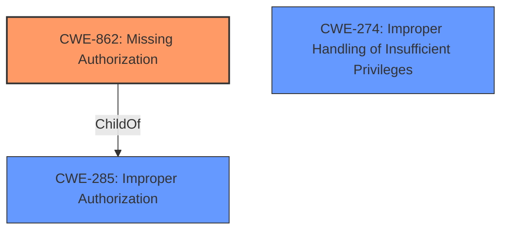

# Raw Analyzer Response for CVE-2021-0644

# Summary
| CWE ID  | CWE Name                                                    | Confidence | CWE Abstraction Level | CWE Vulnerability Mapping Label | CWE-Vulnerability Mapping Notes |
|---------|-------------------------------------------------------------|------------|-----------------------|---------------------------------|---------------------------------|
| CWE-862 | Missing Authorization                                       | 1.0        | Class                 | Primary                           | Allowed-with-Review             |
| CWE-285 | Improper Authorization                                    | 0.7        | Class                 | Secondary                         | Discouraged                     |
| CWE-274 | Improper Handling of Insufficient Privileges              | 0.6        | Base                  | Secondary                         | Discouraged                     |

## Evidence and Confidence

*   **Confidence Score:** 1.0
*   **Evidence Strength:** HIGH

## Relationship Analysis
The primary weakness is a **missing permission check**, which falls under the broader category of authorization issues. CWE-862 (Missing Authorization) is a Class-level CWE that represents the general absence of an authorization mechanism. While it's tempting to go with a more specific Base or Variant, the description clearly indicates that the authorization check is simply missing, making CWE-862 the most accurate fit.

CWE-285 (Improper Authorization) is a parent of CWE-862 but is discouraged. CWE-274 (Improper Handling of Insufficient Privileges) is at the base level, but is also discouraged.

Here's the Mermaid diagram to visualize these relationships:

## Vulnerability Chain
The chain of events for this vulnerability is as follows:
1.  **Root Cause:** **Missing permission check** in `conditionallyRemoveIdentifiers` (CWE-862).
2.  **Weakness:** The `SubscriptionInfo.mGroupUUID` is not cleared when the caller lacks `READ_DEVICE_IDENTIFIERS` permission.
3.  **Impact:** Information disclosure, allowing retrieval of a trackable identifier with only `READ_PHONE_STATE` permission.

## Summary of Analysis
The initial analysis, based on the vulnerability description and CVE details, points towards a **missing permission check** as the root cause. The vulnerability allows an attacker with `READ_PHONE_STATE` permission to access `SubscriptionInfo.mGroupUUID`, which should require `READ_DEVICE_IDENTIFIERS` permission.

The evidence from the vulnerability description includes: "In conditionallyRemoveIdentifiers of SubscriptionController.java, there is a possible way to retrieve a trackable identifier due to a **missing permission check**." The CVE Reference Links Content Summary further supports this, stating: "The vulnerability stems from the `SubscriptionInfo.mGroupUUID` not being cleared in `conditionallyRemoveIdentifiers` when the caller only has the `READ_PHONE_STATE` permission...and not the `READ_DEVICE_IDENTIFIERS` permission."

Given that the code **fails to** perform the necessary authorization check, CWE-862 (Missing Authorization) is the most appropriate choice. It directly reflects the **root cause** of the vulnerability. The other suggested CWEs, while related to authorization, do not precisely capture the specific scenario of a **missing check**.

Relevant CWE Information:

# Enhanced Context (25 CWEs)
The following CWEs were identified as potentially relevant to this vulnerability:

## CWE-280: Improper Handling of Insufficient Permissions or Privileges 
**Abstraction Level**: Base
**Similarity Score**: 0.78

**Description**:
The product does not handle or incorrectly handles when it has insufficient privileges to access resources or functionality as specified by their permissions. This may cause it to follow unexpected code paths that may leave the product in an invalid state.
*Not selected:* While this CWE relates to privilege handling, the root cause is not in the *handling* of insufficient privileges, but in the absence of a permission check *before* access is granted.

## CWE-941: Incorrectly Specified Destination in a Communication Channel
**Abstraction Level**: Base
**Similarity Score**: 0.77

**Description**:
The product creates a communication channel to initiate an outgoing request to an actor, but it does not correctly specify the intended destination for that actor.
*Not selected:* This CWE is irrelevant to the described vulnerability.

## CWE-267: Privilege Defined With Unsafe Actions
**Abstraction Level**: Base
**Similarity Score**: 0.77

**Description**:
A particular privilege, role, capability, or right can be used to perform unsafe actions that were not intended, even when it is assigned to the correct entity.
*Not selected:* This CWE does not align with the scenario where an intended privilege is defined with unsafe actions

## CWE-266: Incorrect Privilege Assignment
**Abstraction Level**: Base
**Similarity Score**: 0.77

**Description**:
A product incorrectly assigns a privilege to a particular actor, creating an unintended sphere of control for that actor.
*Not selected:* This CWE does not align with the scenario where a privilege is assigned incorrectly

## CWE-754: Improper Check for Unusual or Exceptional Conditions
**Abstraction Level**: Class
**Similarity Score**: 0.76

**Description**:
The product does not check or incorrectly checks for unusual or exceptional conditions that are not expected to occur frequently during day to day operation of the product.
*Not selected:* This CWE does not align with the scenario where there is missing permission check

## CWE-274: Improper Handling of Insufficient Privileges
**Abstraction Level**: Base
**Similarity Score**: 0.76

**Description**:
The product does not handle or incorrectly handles when it has insufficient privileges to perform an operation, leading to resultant weaknesses.
*Considered but not selected:* While related, the core issue is not the *handling* of insufficient privileges, but the **missing permission check** that should have prevented the operation in the first place.

## CWE-668: Exposure of Resource to Wrong Sphere
**Abstraction Level**: Class
**Similarity Score**: 0.76

**Description**:
The product exposes a resource to the wrong control sphere, providing unintended actors with inappropriate access to the resource.
*Not selected:* This CWE does not align with the scenario where resource is exposed to wrong sphere

## CWE-203: Observable Discrepancy
**Abstraction Level**: Base
**Similarity Score**: 0.76

**Description**:
The product behaves differently or sends different responses under different circumstances in a way that is observable to an unauthorized actor, which exposes security-relevant information about the state of the product, such as whether a particular operation was successful or not.
*Not selected:* This CWE does not align with the scenario where there is observable discrepancy

## CWE-451: User Interface (UI) Misrepresentation of Critical Information
**Abstraction Level**: Class
**Similarity Score**: 0.76

**Description**:
The user interface (UI) does not properly represent critical information to the user, allowing the information - or its source - to be obscured or spoofed. This is often a component in phishing attacks.
*Not selected:* This CWE does not align with the scenario of UI misrepresentation

## CWE-807: Reliance on Untrusted Inputs in a Security Decision
**Abstraction Level**: Base
**Similarity Score**: 0.76

**Description**:
The product uses a protection mechanism that relies on the existence or values of an input, but the input can be modified by an untrusted actor in a way that bypasses the protection mechanism.
*Not selected:* This CWE does not align with the scenario where there is reliance on untrusted inputs

## CWE-941: Incorrectly Specified Destination in a Communication Channel
**Abstraction Level**: Base
**Similarity Score**: 5503.65

**Description**:
The product creates a communication channel to initiate an outgoing request to an actor, but it does not correctly specify the intended destination for that actor.
*Not selected:* This CWE is irrelevant to the described vulnerability.

## CWE-927: Use of Implicit Intent for Sensitive Communication
**Abstraction Level**: Variant
**Similarity Score**: 5289.41

**Description**:
The Android application uses an implicit intent for transmitting sensitive data to other applications.
*Not selected:* This CWE does not align with the scenario of implicit intent usage

## CWE-863: Incorrect Authorization
**Abstraction Level**: Class
**Similarity Score**: 4928.56

**Description**:
The product performs an authorization check when an actor attempts to access a resource or perform an action, but it does not correctly perform the check.
*Not selected:* The authorization check is missing, not incorrect.

## CWE-1284: Improper Validation of Specified Quantity in Input
**Abstraction Level**: Base
**Similarity Score**: 4840.29

**Description**:
The product receives input that is expected to specify