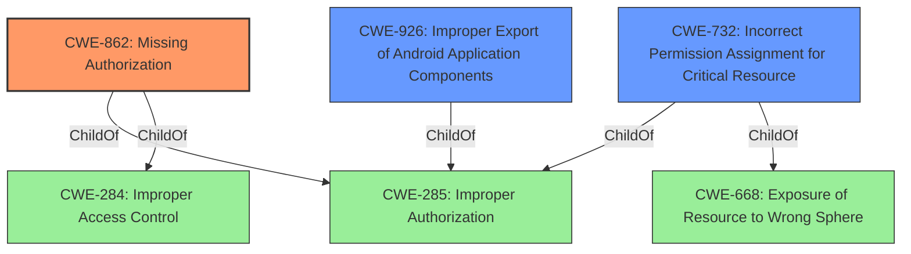

# Analysis for CVE-2021-0645

# Summary
| CWE ID | CWE Name | Confidence | CWE Abstraction Level | CWE Vulnerability Mapping Label | CWE-Vulnerability Mapping Notes |
|---|---|---|---|---|---|
| CWE-862 | Missing Authorization | 0.9 | Class | Allowed-with-Review | Primary CWE |
| CWE-732 | Incorrect Permission Assignment for Critical Resource | 0.7 | Class | Allowed-with-Review | Secondary Candidate |
| CWE-926 | Improper Export of Android Application Components | 0.6 | Variant | Allowed | Secondary Candidate |

## Evidence and Confidence

*   **Confidence Score:** 0.9
*   **Evidence Strength:** HIGH

## Relationship Analysis
The primary CWE is CWE-862 **Missing Authorization**, which is a class-level CWE. It has child-of relationships with CWE-285 and CWE-284. CWE-732 **Incorrect Permission Assignment for Critical Resource** is also a class-level CWE and is a child of CWE-285 and CWE-668. CWE-926 **Improper Export of Android Application Components** is a variant-level CWE and is a child of CWE-285. The vulnerability involves a permissions bypass, which suggests a problem with authorization. Therefore, CWE-862 is chosen as the primary CWE.

## Vulnerability Chain
The chain of root cause and weaknesses is as follows:
1.  **Root Cause:** **Missing Authorization** in `shouldBlockFromTree` of `ExternalStorageProvider.java`.
2.  **Weakness:** Permissions bypass
3.  **Impact:** Local escalation of privilege, allowing an app to read private app directories in external storage.

## Summary of Analysis
The initial analysis identified several potential CWEs, including CWE-862 **Missing Authorization**, CWE-732 **Incorrect Permission Assignment for Critical Resource**, and CWE-926 **Improper Export of Android Application Components**. The vulnerability description indicates a permissions bypass in the `shouldBlockFromTree` function, leading to a local escalation of privilege. The CVE Reference Links Content Summary highlights that a local malicious application could bypass operating system protections, which aligns with authorization and access control issues.

Based on the evidence, CWE-862 **Missing Authorization** is the most appropriate primary CWE because the vulnerability stems from the product not performing an authorization check when an app attempts to access a restricted resource (private app directories in external storage).

CWE-732 **Incorrect Permission Assignment for Critical Resource** was considered but is less specific than CWE-862. While the vulnerability involves permissions, the core issue is the absence of a proper authorization check, rather than an incorrect assignment of permissions.

CWE-926 **Improper Export of Android Application Components** was also considered, but the vulnerability description does not explicitly mention the improper export of application components. Instead, it focuses on a permissions bypass within the `shouldBlockFromTree` function.

The selected CWEs are at the optimal level of specificity because they directly address the root cause of the vulnerability, which is the **missing authorization** check in a critical function.

Relevant CWE Information:

# Enhanced Context (25 CWEs)
The following CWEs were identified as potentially relevant to this vulnerability:

## CWE-205: Observable Behavioral Discrepancy
**Abstraction Level**: Base
**Similarity Score**: 0.78
**Source**: dense

**Description**:
The product's behaviors indicate important differences that may be observed by unauthorized actors in a way that reveals (1) its internal state or decision process, or (2) differences from other products with equivalent functionality.

**Mapping Guidance**:
- Usage: Allowed
- Rationale: This CWE entry is at the Base level of abstraction, which is a preferred level of abstraction for mapping to the root causes of vulnerabilities.

## CWE-203: Observable Discrepancy
**Abstraction Level**: Base
**Similarity Score**: 0.77
**Source**: dense

**Description**:
The product behaves differently or sends different responses under different circumstances in a way that is observable to an unauthorized actor, which exposes security-relevant information about the state of the product, such as whether a particular operation was successful or not.

**Mapping Guidance**:
- Usage: Allowed
- Rationale: This CWE entry is at the Base level of abstraction, which is a preferred level of abstraction for mapping to the root causes of vulnerabilities.

## CWE-204: Observable Response Discrepancy
**Abstraction Level**: Base
**Similarity Score**: 0.76
**Source**: dense

**Description**:
The product provides different responses to incoming requests in a way that reveals internal state information to an unauthorized actor outside of the intended control sphere.

**Mapping Guidance**:
- Usage: Allowed
- Rationale: This CWE entry is at the Base level of abstraction, which is a preferred level of abstraction for mapping to the root causes of vulnerabilities.

## CWE-208: Observable Timing Discrepancy
**Abstraction Level**: Base
**Similarity Score**: 0.76
**Source**: dense

**Description**:
Two separate operations in a product require different amounts of time to complete, in a way that is observable to an actor and reveals security-relevant information about the state of the product, such as whether a particular operation was successful or not.

**Mapping Guidance**:
- Usage: Allowed
- Rationale: This CWE entry is at the Base level of abstraction, which is a preferred level of abstraction for mapping to the root causes of vulnerabilities.

## CWE-667: Improper Locking
**Abstraction Level**: Class
**Similarity Score**: 0.76
**Source**: dense

**Description**:
The product does not properly acquire or release a lock on a resource, leading to unexpected resource state changes and behaviors.

**Mapping Guidance**:
- Usage: Allowed-with-Review
- Rationale: This CWE entry is a Class and might have Base-level children that would be more appropriate

## CWE-662: Improper Synchronization
**Abstraction Level**: Class
**Similarity Score**: 0.75
**Source**: dense

**Description**:
The product utilizes multiple threads or processes to allow temporary access to a shared resource that can only be exclusive to one process at a time, but it does not properly synchronize these actions, which might cause simultaneous accesses of this resource by multiple threads or processes.

**Mapping Guidance**:
- Usage: Discouraged
- Rationale: This CWE entry is a level-1 Class (i.e., a child of a Pillar). It might have lower-level children that would be more appropriate

## CWE-207: Observable Behavioral Discrepancy With Equivalent Products
**Abstraction Level**: Variant
**Similarity Score**: 0.75
**Source**: dense

**Description**:
The product operates in an environment in which its existence or specific identity should not be known, but it behaves differently than other products with equivalent functionality, in a way that is observable to an attacker.

**Mapping Guidance**:
- Usage: Allowed
- Rationale: This CWE entry is at the Variant level of abstraction, which is a preferred level of abstraction for mapping to the root causes of vulnerabilities.

## CWE-668: Exposure of Resource to Wrong Sphere
**Abstraction Level**: Class
**Similarity Score**: 0.75
**Source**: dense

**Description**:
The product exposes a resource to the wrong control sphere, providing unintended actors with inappropriate access to the resource.

**Mapping Guidance**:
- Usage: Discouraged
- Rationale: CWE-668 is high-level and is often misused as a catch-all when lower-level CWE IDs might be applicable. It is sometimes used for low-information vulnerability reports [REF-1287]. It is a level-1 Class (i.e., a child of a Pillar). It is not useful for trend analysis.

## CWE-754: Improper Check for Unusual or Exceptional Conditions
**Abstraction Level**: Class
**Similarity Score**: 0.74
**Source**: dense

**Description**:
The product does not check or