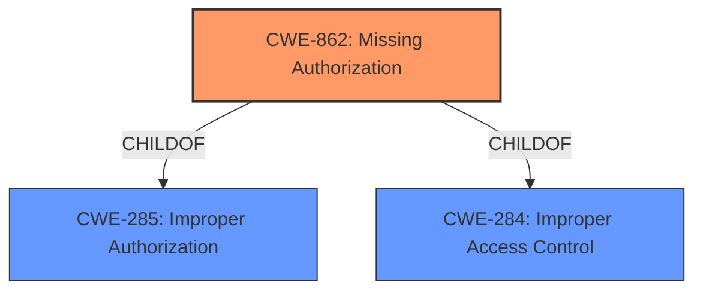

# Analysis Report for CVE-2021-0654

# Vulnerability Analysis Report: CVE-2021-0654

## Description


## Analysis (with Relationship Data)

# Summary
| CWE ID | CWE Name | Confidence | CWE Abstraction Level | CWE Vulnerability Mapping Label | CWE-Vulnerability Mapping Notes |
|---|---|---|---|---|---|
| CWE-862 | Missing Authorization | 1.0 | Class | Primary | Allowed-with-Review |

## Evidence and Confidence

*   **Confidence Score:** 1.0
*   **Evidence Strength:** HIGH

## Relationship Analysis
The primary relationship that influenced my decision was the ChildOf relationship that CWE-862 has with CWE-285 and CWE-284. While these parent CWEs are more general, CWE-862 directly addresses the specific weakness described in the vulnerability, which is a **missing permission check**. The abstraction level of Class also led me to consider potential Base-level children of CWE-862, but none were a more precise fit.



## Vulnerability Chain
The vulnerability chain is relatively straightforward:
1.  The root cause is a **missing permission check** in `isRealSnapshot` function.
2.  This **missing permission check** leads to local information disclosure from locked profiles.

## Summary of Analysis
My analysis is based directly on the provided evidence, which explicitly states "**missing permission check**" as the root cause. This aligns perfectly with the definition of CWE-862, which is "The product does not perform an authorization check when an actor attempts to access a resource or perform an action." The vulnerability allows local information disclosure, which is a direct consequence of the **missing authorization**.

The retriever results also list CWE-862 as the top candidate. The confidence in this mapping is high (1.0) because the evidence directly supports the classification, and the CWE's description matches the vulnerability's root cause.

CWE-667 (Improper Locking), CWE-665 (Improper Initialization), CWE-927 (Use of Implicit Intent for Sensitive Communication), and CWE-1021 (Improper Restriction of Rendered UI Layers or Frames) were considered but ultimately rejected. None of these CWEs accurately reflect the root cause of the vulnerability, which is the **missing authorization check**.

Relevant CWE Information:

# Enhanced Context (25 CWEs)
The following CWEs were identified as potentially relevant to this vulnerability:

## CWE-862: Missing Authorization
**Abstraction Level**: Class
**Similarity Score**: 0.418
**Source**: sparse

**Description**:
The product does not perform an authorization check when an actor attempts to access a resource or perform an action.

**Mapping Guidance**:
- Usage: Allowed-with-Review
- Rationale: This CWE entry is a Class and might have Base-level children that would be more appropriate

## CWE-667: Improper Locking
**Abstraction Level**: Class
**Similarity Score**: 0.345
**Source**: sparse

**Description**:
The product does not properly acquire or release a lock on a resource, leading to unexpected resource state changes and behaviors.

**Mapping Guidance**:
- Usage: Allowed-with-Review
- Rationale: This CWE entry is a Class and might have Base-level children that would be more appropriate

## CWE-665: Improper Initialization
**Abstraction Level**: Class
**Similarity Score**: 0.344
**Source**: sparse

**Description**:
The product does not initialize or incorrectly initializes a resource, which might leave the resource in an unexpected state when it is accessed or used.

**Mapping Guidance**:
- Usage: Discouraged
- Rationale: This CWE entry is a level-1 Class (i.e., a child of a Pillar). It might have lower-level children that would be more appropriate

## CWE-927: Use of Implicit Intent for Sensitive Communication
**Abstraction Level**: Variant
**Similarity Score**: 0.340
**Source**: sparse

**Description**:
The Android application uses an implicit intent for transmitting sensitive data to other applications.

**Mapping Guidance**:
- Usage: Allowed
- Rationale: This CWE entry is at the Variant level of abstraction, which is a preferred level of abstraction for mapping to the root causes of vulnerabilities.

## CWE-1021: Improper Restriction of Rendered UI Layers or Frames
**Abstraction Level**: Base
**Similarity Score**: 0.334
**Source**: sparse

**Description**:
The web application does not restrict or incorrectly restricts frame objects or UI layers that belong to another application or domain, which can lead to user confusion about which interface the user is interacting with.

**Mapping Guidance**:
- Usage: Allowed
- Rationale: This CWE entry is at the Base level of abstraction, which is a preferred level of abstraction for mapping to the root causes of vulnerabilities.


## CWE Relationship Analysis

Current CWEs represent these abstraction levels: .


### Vulnerability Chain Analysis

**Chain starting from CWE-667:**
- 667 (Improper Locking) - ROOT


**Chain starting from CWE-862:**
- 862 (Missing Authorization) - ROOT


### CWE Relationship Diagram

```mermaid
graph TD
    classDef primary fill:#f96,stroke:#333,stroke-width:2px
    classDef secondary fill:#69f,stroke:#333
    classDef tertiary fill:#9e9,stroke:#333
```


*Report generated on 2025-04-01 17:51:52*
