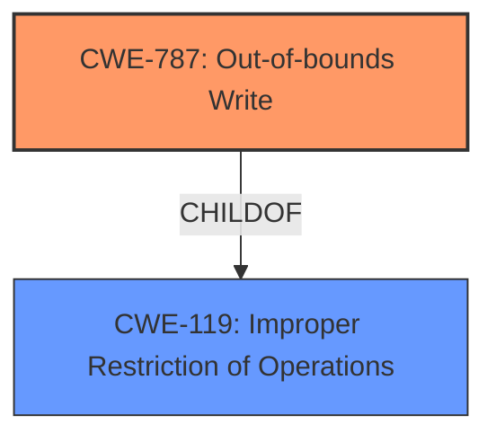

# Analysis Report for CVE-2021-0655

# Vulnerability Analysis Report: CVE-2021-0655

## Description


## Analysis (with Relationship Data)

# Summary
| CWE ID | CWE Name | Confidence | CWE Abstraction Level | CWE Vulnerability Mapping Label | CWE-Vulnerability Mapping Notes |
|---|---|---|---|---|---|
| CWE-787 | Out-of-bounds Write | 1.0 | Base | Allowed | Primary CWE |
| CWE-119 | Improper Restriction of Operations within the Bounds of a Memory Buffer | 0.7 | Class | Allowed | Secondary Candidate |

## Evidence and Confidence

*   **Confidence Score:** 0.9
*   **Evidence Strength:** HIGH

## Relationship Analysis
The primary CWE is CWE-787, which is a Base level CWE and a child of CWE-119. CWE-119 is a Class level CWE and represents a more general case of the vulnerability. The analysis focuses on the specific **incorrect bounds check** leading to **memory corruption**, making CWE-787 the most appropriate choice.



## Vulnerability Chain
The vulnerability chain involves an **incorrect bounds check** leading to a **memory corruption**, specifically an out-of-bounds write.
  - **Root Cause:** Incorrect bounds check
  - **Weakness:** Out-of-bounds Write (CWE-787)
  - **Impact:** Local escalation of privilege

## Summary of Analysis
The initial assessment, based on the vulnerability description and key phrases, points towards CWE-787 (Out-of-bounds Write) as the primary CWE. The description explicitly mentions an **incorrect bounds check** which leads to a **memory corruption**, aligning perfectly with the characteristics of CWE-787. The "CWE for similar CVE Descriptions" section also lists CWE-787 as the primary match and top CWE.

The Retriever Results also list CWE-787 as the top result. The evidence provided supports this classification, as it directly states the root cause and resulting weakness.

The hierarchical relationships, specifically the ChildOf relationship between CWE-787 and CWE-119, were considered. While CWE-119 (Improper Restriction of Operations within the Bounds of a Memory Buffer) is a parent of CWE-787, the more specific nature of an "out-of-bounds write" makes CWE-787 a more accurate representation of the vulnerability.

The selected CWE is at the optimal level of specificity because it accurately captures the root cause (incorrect bounds check) and the resulting weakness (out-of-bounds write).

CWE-131 (Incorrect Calculation of Buffer Size), CWE-908 (Use of Uninitialized Resource), CWE-667 (Improper Locking), CWE-362 (Concurrent Execution using Shared Resource with Improper Synchronization ('Race Condition')), CWE-1260 (Improper Handling of Overlap Between Protected Memory Ranges), CWE-130 (Improper Handling of Length Parameter Inconsistency), CWE-704 (Incorrect Type Conversion or Cast), CWE-191 (Integer Underflow (Wrap or Wraparound)), and CWE-20 (Improper Input Validation) were considered but not selected. These CWEs, while potentially related to memory corruption or improper resource handling, do not directly address the specific issue of an **incorrect bounds check** leading to an out-of-bounds write.

Relevant CWE Information:

# Enhanced Context (25 CWEs)
The following CWEs were identified as potentially relevant to this vulnerability:

## CWE-1289: Improper Validation of Unsafe Equivalence in Input
**Abstraction Level**: Base
**Similarity Score**: 0.82

## CWE-1288: Improper Validation of Consistency within Input
**Abstraction Level**: Base
**Similarity Score**: 0.79

## CWE-179: Incorrect Behavior Order: Early Validation
**Abstraction Level**: Base
**Similarity Score**: 0.77

## CWE-606: Unchecked Input for Loop Condition
**Abstraction Level**: Base
**Similarity Score**: 0.77

## CWE-807: Reliance on Untrusted Inputs in a Security Decision
**Abstraction Level**: Base
**Similarity Score**: 0.76

## CWE-115: Misinterpretation of Input
**Abstraction Level**: Base
**Similarity Score**: 0.76

## CWE-183: Permissive List of Allowed Inputs
**Abstraction Level**: Base
**Similarity Score**: 0.76

## CWE-681: Incorrect Conversion between Numeric Types
**Abstraction Level**: Base
**Similarity Score**: 0.76

## CWE-667: Improper Locking
**Abstraction Level**: Class
**Similarity Score**: 0.76

## CWE-1173: Improper Use of Validation Framework
**Abstraction Level**: Base
**Similarity Score**: 0.76

## CWE-190: Integer Overflow or Wraparound
**Abstraction Level**: Base
**Similarity Score**: 6447.29

## CWE-125: Out-of-bounds Read
**Abstraction Level**: Base
**Similarity Score**: 6346.44

## CWE-1284: Improper Validation of Specified Quantity in Input
**Abstraction Level**: Base
**Similarity Score**: 6322.04

## CWE-667: Improper Locking
**Abstraction Level**: Class
**Similarity Score**: 6311.30

## CWE-362: Concurrent Execution using Shared Resource with Improper Synchronization ('Race Condition')
**Abstraction Level**: Class
**Similarity Score**: 6233.02

## CWE-41: Improper Resolution of Path Equivalence
**Abstraction Level**: base
**Similarity Score**: 5.03

## CWE-805: Buffer Access with Incorrect Length Value
**Abstraction Level**: base
**Similarity Score**: 4.33

## CWE-1260: Improper Handling of Overlap Between Protected Memory Ranges
**Abstraction Level**: base
**Similarity Score**: 4.33

## CWE-190: Integer Overflow or Wraparound
**Abstraction Level**: base
**Similarity Score**: 4.33

## CWE-22: Improper Limitation of a Pathname to a Restricted Directory ('Path Traversal')
**Abstraction Level**: base
**Similarity Score**: 4.33

## CWE-770: Allocation of Resources Without Limits or Throttling
**Abstraction Level**: base
**Similarity Score**: 4.33

## CWE-73: External Control of File Name or Path
**Abstraction Level**: base
**Similarity Score**: 4.33

## CWE-1284: Improper Validation of Specified Quantity in Input
**Abstraction Level**: base
**Similarity Score**: 4.33

## CWE-476: NULL Pointer Dereference
**Abstraction Level**: base
**Similarity Score**: 4.33

## CWE-125: Out-of-bounds Read
**Abstraction Level**: base
**Similarity Score**: 3.89


## CWE Relationship Analysis

Current CWEs represent these abstraction levels: .


### Vulnerability Chain Analysis

**Chain starting from CWE-787:**
- 787 (Out-of-bounds Write) - ROOT


**Chain starting from CWE-362:**
- 362 (Concurrent Execution using Shared Resource with Improper Synchronization ('Race Condition')) - ROOT


### CWE Relationship Diagram

```mermaid
graph TD
    classDef primary fill:#f96,stroke:#333,stroke-width:2px
    classDef secondary fill:#69f,stroke:#333
    classDef tertiary fill:#9e9,stroke:#333
```


*Report generated on 2025-04-02 00:37:14*
