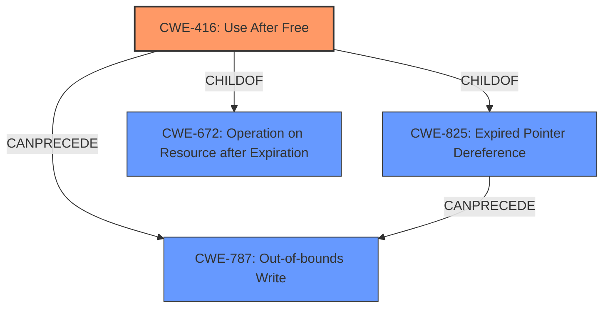

# Analysis for CVE-2021-0664

# Summary
| CWE ID  | CWE Name                                                                           | Confidence | CWE Abstraction Level | CWE Vulnerability Mapping Label | CWE-Vulnerability Mapping Notes |
| :-------- | :--------------------------------------------------------------------------------- | :---------- | :---------------------- | :------------------------------ | :-------------------------------- |
| CWE-416   | Use After Free                                                                     | 1          | Variant               | Primary                         | Allowed                           |
| CWE-787   | Out-of-bounds Write                                                                  | 0.5         | Base                  | Secondary                       | Allowed                           |

## Evidence and Confidence

*   **Confidence Score:** 0.75
*   **Evidence Strength:** HIGH

## Relationship Analysis
The primary relationship influencing this decision is that CWE-416 **(Use After Free)** can precede CWE-787 **(Out-of-bounds Write)**, suggesting a potential chain where the **use after free** leads to memory corruption via an out-of-bounds write. The selection of CWE-416 as the primary is based on the explicit mention of "use after free" in the vulnerability description. CWE-416 is a variant, while CWE-787 is a base level CWE.

## Vulnerability Chain
The vulnerability chain starts with a **use after free** condition (CWE-416), potentially leading to **memory corruption**, which may manifest as an out-of-bounds write (CWE-787). The impact is a local escalation of privilege.

## Summary of Analysis
The initial assessment focused on identifying the root cause and potential impacts described in the vulnerability. The description explicitly mentions "**use after free**" as the root cause and "**memory corruption**" as a consequence. The CVE Reference Links Content Summary also supports "**Use after free vulnerability**".

The Retriever Results listed CWE-416 **(Use After Free)** and CWE-787 **(Out-of-bounds Write)** as top candidates. Given the explicit mention of "use after free", CWE-416 was selected as the primary CWE. The "**memory corruption**" was determined to potentially be the result of an out-of-bounds write (CWE-787), making it a secondary candidate.

The graph relationships show that CWE-416 can precede CWE-787. This influenced the decision to include both CWEs in the mapping, with CWE-416 as the primary root cause and CWE-787 as a potential consequence.

The selection of CWE-416 as the primary CWE is based on the explicit evidence provided in the vulnerability description and the CVE Reference Links Content Summary. CWE-787 is a reasonable secondary mapping to explain how "**memory corruption**" occurs from "**use after free**".

Relevant CWE Information:

# Enhanced Context (25 CWEs)
The following CWEs were identified as potentially relevant to this vulnerability:

## CWE-226: Sensitive Information in Resource Not Removed Before Reuse
**Abstraction Level**: Base
**Similarity Score**: 0.79
**Source**: dense

**Description**:
The product releases a resource such as memory or a file so that it can be made available for reuse, but it does not clear or "zeroize" the information contained in the resource before the product performs a critical state transition or makes the resource available for reuse by other entities.

**Mapping Guidance**:
- Usage: Allowed
- Rationale: This CWE entry is at the Base level of abstraction, which is a preferred level of abstraction for mapping to the root causes of vulnerabilities.

*This CWE was not selected because the vulnerability description does not mention anything about sensitive information not being cleared.*

## CWE-404: Improper Resource Shutdown or Release
**Abstraction Level**: Class
**Similarity Score**: 0.79
**Source**: dense

**Description**:
The product does not release or incorrectly releases a resource before it is made available for re-use.

**Mapping Guidance**:
- Usage: Allowed-with-Review
- Rationale: This CWE entry is a Class and might have Base-level children that would be more appropriate

*This CWE was not selected because the vulnerability description does not mention anything about improper shutdown or release.*

## CWE-667: Improper Locking
**Abstraction Level**: Class
**Similarity Score**: 0.79
**Source**: dense

**Description**:
The product does not properly acquire or release a lock on a resource, leading to unexpected resource state changes and behaviors.

**Mapping Guidance**:
- Usage: Allowed-with-Review
- Rationale: This CWE entry is a Class and might have Base-level children that would be more appropriate

*This CWE was not selected because the vulnerability description does not mention anything about improper locking.*

## CWE-415: Double Free
**Abstraction Level**: Variant
**Similarity Score**: 0.78
**Source**: dense

**Description**:
The product calls free() twice on the same memory address, potentially leading to modification of unexpected memory locations.

**Mapping Guidance**:
- Usage: Allowed
- Rationale: This CWE entry is at the Variant level of abstraction, which is a preferred level of abstraction for mapping to the root causes of vulnerabilities.

*This CWE was not selected because the vulnerability description explicitly says "**use after free**" and not double free.*

## CWE-366: Race Condition within a Thread
**Abstraction Level**: Base
**Similarity Score**: 0.78
**Source**: dense

**Description**:
If two threads of execution use a resource simultaneously, there exists the possibility that resources may be used while invalid, in turn making the state of execution undefined.

**Mapping Guidance**:
- Usage: Allowed
- Rationale: This CWE entry is at the Base level of abstraction, which is a preferred level of abstraction for mapping to the root causes of vulnerabilities.

*This CWE was not selected because the vulnerability description does not mention anything about race conditions.*

## CWE-131: Incorrect Calculation of Buffer Size
**Abstraction Level**: Base
**Similarity Score**: 0.77
**Source**: dense

**Description**:
The product does not correctly calculate the size to be used when allocating a buffer, which could lead to a buffer overflow.

**Mapping Guidance**:
- Usage: Allowed
- Rationale: This CWE entry is at the Base level of abstraction, which is a preferred level of abstraction for mapping to the root causes of vulnerabilities.

*This CWE was not selected because the vulnerability description does not mention anything about incorrect calculation of buffer size.*

## CWE-362: Concurrent Execution using Shared Resource with Improper Synchronization ('Race Condition')
**Abstraction Level**: Class
**Similarity Score**: 0.76
**Source**: dense

**Description**:
The product contains a concurrent code sequence that requires temporary, exclusive access to a shared resource, but a timing window exists in which the shared resource can be modified by another code sequence operating concurrently.

**Mapping Guidance**:
- Usage: Allowed-with-Review
- Rationale: This CWE entry is a Class and might have Base-level children that would be more appropriate

*This CWE was not selected because the vulnerability description does not mention anything about race conditions.*

## CWE-908: Use of Uninitialized Resource
**Abstraction Level**: Base
**Similarity Score**: 0.76
**Source**: dense

**Description**:
The product uses or accesses a resource that has not been initialized.

**Mapping Guidance**:
- Usage: Allowed
- Rationale: This CWE entry is at the Base level of abstraction, which is a preferred level of abstraction for mapping to the root causes of vulnerabilities.

*This CWE was not selected because the vulnerability description does not mention anything about the use of an unitialized resource.*

## CWE-824: Access of Uninitialized Pointer
**Abstraction Level**: Base
**Similarity Score**: 0.76
**Source**: dense

**Description**:
The product accesses or uses a pointer that has not been initialized.

**Mapping Guidance**:
- Usage: Allowed
- Rationale: This CWE entry is at the Base level of abstraction, which is a preferred level of abstraction for mapping to the root causes of vulnerabilities.

*This CWE was not selected because the vulnerability description does not mention anything about accessing an unitialized pointer.*

## CWE-662: Improper Synchronization
**Abstraction Level**: Class
**Similarity Score**: 0.