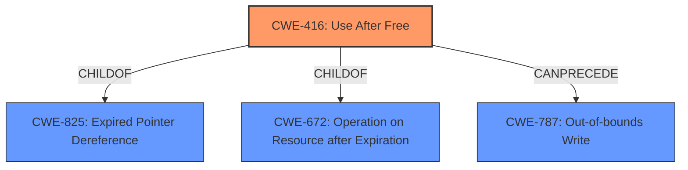

# Raw Analyzer Response for CVE-2021-0670

# Summary
| CWE ID | CWE Name | Confidence | CWE Abstraction Level | CWE Vulnerability Mapping Label | CWE-Vulnerability Mapping Notes |
|---|---|---|---|---|---|
| CWE-416 | Use After Free | 1.0 | Variant | Allowed | Primary CWE |
| CWE-787 | Out-of-bounds Write | 0.7 | Base | Allowed | Secondary Candidate |

## Evidence and Confidence

*   **Confidence Score:** 0.9
*   **Evidence Strength:** HIGH

## Relationship Analysis
The primary weakness identified is CWE-416, Use After Free, which is a Variant level CWE. CWE-416 can lead to other issues such as CWE-787, Out-of-bounds Write. CWE-416 is a child of CWE-825 (Expired Pointer Dereference) and CWE-672 (Operation on Resource after Expiration). The hierarchical relationships and the nature of the vulnerability description support the selection of CWE-416 as the primary CWE.

## Vulnerability Chain
The vulnerability chain starts with a **use after free** (CWE-416), which leads to **memory corruption**. The impact is a local escalation of privilege.

## Summary of Analysis
The vulnerability description indicates a **use after free** condition leading to **memory corruption** and privilege escalation. The primary CWE is CWE-416, Use After Free, which aligns with the **root cause** of the vulnerability. The secondary CWE is CWE-787, Out-of-bounds Write, which can be a consequence of CWE-416.

The selection of CWE-416 is strongly supported by the following evidence:
*   The vulnerability description explicitly mentions "use after free" as the **rootcause**.
*   The "CVE Reference Links Content Summary" confirms the presence of a use-after-free condition in the `apusys` driver.
*   The "CWE for similar CVE Descriptions" lists CWE-416 as one of the top CWEs.

The selection of CWE-787 as a secondary candidate is supported by the following evidence:
*   The vulnerability description mentions "**memory corruption**" which can be a symptom of out-of-bounds writes.
*   The "CWE for similar CVE Descriptions" lists CWE-787 as the primary CWE Match.

I am confident in my assessment, as the evidence points strongly towards a use-after-free vulnerability with potential memory corruption issues. I am choosing CWE-416, Use After Free, as the primary CWE because the vulnerability description explicitly mentions it. CWE-787 is a potential consequence of the UAF, so I have listed it as a secondary candidate.

Relevant CWE Information:

# Enhanced Context (25 CWEs)
The following CWEs were identified as potentially relevant to this vulnerability:

## CWE-226: Sensitive Information in Resource Not Removed Before Reuse
**Abstraction Level**: Base
**Similarity Score**: 0.78
**Source**: dense

**Description**:
The product releases a resource such as memory or a file so that it can be made available for reuse, but it does not clear or "zeroize" the information contained in the resource before the product performs a critical state transition or makes the resource available for reuse by other entities.

**Mapping Guidance**:
- Usage: Allowed
- Rationale: This CWE entry is at the Base level of abstraction, which is a preferred level of abstraction for mapping to the root causes of vulnerabilities.

*This CWE was not selected because the vulnerability is a Use-After-Free, not about information leakage*

## CWE-404: Improper Resource Shutdown or Release
**Abstraction Level**: Class
**Similarity Score**: 0.78
**Source**: dense

**Description**:
The product does not release or incorrectly releases a resource before it is made available for re-use.

**Mapping Guidance**:
- Usage: Allowed-with-Review
- Rationale: This CWE entry is a Class and might have Base-level children that would be more appropriate

*This CWE was not selected because the vulnerability is a Use-After-Free, not about improper shutdown*

## CWE-667: Improper Locking
**Abstraction Level**: Class
**Similarity Score**: 0.77
**Source**: dense

**Description**:
The product does not properly acquire or release a lock on a resource, leading to unexpected resource state changes and behaviors.

**Mapping Guidance**:
- Usage: Allowed-with-Review
- Rationale: This CWE entry is a Class and might have Base-level children that would be more appropriate

*This CWE was not selected because the vulnerability does not involve improper locking mechanisms*

## CWE-665: Improper Initialization
**Abstraction Level**: Class
**Similarity Score**: 0.77
**Source**: dense

**Description**:
The product does not initialize or incorrectly initializes a resource, which might leave the resource in an unexpected state when it is accessed or used.

**Mapping Guidance**:
- Usage: Discouraged
- Rationale: This CWE entry is a level-1 Class (i.e., a child of a Pillar). It might have lower-level children that would be more appropriate

*This CWE was not selected because the vulnerability is a Use-After-Free, not about improper initialization*

## CWE-662: Improper Synchronization
**Abstraction Level**: Class
**Similarity Score**: 0.77
**Source**: dense

**Description**:
The product utilizes multiple threads or processes to allow temporary access to a shared resource that can only be exclusive to one process at a time, but it does not properly synchronize these actions, which might cause simultaneous accesses of this resource by multiple threads or processes.

**Mapping Guidance**:
- Usage: Discouraged
- Rationale: This CWE entry is a level-1 Class (i.e., a child of a Pillar). It might have lower-level children that would be more appropriate

*This CWE was not selected because the vulnerability does not involve improper synchronization mechanisms*

## CWE-909: Missing Initialization of Resource
**Abstraction Level**: Class
**Similarity Score**: 0.76
**Source**: dense

**Description**:
The product does not initialize a critical resource.

**Mapping Guidance**:
- Usage: Allowed-with-Review
- Rationale: This CWE entry is a Class and might have Base-level children that would be more appropriate

*This CWE was not selected because the vulnerability is a Use-After-Free, not about missing initialization*

## CWE-457: Use of Uninitialized Variable
**Abstraction Level**: Variant
**Similarity Score**: 0.76
**Source**: dense

**Description**:
The code uses a variable that has not been initialized, leading to unpredictable or unintended results.

**Mapping Guidance**:
- Usage: Allowed
- Rationale: This CWE entry is at the Variant level of abstraction, which is a preferred level of abstraction for mapping to the root causes of vulnerabilities.

*This CWE was not selected because the vulnerability is a Use-After-Free, not about uninitialized variables*

## CWE-908: Use of Uninitialized Resource
**Abstraction Level**: Base
**Similarity Score**: 0.75
**Source**: dense

**Description**:
The product uses or accesses a resource that has not been initialized.

**Mapping Guidance**:
- Usage: Allowed
- Rationale: This CWE entry is at the Base level of abstraction, which is a preferred level of abstraction for mapping to the root causes of vulnerabilities.

*This CWE was not selected because the vulnerability is a Use-After-Free, not about uninitialized resources*

## CWE-366: Race Condition within a Thread
**Abstraction Level**: Base
**Similarity Score**: 0.75
**Source**: dense

**Description**:
If two threads of execution use a resource simultaneously, there exists the possibility that resources may be used while invalid, in turn making the state of execution undefined.

**Mapping Guidance**:
- Usage: Allowed
- Rationale: This CWE entry is at the Base level of abstraction, which is a preferred level of abstraction for mapping to the root causes of vulnerabilities.

*This CWE was not selected because the vulnerability is a Use-After-Free, not specifically about race conditions within a thread*

## CWE-131: Incorrect Calculation of Buffer Size
**Abstraction Level**: Base
**Similarity Score**: 0.75
**Source**: dense

**Description**:
The product does not correctly calculate the size to be used