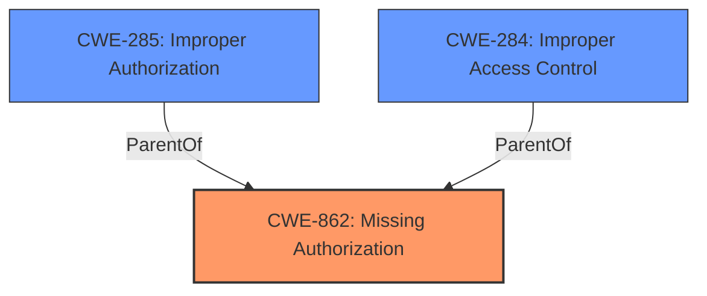

# Analysis for CVE-2021-0672

# Summary
| CWE ID | CWE Name | Confidence | CWE Abstraction Level | CWE Vulnerability Mapping Label | CWE-Vulnerability Mapping Notes |
|---|---|---|---|---|---|
| **CWE-862** | **Missing Authorization** | 0.9 | Class | Primary | Allowed-with-Review |
| CWE-223 | Omission of Security-relevant Information | 0.6 | Base | Secondary | Allowed |
| CWE-909 | Missing Initialization of Resource | 0.5 | Class | Secondary | Allowed-with-Review |

## Evidence and Confidence

*   **Confidence Score:** 0.9
*   **Evidence Strength:** HIGH

## Relationship Analysis
The primary relationship influencing the decision is the hierarchical relationship. CWE-862 **Missing Authorization** is a class-level CWE, but given the limited information, a more specific base-level CWE cannot be confidently asserted. CWE-284 and CWE-285 are parents of CWE-862. The other candidates did not have a clear parent-child relation.

## Vulnerability Chain
The vulnerability chain starts with a **missing permission check** (CWE-862), leading to potential local information disclosure. It is a direct cause-and-effect relationship.

## Summary of Analysis
The initial analysis focused on identifying the root cause of the vulnerability, which is a **missing permission check**. This directly aligns with CWE-862 **Missing Authorization**. The retriever results also listed CWE-862 as the top candidate.

The vulnerability description key phrases highlight the **missing permission check** as the root cause and information disclosure as the impact. The CVE reference links content summary confirms this by stating, "The provided text indicates that CVE-2021-0672 is related to a vulnerability in a MediaTek browser application."

The decision is based on the provided evidence, particularly the vulnerability description key phrases that explicitly mention the **missing permission check**.

The selected CWE is at the optimal level of specificity, given the available information. While there might be more specific CWEs related to authorization, the current evidence doesn't allow for a more granular classification. The MITRE mapping guidance suggests reviewing children of CWE-862 for a better fit, but none of the children CWEs are more suitable based on the provided description.

Relevant CWE Information:

# Enhanced Context (25 CWEs)

## CWE-226: Sensitive Information in Resource Not Removed Before Reuse
**Abstraction Level**: Base
**Similarity Score**: 0.77
**Source**: dense

**Description**:
The product releases a resource such as memory or a file so that it can be made available for reuse, but it does not clear or "zeroize" the information contained in the resource before the product performs a critical state transition or makes the resource available for reuse by other entities.
**Why not used**: This CWE is not related to **missing authorization**.

## CWE-909: Missing Initialization of Resource
**Abstraction Level**: Class
**Similarity Score**: 0.76
**Source**: dense

**Description**:
The product does not initialize a critical resource.
**Why considered**: It was a close candidate since not initializing a resource could mean it has default permissions.
**Why not used**: Ultimately, the explicit mention of "**missing permission check**" made CWE-862 the more appropriate choice.

## CWE-941: Incorrectly Specified Destination in a Communication Channel
**Abstraction Level**: Base
**Similarity Score**: 0.76
**Source**: dense

**Description**:
The product creates a communication channel to initiate an outgoing request to an actor, but it does not correctly specify the intended destination for that actor.
**Why not used**: This CWE is not related to **missing authorization**.

## CWE-665: Improper Initialization
**Abstraction Level**: Class
**Similarity Score**: 0.76
**Source**: dense

**Description**:
The product does not initialize or incorrectly initializes a resource, which might leave the resource in an unexpected state when it is accessed or used.
**Why not used**: This CWE is not related to **missing authorization**.

## CWE-451: User Interface (UI) Misrepresentation of Critical Information
**Abstraction Level**: Class
**Similarity Score**: 0.76
**Source**: dense

**Description**:
The user interface (UI) does not properly represent critical information to the user, allowing the information - or its source - to be obscured or spoofed. This is often a component in phishing attacks.
**Why not used**: This CWE is not related to **missing authorization**.

## CWE-754: Improper Check for Unusual or Exceptional Conditions
**Abstraction Level**: Class
**Similarity Score**: 0.76
**Source**: dense

**Description**:
The product does not check or incorrectly checks for unusual or exceptional conditions that are not expected to occur frequently during day to day operation of the product.
**Why not used**: This CWE is not related to **missing authorization**.

## CWE-404: Improper Resource Shutdown or Release
**Abstraction Level**: Class
**Similarity Score**: 0.76
**Source**: dense

**Description**:
The product does not release or incorrectly releases a resource before it is made available for re-use.
**Why not used**: This CWE is not related to **missing authorization**.

## CWE-203: Observable Discrepancy
**Abstraction Level**: Base
**Similarity Score**: 0.75
**Source**: dense

**Description**:
The product behaves differently or sends different responses under different circumstances in a way that is observable to an unauthorized actor, which exposes security-relevant information about the state of the product, such as whether a particular operation was successful or not.
**Why not used**: This CWE is not related to **missing authorization**.

## CWE-908: Use of Uninitialized Resource
**Abstraction Level**: Base
**Similarity Score**: 0.75
**Source**: dense

**Description**:
The product uses or accesses a resource that has not been initialized.
**Why not used**: This CWE is not related to **missing authorization**.

## CWE-807: Reliance on Untrusted Inputs in a Security Decision
**Abstraction Level**: Base
**Similarity Score**: 0.75
**Source**: dense

**Description**:
The product uses a protection mechanism that relies on the existence or values of an input, but the input can be modified by an untrusted actor in a way that bypasses the protection mechanism.
**Why not used**: This CWE is not related to **missing authorization**.

## CWE-941: Incorrectly Specified Destination in a Communication Channel
**Abstraction Level**: Base
**Similarity Score**: 4855.50
**Source**: sparse

**Description**:
The product creates a communication channel to initiate an outgoing request to an actor, but it does not correctly specify the intended destination for that actor.
**Why not used**: This CWE is not related to **missing authorization**.

## CWE-927: Use of Implicit Intent for Sensitive Communication
**Abstraction Level**: Variant
**Similarity Score**: 4486.66
**Source**: sparse

**Description**:
The Android application uses an implicit intent for transmitting sensitive data to other applications.
**Why not used**: This CWE is not related to **missing authorization**.

## CWE-909: Missing Initialization of Resource
**Abstraction Level**: Class
**Similarity Score**: 4335.03
**Source**: sparse

**Description**:
The product does not initialize a critical resource.
**Why considered**: It was a close candidate since not initializing a resource could mean it has default permissions.
**Why not used**: Ultimately, the explicit mention of "**missing permission check**" made CWE-862 the more appropriate choice.

## CWE-863: Incorrect Authorization
**Abstraction Level**: Class
**Similarity Score**: 4293.73
**Source**: sparse

**Description**:
The product performs an authorization check when an actor attempts to access a resource or perform an action, but it does not correctly perform the check.
**Why not used**: While related to authorization, the description mentions "**missing permission check**," which suggests the check is absent rather than incorrect.

## CWE-923: Improper Restriction of Communication Channel to Intended Endpoints
**Abstraction Level**: Class
**Similarity Score**: 4256.62
**Source**: sparse

**Description**:
The product establishes a communication channel to (or from) an endpoint for privileged or protected operations, but it does not properly ensure that it is communicating with the correct endpoint.
**Why not used**: This CWE is not related to **