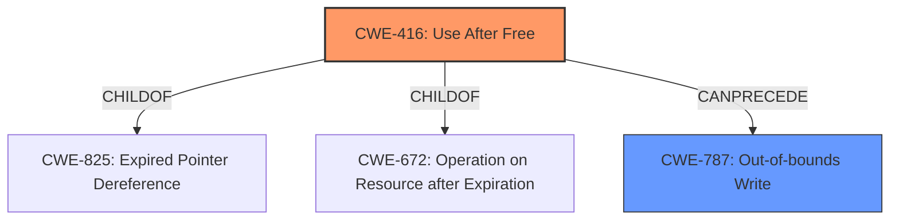

# Analysis Report for CVE-2021-0684

# Vulnerability Analysis Report: CVE-2021-0684

## Description


## Analysis (with Relationship Data)

# Summary
| CWE ID | CWE Name | Confidence | CWE Abstraction Level | CWE Vulnerability Mapping Label | CWE-Vulnerability Mapping Notes |
|---|---|---|---|---|---|
| CWE-416 | Use After Free | 1.0 | Variant | Allowed | Primary CWE |
| CWE-787 | Out-of-bounds Write | 0.7 | Base | Allowed | Secondary CWE |

## Evidence and Confidence

*   **Confidence Score:** 0.9
*   **Evidence Strength:** HIGH

## Relationship Analysis
The primary CWE is CWE-416 **Use After Free**, which is a Variant of CWE-825 **Expired Pointer Dereference** and CWE-672 **Operation on Resource after Expiration**. The vulnerability description explicitly mentions a **use after free**, making CWE-416 the most appropriate primary classification.

CWE-787 **Out-of-bounds Write** is identified as a secondary CWE because the vulnerability description mentions an **out of bounds write** resulting from the **use after free**.



## Vulnerability Chain
The vulnerability chain starts with a **use after free** (CWE-416), which leads to an **out of bounds write** (CWE-787), and ultimately results in local escalation of privilege.

## Summary of Analysis
The analysis is based on the vulnerability description and the CVE Reference Links Content Summary, which provide clear evidence of a **use after free** condition leading to an **out of bounds write**.

The vulnerability description states: "In TouchInputMappersync of TouchInputMapper.cpp, there is a possible **out of bounds write** due to a **use after free**. This could lead to local escalation of privilege with no additional execution privileges needed."

The CVE Reference Links Content Summary states that the root cause is "improper handling of vector references within the Android framework's native layer" that leads to invalidated references and potential memory corruption.

The selection of CWE-416 as the primary CWE is directly supported by the explicit mention of "**use after free**" in the vulnerability description and the CVE Reference Links Content Summary. CWE-787 is a secondary CWE due to the mention of "**out of bounds write**" as a consequence of the **use after free**. The selected CWEs are at the appropriate level of specificity, with CWE-416 being a Variant and CWE-787 being a Base.

Relevant CWE Information:

# Enhanced Context (25 CWEs)

## CWE-667: Improper Locking
**Abstraction Level**: Class
**Similarity Score**: 0.79
**Source**: dense

**Description**:
The product does not properly acquire or release a lock on a resource, leading to unexpected resource state changes and behaviors.
*Was considered, but not selected* because the vulnerability description does not mention any issues with locking mechanisms.

## CWE-404: Improper Resource Shutdown or Release
**Abstraction Level**: Class
**Similarity Score**: 0.78
**Source**: dense

**Description**:
The product does not release or incorrectly releases a resource before it is made available for re-use.
*Was considered, but not selected* because it focuses on incorrect resource release, whereas the primary issue is using a resource after it has already been freed.

## CWE-226: Sensitive Information in Resource Not Removed Before Reuse
**Abstraction Level**: Base
**Similarity Score**: 0.77
**Source**: dense

**Description**:
The product releases a resource such as memory or a file so that it can be made available for reuse, but it does not clear or "zeroize" the information contained in the resource before the product performs a critical state transition or makes the resource available for reuse by other entities.
*Was considered, but not selected* because the primary issue is not about sensitive data, but rather using already freed memory.

## CWE-366: Race Condition within a Thread
**Abstraction Level**: Base
**Similarity Score**: 0.76
**Source**: dense

**Description**:
If two threads of execution use a resource simultaneously, there exists the possibility that resources may be used while invalid, in turn making the state of execution undefined.
*Was considered, but not selected* because although a race condition might exist, it is not the primary weakness described.

## CWE-362: Concurrent Execution using Shared Resource with Improper Synchronization ('Race Condition')
**Abstraction Level**: Class
**Similarity Score**: 0.76
**Source**: dense

**Description**:
The product contains a concurrent code sequence that requires temporary, exclusive access to a shared resource, but a timing window exists in which the shared resource can be modified by another code sequence operating concurrently.
*Was considered, but not selected* because although a race condition might exist, it is not the primary weakness described.

## CWE-662: Improper Synchronization
**Abstraction Level**: Class
**Similarity Score**: 0.75
**Source**: dense

**Description**:
The product utilizes multiple threads or processes to allow temporary access to a shared resource that can only be exclusive to one process at a time, but it does not properly synchronize these actions, which might cause simultaneous accesses of this resource by multiple threads or processes.
*Was considered, but not selected* because the vulnerability description does not explicitly mention synchronization issues.

## CWE-754: Improper Check for Unusual or Exceptional Conditions
**Abstraction Level**: Class
**Similarity Score**: 0.75
**Source**: dense

**Description**:
The product does not check or incorrectly checks for unusual or exceptional conditions that are not expected to occur frequently during day to day operation of the product.
*Was considered, but not selected* because it does not directly relate to the **use after free** condition.

## CWE-415: Double Free
**Abstraction Level**: Variant
**Similarity Score**: 0.74
**Source**: dense

**Description**:
The product calls free() twice on the same memory address, potentially leading to modification of unexpected memory locations.
*Was considered, but not selected* because the vulnerability is related to using the freed memory, not freeing it twice.

## CWE-908: Use of Uninitialized Resource
**Abstraction Level**: Base
**Similarity Score**: 0.74
**Source**: dense

**Description**:
The product uses or accesses a resource that has not been initialized.
*Was considered, but not selected* because the vulnerability is about using memory after it has been freed, not before it has been initialized.

## CWE-909: Missing Initialization of Resource
**Abstraction Level**: Class
**Similarity Score**: 0.74
**Source**: dense

**Description**:
The product does not initialize a critical resource.
*Was considered, but not selected* because the vulnerability focuses on using a resource after it has been freed, not on missing initialization.

## CWE-364: Signal Handler Race Condition
**Abstraction Level**: Base
**Similarity Score**: 7032.99
**Source**: sparse

**Description**:
The product uses a signal handler that introduces a race condition.
*Was considered, but not selected* because signal handlers are not mentioned in the description.

## CWE-367: Time-of-check Time-of-use (TOCTOU) Race Condition
**Abstraction Level**: Base
**Similarity Score**: 5897.44
**Source**: sparse

**Description**:
The product checks the state of a resource before using that resource, but the resource's state can change between the check and the use in a way that invalidates the results of the check. This can cause the product to perform invalid actions when the resource is in an unexpected state.
*Was considered, but not selected* because this CWE focuses on a race condition between checking and using a resource, which is not the primary issue here.

## CWE-123: Write-what-where Condition
**Abstraction Level**: base
**Similarity Score**: 5.03
**Source**: graph

**Description**:
CWE-123: Write-what-where Condition
*Was considered, but not selected* because the provided vulnerability details do not specifically indicate an attacker-controlled write to arbitrary memory locations.

## CWE-120: Buffer Copy without Checking Size of Input ('Classic Buffer Overflow')
**Abstraction Level**: base
**Similarity Score**: 4.33
**Source**: graph

**Description**:
CWE-120: Buffer Copy without Checking Size of Input ('Classic Buffer Overflow')
*Was considered, but not selected* because the vulnerability description


## CWE Relationship Analysis

Current CWEs represent these abstraction levels: .


### Vulnerability Chain Analysis

**Chain starting from CWE-667:**
- 667 (Improper Locking) - ROOT


**Chain starting from CWE-787:**
- 787 (Out-of-bounds Write) - ROOT


### CWE Relationship Diagram

```mermaid
graph TD
    classDef primary fill:#f96,stroke:#333,stroke-width:2px
    classDef secondary fill:#69f,stroke:#333
    classDef tertiary fill:#9e9,stroke:#333
```


*Report generated on 2025-04-02 09:22:48*
