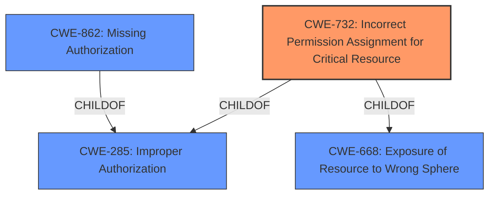

# Analysis Report for CVE-2021-0691

# Vulnerability Analysis Report: CVE-2021-0691

## Description


## Analysis (with Relationship Data)

# Summary
| CWE ID | CWE Name | Confidence | CWE Abstraction Level | CWE Vulnerability Mapping Label | CWE-Vulnerability Mapping Notes |
|---|---|---|---|---|---|
| CWE-732 | Incorrect Permission Assignment for Critical Resource | 0.8 | Class | Allowed-with-Review | Primary CWE |
| CWE-862 | Missing Authorization | 0.6 | Class | Allowed-with-Review | Secondary Candidate |

## Evidence and Confidence

*   **Confidence Score:** 0.7
*   **Evidence Strength:** HIGH

## Relationship Analysis
The analysis focuses on the relationship between CWE-732 and its parent CWEs, CWE-285 and CWE-668. CWE-732, while a Class, provides a more specific description of the vulnerability related to incorrect permission assignment for critical resources, making it a better fit than its parents. CWE-862, Missing Authorization, is also considered due to the authorization aspect of the vulnerability, but it is less specific than CWE-732 in this context.



## Vulnerability Chain
The vulnerability chain starts with an **overly-permissive SELinux policy** (CWE-732). This leads to the ability to gain code execution in other processes, resulting in a local escalation of privilege. The root cause is the incorrect assignment of permissions, which directly leads to the impact.

## Summary of Analysis
The initial assessment identified CWE-732 as the primary candidate due to the vulnerability description mentioning an **overly-permissive SELinux policy**. This aligns directly with the definition of CWE-732: "The product specifies permissions for a security-critical resource in a way that allows that resource to be read or modified by unintended actors."

The evidence for this is found in the Vulnerability Description Key Phrases: "**rootcause:** **overly-permissive SELinux policy**". Further supporting evidence comes from the CVE Reference Links Content Summary: "CVE-2021-0691 is an elevation of privilege vulnerability due to an overly permissive SELinux policy in Android 11 which allowed a local application to escalate its privileges by leveraging an improperly granted adb data loader permission."

CWE-862, Missing Authorization, was also considered because the **overly-permissive policy** essentially bypasses authorization checks. However, CWE-732 is more specific, addressing the incorrect assignment of permissions that enables this bypass.

The final decision is based on the evidence provided, relationship analysis, and mapping guidance. CWE-732 is the most appropriate because it directly addresses the **root cause** of the vulnerability - the **incorrect permission assignment**. It is at the Class level of abstraction, offering a balance between specificity and broad applicability.

Relevant CWE Information:

# Enhanced Context (25 CWEs)

## CWE-667: Improper Locking
**Abstraction Level**: Class
**Similarity Score**: 0.79
**Source**: dense
**Description**:
The product does not properly acquire or release a lock on a resource, leading to unexpected resource state changes and behaviors.
**Why Not Used:** This CWE is related to concurrency issues, which are not the primary concern in this vulnerability.

## CWE-404: Improper Resource Shutdown or Release
**Abstraction Level**: Class
**Similarity Score**: 0.78
**Source**: dense
**Description**:
The product does not release or incorrectly releases a resource before it is made available for re-use.
**Why Not Used:** This CWE focuses on resource management, which is not the core issue in the given vulnerability.

## CWE-754: Improper Check for Unusual or Exceptional Conditions
**Abstraction Level**: Class
**Similarity Score**: 0.77
**Source**: dense
**Description**:
The product does not check or incorrectly checks for unusual or exceptional conditions that are not expected to occur frequently during day to day operation of the product.
**Why Not Used:** This CWE is about error handling, which is not directly related to the root cause of the vulnerability.

## CWE-203: Observable Discrepancy
**Abstraction Level**: Base
**Similarity Score**: 0.77
**Source**: dense
**Description**:
The product behaves differently or sends different responses under different circumstances in a way that is observable to an unauthorized actor, which exposes security-relevant information about the state of the product, such as whether a particular operation was successful or not.
**Why Not Used:** This CWE is more about information disclosure, not directly related to the permission issue.

## CWE-653: Improper Isolation or Compartmentalization
**Abstraction Level**: Class
**Similarity Score**: 0.76
**Source**: dense
**Description**:
The product does not properly compartmentalize or isolate functionality, processes, or resources that require different privilege levels, rights, or permissions.
**Why Not Used:** While related to security boundaries, it doesn't specifically address the incorrect permission assignment like CWE-732.

## CWE-668: Exposure of Resource to Wrong Sphere
**Abstraction Level**: Class
**Similarity Score**: 0.76
**Source**: dense
**Description**:
The product exposes a resource to the wrong control sphere, providing unintended actors with inappropriate access to the resource.
**Why Not Used:** While related to the issue, CWE-732 is a more specific description of the vulnerability.

## CWE-362: Concurrent Execution using Shared Resource with Improper Synchronization ('Race Condition')
**Abstraction Level**: Class
**Similarity Score**: 0.76
**Source**: dense
**Description**:
The product contains a concurrent code sequence that requires temporary, exclusive access to a shared resource, but a timing window exists in which the shared resource can be modified by another code sequence operating concurrently.
**Why Not Used:** This CWE is about concurrency and race conditions, which are not directly relevant to the vulnerability.

## CWE-451: User Interface (UI) Misrepresentation of Critical Information
**Abstraction Level**: Class
**Similarity Score**: 0.76
**Source**: dense
**Description**:
The user interface (UI) does not properly represent critical information to the user, allowing the information - or its source - to be obscured or spoofed. This is often a component in phishing attacks.
**Why Not Used:** This CWE concerns UI-related issues, which are not part of this vulnerability.

## CWE-226: Sensitive Information in Resource Not Removed Before Reuse
**Abstraction Level**: Base
**Similarity Score**: 0.76
**Source**: dense
**Description**:
The product releases a resource such as memory or a file so that it can be made available for reuse, but it does not clear or "zeroize" the information contained in the resource before the product performs a critical state transition or makes the resource available for reuse by other entities.
**Why Not Used:** This CWE is about resource reuse and information leakage, not the core issue here.

## CWE-755: Improper Handling of Exceptional Conditions
**Abstraction Level**: Class
**Similarity Score**: 0.76
**Source**: dense
**Description**:
The product does not handle or incorrectly handles an exceptional condition.
**Why Not Used:** This CWE focuses on error handling, which is not the primary concern of this vulnerability.

## CWE-367: Time-of-check Time-of-use (TOCTOU) Race Condition
**Abstraction Level**: Base
**Similarity Score**: 5204.52
**Source**: sparse
**Description**:
The product checks the state of a resource before using that resource, but the resource's state can change between the check and the use in a way that invalidates the results of the check. This can cause the product to perform invalid actions when the resource is in an unexpected state.
**Why Not Used:** Race condition is not the primary issue.

## CWE-863: Incorrect Authorization
**Abstraction Level**: Class
**Similarity Score**: 5158.65
**Source**: sparse
**Description**:
The product performs an authorization check when an actor attempts to access a resource or perform an action, but it does not correctly perform the check.
**Why Not Used:** CWE-732 is more specific.

## CWE-285: Improper Authorization
**Abstraction Level**: Class
**Similarity Score**: 5097.48
**Source**: sparse
**Description**:
The product does not perform or incorrectly performs an authorization check when an actor attempts to access a resource or perform an action.
**Why Not Used:** CWE-7


## CWE Relationship Analysis

Current CWEs represent these abstraction levels: .


### Vulnerability Chain Analysis

**Chain starting from CWE-732:**
- 732 (Incorrect Permission Assignment for Critical Resource) - ROOT


**Chain starting from CWE-667:**
- 667 (Improper Locking) - ROOT


### CWE Relationship Diagram

```mermaid
graph TD
    classDef primary fill:#f96,stroke:#333,stroke-width:2px
    classDef secondary fill:#69f,stroke:#333
    classDef tertiary fill:#9e9,stroke:#333
```


*Report generated on 2025-04-01 17:16:33*
