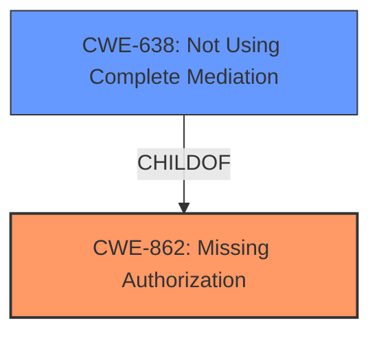

# Raw Analyzer Response for CVE-2021-0694

# Summary
| CWE ID | CWE Name | Confidence | CWE Abstraction Level | CWE Vulnerability Mapping Label | CWE-Vulnerability Mapping Notes |
|---|---|---|---|---|---|
| CWE-862 | Missing Authorization | 0.9 | Class | Primary | Allowed-with-Review |
| CWE-638 | Not Using Complete Mediation | 0.7 | Class | Secondary | Allowed-with-Review |

## Evidence and Confidence

*   **Confidence Score:** 0.9
*   **Evidence Strength:** HIGH

## Relationship Analysis
The primary CWE is CWE-862, Missing Authorization, a Class-level CWE. A related CWE is CWE-638, Not Using Complete Mediation, which is a child of CWE-862, indicating a potential refinement. The choice of CWE-862 as the primary mapping is driven by the high-level oversight in authorization within the described vulnerability.

## Vulnerability Chain
The vulnerability chain starts with **insufficient background restrictions**, which leads to a **missing authorization** check, allowing a background application to regain foreground permissions, resulting in local escalation of privilege.

## Summary of Analysis
The initial assessment, based on the vulnerability description and the retriever results, pointed towards CWE-862 (Missing Authorization) as the primary candidate. The **root cause** is the **insufficient background restrictions**. The CVE reference link content summary explicitly mentions **insufficient checks for foreground state when calling Service.startForeground() after the initial service start** as a weakness.

The vulnerability description states that there is a way for a background application to regain foreground permissions due to **insufficient background restrictions**. The retriever results listed CWE-862 (Missing Authorization) as a potential match. CWE-638 (Not Using Complete Mediation) was also considered, as it is a child of CWE-862 and represents a more specific scenario where access checks are not performed every time a resource is accessed.

The decision to choose CWE-862 as the primary CWE is based on the evidence of **insufficient background restrictions** leading to a lack of authorization checks. This aligns with the description of CWE-862, which states that "The product does not perform an authorization check when an actor attempts to access a resource or perform an action."

The MITRE mapping guidance for CWE-862 suggests examining children of this entry to see if there is a better fit. CWE-638 (Not Using Complete Mediation) is a child of CWE-862 and describes a scenario where access checks are not performed every time a resource is accessed. While this is a possibility, the initial **root cause** is broader, involving the initial lack of authorization rather than the absence of continuous checks. Therefore, CWE-862 is the more appropriate primary mapping.

CWE-638 is considered a secondary issue. It matches the case where the system only checked for the `mAllowWhileInUsePermissionInFgs` flag at service start, but not on later calls to `Service.startForeground()`.

Relevant CWE Information:

# Enhanced Context (25 CWEs)
The following CWEs were identified as potentially relevant to this vulnerability:

## CWE-667: Improper Locking
**Abstraction Level**: Class
**Similarity Score**: 0.79
**Source**: dense

**Description**:
The product does not properly acquire or release a lock on a resource, leading to unexpected resource state changes and behaviors.

**Mapping Guidance**:
- Usage: Allowed-with-Review
- Rationale: This CWE entry is a Class and might have Base-level children that would be more appropriate

*Rationale for not selecting CWE-667:* This CWE focuses on locking issues, which are not relevant to the vulnerability description.

## CWE-754: Improper Check for Unusual or Exceptional Conditions
**Abstraction Level**: Class
**Similarity Score**: 0.77
**Source**: dense

**Description**:
The product does not check or incorrectly checks for unusual or exceptional conditions that are not expected to occur frequently during day to day operation of the product.

**Mapping Guidance**:
- Usage: Allowed-with-Review
- Rationale: This CWE entry is a Class and might have Base-level children that would be more appropriate

*Rationale for not selecting CWE-754:* While the situation is unusual, the core issue is missing authorization, not a general failure to check for exceptional conditions.

## CWE-226: Sensitive Information in Resource Not Removed Before Reuse
**Abstraction Level**: Base
**Similarity Score**: 0.77
**Source**: dense

**Description**:
The product releases a resource such as memory or a file so that it can be made available for reuse, but it does not clear or "zeroize" the information contained in the resource before the product performs a critical state transition or makes the resource available for reuse by other entities.

**Mapping Guidance**:
- Usage: Allowed
- Rationale: This CWE entry is at the Base level of abstraction, which is a preferred level of abstraction for mapping to the root causes of vulnerabilities.

*Rationale for not selecting CWE-226:* This CWE focuses on resource reuse issues, which are not relevant to the vulnerability description.

## CWE-404: Improper Resource Shutdown or Release
**Abstraction Level**: Class
**Similarity Score**: 0.77
**Source**: dense

**Description**:
The product does not release or incorrectly releases a resource before it is made available for re-use.

**Mapping Guidance**:
- Usage: Allowed-with-Review
- Rationale: This CWE entry is a Class and might have Base-level children that would be more appropriate

*Rationale for not selecting CWE-404:* This CWE focuses on resource release issues, which are not relevant to the vulnerability description.

## CWE-665: Improper Initialization
**Abstraction Level**: Class
**Similarity Score**: 0.76
**Source**: dense

**Description**:
The product does not initialize or incorrectly initializes a resource, which might leave the resource in an unexpected state when it is accessed or used.

**Mapping Guidance**:
- Usage: Discouraged
- Rationale: This CWE entry is a level-1 Class (i.e., a child of a Pillar). It might have lower-level children that would be more appropriate

*Rationale for not selecting CWE-665:* This CWE focuses on initialization issues, which are not directly related to the vulnerability.

## CWE-908: Use of Uninitialized Resource
**Abstraction Level**: Base
**Similarity Score**: 0.76
**Source**: dense

**Description**:
The product uses or accesses a resource that has not been initialized.

**Mapping Guidance**:
- Usage: Allowed
- Rationale: This CWE entry is at the Base level of abstraction, which is a preferred level of abstraction for mapping to the root causes of vulnerabilities.

*Rationale for not selecting CWE-908:* This CWE focuses on the use of uninitialized resources, which is not the primary issue in the vulnerability description.

## CWE-280: Improper Handling of Insufficient Permissions or Privileges
**Abstraction Level**: Base
**Similarity Score**: 0.76
**Source**: dense

**Description**:
The product does not handle or incorrectly handles when it has insufficient privileges to access resources or functionality as specified by their permissions. This may cause it to follow unexpected code paths that may leave the product in an invalid state.

**Mapping Guidance**:
- Usage: Allowed
- Rationale: This CWE entry is at the Base level of abstraction, which is a preferred level of abstraction for mapping to the root causes of vulnerabilities.

*Rationale for not selecting CWE-280:* Although related to privileges, the core issue is the missing authorization check, not the handling of insufficient permissions.

## CWE-668: Exposure of Resource to Wrong Sphere
**Abstraction Level**: Class
**Similarity Score**: 0.76
**Source**: dense

**Description**:
The product exposes a resource to the wrong control sphere, providing unintended actors with inappropriate access to the resource.

**Mapping Guidance**:
- Usage: Discouraged
- Rationale: CWE-668 is high-level and is often misused as a catch-all when lower-level CWE IDs might be applicable. It is sometimes used for low-information vulnerability reports [REF-1287]. It is a level-1 Class (i.e., a child of a Pillar). It is not useful for trend analysis.

*Rationale for not selecting CWE-668:* While the vulnerability involves exposure of privileges, CWE-862 provides a more precise description of the missing authorization check.

## CWE-451: User Interface (UI) Misrepresentation of Critical Information
**Abstraction Level**: Class
**Similarity Score**: 0.76
**Source**: dense

**Description**:
The user interface (UI) does not properly represent critical information to the user, allowing the information - or its source - to be obscured or spoofed.