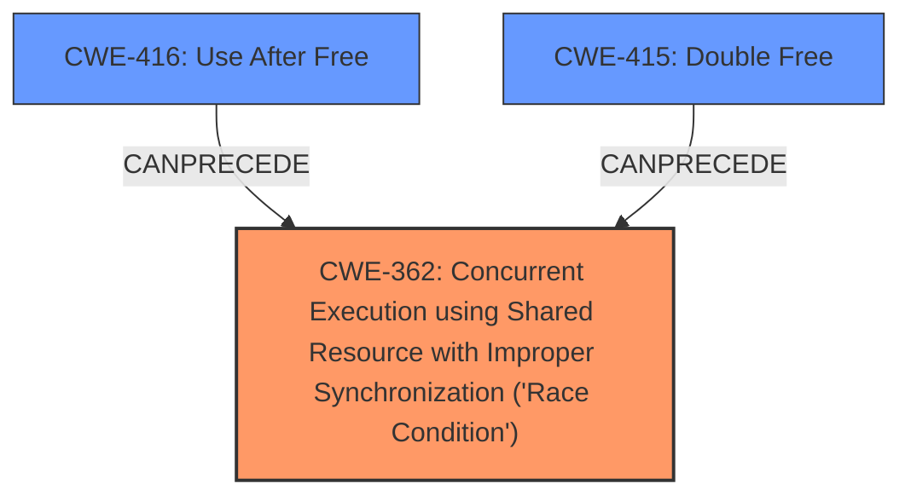

# Raw Analyzer Response for CVE-2021-0870

# Summary
| CWE ID | CWE Name | Confidence | CWE Abstraction Level | CWE Vulnerability Mapping Label | CWE-Vulnerability Mapping Notes |
|---|---|---|---|---|---|
| CWE-362 | Concurrent Execution using Shared Resource with Improper Synchronization ('**Race Condition**') | 1.0 | Class | Allowed-with-Review | Primary CWE |
| CWE-416 | Use After Free | 0.5 | Variant | Allowed | Secondary Candidate |
| CWE-415 | Double Free | 0.5 | Variant | Allowed | Secondary Candidate |

## Evidence and Confidence

*   **Confidence Score:** 0.7
*   **Evidence Strength:** HIGH

## Relationship Analysis
The primary CWE selected is CWE-362, which is a Class-level CWE. The vulnerability description explicitly mentions a "**race condition**," making this a strong initial candidate. The secondary candidates, CWE-416 and CWE-415, are both Variants and can result from **race conditions**.

## Vulnerability Chain
The vulnerability chain starts with the **race condition** (CWE-362) and leads to memory corruption. It is possible that the memory corruption could manifest as a use-after-free (CWE-416) or double-free (CWE-415).

## Summary of Analysis
The vulnerability description explicitly states that a **race condition** exists in `RW_SetActivatedTagType` of `rw_main.cc`, leading to possible memory corruption.

The evidence from the "Vulnerability Description Key Phrases" and "CVE Reference Links Content Summary" clearly supports the presence of a **race condition**.

CWE-362 (Concurrent Execution using Shared Resource with Improper Synchronization ('**Race Condition**')) is selected as the primary CWE because it directly reflects the stated **root cause** of the vulnerability. The "**rootcause:** **race condition**" phrase in the vulnerability description key phrases indicates that the vulnerability is due to a **race condition**.

CWE-416 (Use After Free) and CWE-415 (Double Free) are considered as secondary CWEs because they are potential consequences of memory corruption resulting from the **race condition**. These are added with lower confidence because these are only potential outcomes, not definitively confirmed in the description.

The selection of CWE-362 is justified by the explicit mention of a **race condition** in the vulnerability description. While CWE-362 is a Class, the available evidence does not point to a more specific Base or Variant.

Relevant CWE Information:

# Enhanced Context (25 CWEs)

## CWE-404: Improper Resource Shutdown or Release
**Abstraction Level**: Class
**Similarity Score**: 0.78
**Source**: dense

**Description**:
The product does not release or incorrectly releases a resource before it is made available for re-use.
**Rationale for not selecting**: This CWE is not directly supported by the provided evidence.

## CWE-667: Improper Locking
**Abstraction Level**: Class
**Similarity Score**: 0.78
**Source**: dense

**Description**:
The product does not properly acquire or release a lock on a resource, leading to unexpected resource state changes and behaviors.
**Rationale for not selecting**: While locking issues can contribute to **race conditions**, the description does not explicitly mention locking.

## CWE-226: Sensitive Information in Resource Not Removed Before Reuse
**Abstraction Level**: Base
**Similarity Score**: 0.77
**Source**: dense

**Description**:
The product releases a resource such as memory or a file so that it can be made available for reuse, but it does not clear or "zeroize" the information contained in the resource before the product performs a critical state transition or makes the resource available for reuse by other entities.
**Rationale for not selecting**: This CWE is not directly supported by the provided evidence.

## CWE-362: Concurrent Execution using Shared Resource with Improper Synchronization ('Race Condition')
**Abstraction Level**: Class
**Similarity Score**: 0.77
**Source**: dense

**Description**:
The product contains a concurrent code sequence that requires temporary, exclusive access to a shared resource, but a timing window exists in which the shared resource can be modified by another code sequence operating concurrently.
**Rationale for selecting**: This CWE is selected because the "**rootcause:** **race condition**" key phrase clearly indicates a **race condition**.

## CWE-366: Race Condition within a Thread
**Abstraction Level**: Base
**Similarity Score**: 0.77
**Source**: dense

**Description**:
If two threads of execution use a resource simultaneously, there exists the possibility that resources may be used while invalid, in turn making the state of execution undefined.
**Rationale for not selecting**: While this is a more specific form of CWE-362, there is no evidence to indicate that this **race condition** is specifically within a thread.

## CWE-662: Improper Synchronization
**Abstraction Level**: Class
**Similarity Score**: 0.76
**Source**: dense

**Description**:
The product utilizes multiple threads or processes to allow temporary access to a shared resource that can only be exclusive to one process at a time, but it does not properly synchronize these actions, which might cause simultaneous accesses of this resource by multiple threads or processes.
**Rationale for not selecting**: Improper synchronization can cause **race conditions**, but the root cause is the **race condition**, and there's no specific mention of synchronization issues.

## CWE-754: Improper Check for Unusual or Exceptional Conditions
**Abstraction Level**: Class
**Similarity Score**: 0.75
**Source**: dense

**Description**:
The product does not check or incorrectly checks for unusual or exceptional conditions that are not expected to occur frequently during day to day operation of the product.
**Rationale for not selecting**: There is no evidence to support this.

## CWE-367: Time-of-check Time-of-use (TOCTOU) Race Condition
**Abstraction Level**: Base
**Similarity Score**: 0.75
**Source**: dense

**Description**:
The product checks the state of a resource before using that resource, but the resource's state can change between the check and the use in a way that invalidates the results of the check. This can cause the product to perform invalid actions when the resource is in an unexpected state.
**Rationale for not selecting**: There is no evidence to support this.

## CWE-405: Asymmetric Resource Consumption (Amplification)
**Abstraction Level**: Class
**Similarity Score**: 0.75
**Source**: dense

**Description**:
The product does not properly control situations in which an adversary can cause the product to consume or produce excessive resources without requiring the adversary to invest equivalent work or otherwise prove authorization, i.e., the adversary's influence is "asymmetric."
**Rationale for not selecting**: There is no evidence to support this.

## CWE-653: Improper Isolation or Compartmentalization
**Abstraction Level**: Class
**Similarity Score**: 0.75
**Source**: dense

**Description**:
The product does not properly compartmentalize or isolate functionality, processes, or resources that require different privilege levels, rights, or permissions.
**Rationale for not selecting**: There is no evidence to support this.

## CWE-364: Signal Handler Race Condition
**Abstraction Level**: Base
**Similarity Score**: 6597.86
**Source**: sparse

**Description**:
The product uses a signal handler that introduces a **race condition**.
**Rationale for not selecting**: There is no evidence to support that this is a signal handler **race condition**.

## CWE-828: Signal Handler with Functionality that is not Asynchronous-Safe
**Abstraction Level**: Variant
**Similarity Score**: 5507.58
**Source**: sparse

**Description**:
The product defines a signal handler that contains code sequences that are not asynchronous-safe, i.e., the functionality is not reentrant, or it can be interrupted.
**Rationale for not selecting**: There is no evidence to support that this is a signal handler **race condition**.

## CWE-415: Double Free
**Abstraction Level**: Variant
**Similarity Score**: 5488.63
**Source**: sparse

**Description**:
The product calls free() twice on the same memory address, potentially leading to modification of unexpected memory locations.
**Rationale for selecting**: While the description states "memory corruption" which could be a double free, there is no evidence in the description.

## CWE-123: Write-what-where Condition
**Abstraction Level**: base
**Similarity Score**: 5.03