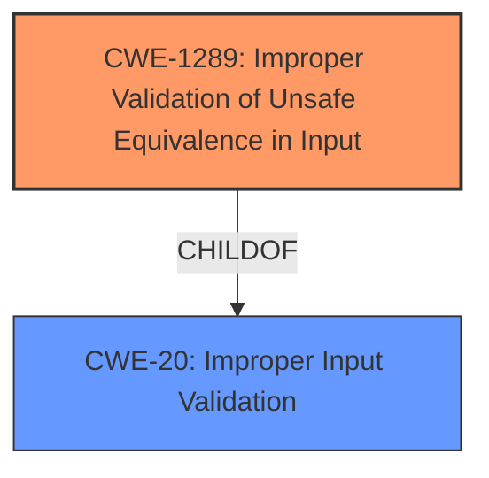

# Enhanced Analysis for CVE-2021-0921

# Summary
| CWE ID | CWE Name | Confidence | CWE Abstraction Level | CWE Vulnerability Mapping Label | CWE-Vulnerability Mapping Notes |
|---|---|---|---|---|---|
| CWE-1289 | Improper Validation of Unsafe Equivalence in Input | 0.8 | Base | Allowed | Primary CWE |
| CWE-20 | Improper Input Validation | 0.6 | Class | Discouraged | Secondary Candidate |

## Evidence and Confidence

*   **Confidence Score:** 0.8
*   **Evidence Strength:** HIGH

## Relationship Analysis
The primary CWE is CWE-1289, which is a Base level CWE. It captures the essence of **improper input validation** where the input is not validated for equivalence against potentially unsafe values. CWE-20 is a more general class, and while relevant, CWE-1289 provides a more specific description of the vulnerability. There are no direct parent-child relationships of consequence here.



## Vulnerability Chain
The vulnerability begins with the **parcel serialization/deserialization mismatch** due to **improper input validation**, specifically the **improper handling of parsed component properties, KeySet mappings, and queries intents** during parceling. This leads to a local elevation of privilege. The root cause is the **improper input validation (CWE-1289)** which results in elevation of privilege.

## Summary of Analysis
The initial analysis pointed to a parcel serialization/deserialization mismatch due to **improper input validation**. The CVE Reference Links Content Summary provided more details about the **weaknesses**, which include **improper handling of parsed component properties (mProperties), Improper handling of KeySet mappings (mKeySetMapping) in ParsedPackageImpl, Improper handling of queries intents (mQueriesIntent) in ParsedPackageImpl**.

The Retriever Results highlighted several potential CWEs, including CWE-1021, CWE-862, CWE-908, CWE-667, CWE-223, CWE-927, CWE-73, CWE-514, CWE-20, and CWE-362.

The most relevant CWE based on the evidence and the CWE specifications is CWE-1289 (Improper Validation of Unsafe Equivalence in Input). This CWE directly addresses the scenario where the product receives an input value (in this case, during deserialization) and fails to properly validate that the input is equivalent to a potentially unsafe value. The vulnerability description specifically mentions a **parcel serialization/deserialization mismatch** due to **improper input validation**, making CWE-1289 a strong fit.

CWE-20 (Improper Input Validation) is a broader category and could also apply, but it's discouraged. CWE-1289 is more specific and therefore more appropriate.

The decision is based on the vulnerability description, CVE Reference Links Content Summary, and the CWE specifications.

Relevant CWE Information:

# Enhanced Context (25 CWEs)

## CWE-1289: Improper Validation of Unsafe Equivalence in Input
**Abstraction Level**: Base
**Similarity Score**: 0.75
**Source**: dense

**Description**:
The product receives an input value that is used as a resource identifier or other type of reference, but it does not validate or incorrectly validates that the input is equivalent to a potentially-unsafe value.

**Mapping Guidance**:
- Usage: Allowed
- Rationale: This CWE entry is at the Base level of abstraction, which is a preferred level of abstraction for mapping to the root causes of vulnerabilities.

**Explanation:** This CWE directly aligns with the vulnerability description. The parcel deserialization process receives input that represents component properties, KeySet mappings, or intent queries. The **failure to validate** the equivalence of these inputs against expected safe values leads to the **deserialization mismatch** and subsequent elevation of privilege. The "CVE Reference Links Content Summary" highlights the **improper handling** of these properties, confirming the **lack of proper validation**.
Confidence: 0.8

## CWE-20: Improper Input Validation
**Abstraction Level**: Class
**Similarity Score**: 0.311
**Source**: sparse

**Description**:
The product receives input or data, but it does not validate or incorrectly validates that the input has the properties that are required to process the data safely and correctly.

**Mapping Guidance**:
- Usage: Discouraged
- Rationale: CWE-20 is commonly misused in low-information vulnerability reports when lower-level CWEs could be used instead, or when more details about the vulnerability are available [REF-1287]. It is not useful for trend analysis. It is also a level-1 Class (i.e., a child of a Pillar).

**Explanation:** While the vulnerability does involve **improper input validation**, CWE-20 is a broad category. The more specific CWE-1289 provides a better characterization of the vulnerability because it focuses on the validation of equivalence, which is more directly relevant to the deserialization mismatch. The guidance discourages using this CWE.
Confidence: 0.6

The other CWEs were considered but rejected because they did not directly address the root cause of the vulnerability. CWE-1021, CWE-862, CWE-908, CWE-667, CWE-223, CWE-927, CWE-73, CWE-514 and CWE-362 focus on UI layers, authorization, uninitialized resources, locking, security information, intents, file paths, covert channels and concurrency respectively, which are not the primary factors in this vulnerability.


## CWE Relationship Analysis

Current CWEs represent these abstraction levels: .


### Vulnerability Chain Analysis

**Chain starting from CWE-667:**
- 667 (Improper Locking) - ROOT


**Chain starting from CWE-862:**
- 862 (Missing Authorization) - ROOT


### CWE Relationship Diagram

```mermaid
graph TD
    classDef primary fill:#f96,stroke:#333,stroke-width:2px
    classDef secondary fill:#69f,stroke:#333
    classDef tertiary fill:#9e9,stroke:#333
```