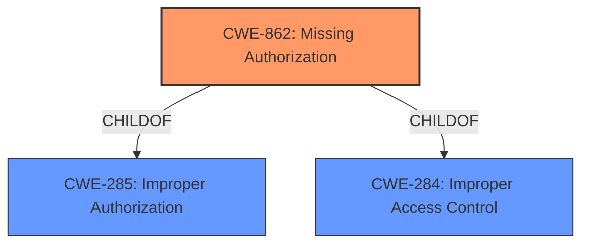

# Analysis Report for CVE-2021-0923

# Vulnerability Analysis Report: CVE-2021-0923

## Description


## Analysis (with Relationship Data)

# Summary
| CWE ID | CWE Name | Confidence | CWE Abstraction Level | CWE Vulnerability Mapping Label | CWE-Vulnerability Mapping Notes |
|---|---|---|---|---|---|
| CWE-862 | Missing Authorization | 1.0 | Class | Allowed-with-Review | Primary CWE: The vulnerability stems from a **missing permission check** in the `createOrUpdate` method of `Permission.java`. |

## Evidence and Confidence

*   **Confidence Score:** 1.0
*   **Evidence Strength:** HIGH

## Relationship Analysis
The primary relationship to consider here is that CWE-862 [CWE-862: Missing Authorization] is a child of CWE-285 [CWE-285: Improper Authorization] and CWE-284. While CWE-285 is a broader class, CWE-862 [CWE-862: Missing Authorization] specifically addresses the scenario where an authorization check is missing altogether, which aligns perfectly with the vulnerability description's **"missing permission check"**. Choosing CWE-862 [CWE-862: Missing Authorization] provides a more precise classification.



## Vulnerability Chain
The chain of events for this vulnerability is straightforward:

1.  **Root Cause:** **Missing permission check** (CWE-862 [CWE-862: Missing Authorization]) in the `createOrUpdate` method.
2.  **Impact:** Gaining internal permissions, leading to local escalation of privilege.

## Summary of Analysis
The analysis is strongly based on the provided evidence, specifically the vulnerability description's key phrase **"missing permission check"**. The CVE Reference Links Content Summary further supports this by stating the issue is related to internal permissions handling and the failure to revoke permissions during owner changes.

The graph relationships confirm that CWE-862 [CWE-862: Missing Authorization] is a specific type of improper authorization, making it the most appropriate choice. The mapping guidance for CWE-862 [CWE-862: Missing Authorization] suggests examining its children for a better fit, but since the core issue is a *missing* check rather than an *incorrect* one, CWE-862 [CWE-862: Missing Authorization] itself is the most accurate.

The selected CWE is at the optimal level of specificity because it directly reflects the root cause described in the vulnerability: the absence of an authorization check. Other CWEs considered, like CWE-285 [CWE-285: Improper Authorization] (Improper Authorization), are too general.

Relevant CWE Information:
- **CWE-862 [CWE-862: Missing Authorization]**: This is the most specific and accurate representation of the vulnerability, as it directly addresses the **missing permission check**.
- **CWE-285 [CWE-285: Improper Authorization]**: Considered but deemed too general. While the vulnerability does involve authorization, the core issue is that authorization is entirely missing, not just improperly implemented.


## CWE Relationship Analysis

Current CWEs represent these abstraction levels: .


### Vulnerability Chain Analysis

**Chain starting from CWE-285:**
- 285 (Improper Authorization) - ROOT


**Chain starting from CWE-862:**
- 862 (Missing Authorization) - ROOT


### CWE Relationship Diagram

```mermaid
graph TD
    classDef primary fill:#f96,stroke:#333,stroke-width:2px
    classDef secondary fill:#69f,stroke:#333
    classDef tertiary fill:#9e9,stroke:#333
```


*Report generated on 2025-04-02 13:32:33*
