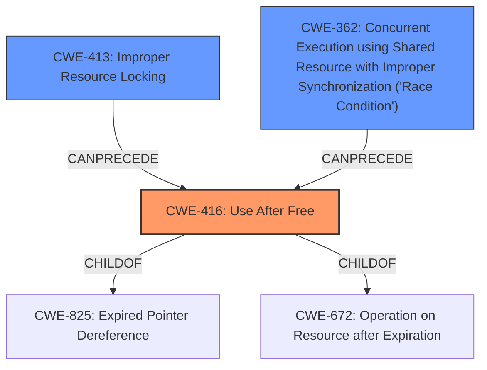

# Analysis for CVE-2021-0936

# Summary
| CWE ID | CWE Name | Confidence | CWE Abstraction Level | CWE Vulnerability Mapping Label | CWE-Vulnerability Mapping Notes |
|---|---|---|---|---|---|
| CWE-416 | Use After Free | 1.0 | Variant | Allowed | Primary CWE |
| CWE-413 | Improper Resource Locking | 0.7 | Base | Allowed | Secondary Candidate |
| CWE-362 | Concurrent Execution using Shared Resource with Improper Synchronization ('Race Condition') | 0.6 | Class | Allowed-with-Review | Secondary Candidate |

## Evidence and Confidence

*   **Confidence Score:** 0.9
*   **Evidence Strength:** HIGH

## Relationship Analysis
The primary weakness is CWE-416 **Use After Free**, which is a Variant level CWE. This is often the result of a race condition (CWE-362) or improper resource locking (CWE-413). CWE-416 is a child of CWE-825 (Expired Pointer Dereference) and CWE-672 (Operation on Resource after Expiration). The analysis of CVE Reference Links Content Summary indicates that race conditions are present, and improper locking can lead to use-after-free conditions.

## Vulnerability Chain
The vulnerability chain starts with the root cause, which could be a race condition (CWE-362) or improper resource locking (CWE-413), and then leads to the main weakness, which is the use-after-free (CWE-416).

## Summary of Analysis
The initial analysis strongly points to CWE-416 **Use After Free** as the primary weakness, supported by the **Vulnerability Description Key Phrases** and the **CVE Reference Links Content Summary**. The description states "**memory corruption** due to a **use after free**" which directly aligns with CWE-416. The CVE summary further reinforces this by detailing the **root cause** as a use-after-free vulnerability in the USB f_accessory gadget driver. Additionally, race conditions and improper locking are mentioned in the CVE summary.

The decision to include CWE-413 and CWE-362 is based on the supporting evidence in the CVE summary: "race conditions identified where multiple threads access shared resources concurrently, leading to data corruption and crashes," and "improper handling of the structure's lifecycle, leading to dangling pointers".

The selection of CWE-416 as the primary CWE is optimal because it directly represents the **rootcause** described in the **Vulnerability Description Key Phrases** and the **CVE Reference Links Content Summary**. The additional CWEs (CWE-413, CWE-362) provide further context on the factors contributing to the primary weakness.

Relevant CWE Information:

# Enhanced Context (25 CWEs)

## CWE-404: Improper Resource Shutdown or Release
**Abstraction Level**: Class
**Similarity Score**: 0.79
**Source**: dense

**Description**:
The product does not release or incorrectly releases a resource before it is made available for re-use.

**Mapping Guidance**:
- Usage: Allowed-with-Review
- Rationale: This CWE entry is a Class and might have Base-level children that would be more appropriate

*This was not selected because while it is related, it does not directly address the use of the freed memory, but rather the release itself.*

## CWE-226: Sensitive Information in Resource Not Removed Before Reuse
**Abstraction Level**: Base
**Similarity Score**: 0.79
**Source**: dense

**Description**:
The product releases a resource such as memory or a file so that it can be made available for reuse, but it does not clear or "zeroize" the information contained in the resource before the product performs a critical state transition or makes the resource available for reuse by other entities.

**Mapping Guidance**:
- Usage: Allowed
- Rationale: This CWE entry is at the Base level of abstraction, which is a preferred level of abstraction for mapping to the root causes of vulnerabilities.

*This was not selected because it relates to sensitive information rather than a general use-after-free condition.*

## CWE-667: Improper Locking
**Abstraction Level**: Class
**Similarity Score**: 0.79
**Source**: dense

**Description**:
The product does not properly acquire or release a lock on a resource, leading to unexpected resource state changes and behaviors.

**Mapping Guidance**:
- Usage: Allowed-with-Review
- Rationale: This CWE entry is a Class and might have Base-level children that would be more appropriate

*This was considered as a contributing factor and a secondary CWE, but it is not the primary issue.*

## CWE-415: Double Free
**Abstraction Level**: Variant
**Similarity Score**: 0.77
**Source**: dense

**Description**:
The product calls free() twice on the same memory address, potentially leading to modification of unexpected memory locations.

**Mapping Guidance**:
- Usage: Allowed
- Rationale: This CWE entry is at the Variant level of abstraction, which is a preferred level of abstraction for mapping to the root causes of vulnerabilities.

*This was not selected because the vulnerability is a use-after-free, not a double free.*

## CWE-366: Race Condition within a Thread
**Abstraction Level**: Base
**Similarity Score**: 0.77
**Source**: dense

**Description**:
If two threads of execution use a resource simultaneously, there exists the possibility that resources may be used while invalid, in turn making the state of execution undefined.

**Mapping Guidance**:
- Usage: Allowed
- Rationale: This CWE entry is at the Base level of abstraction, which is a preferred level of abstraction for mapping to the root causes of vulnerabilities.

*This was considered as a contributing factor since race conditions are mentioned, but the primary weakness is the use-after-free.*

## CWE-362: Concurrent Execution using Shared Resource with Improper Synchronization ('Race Condition')
**Abstraction Level**: Class
**Similarity Score**: 0.76
**Source**: dense

**Description**:
The product contains a concurrent code sequence that requires temporary, exclusive access to a shared resource, but a timing window exists in which the shared resource can be modified by another code sequence operating concurrently.

**Mapping Guidance**:
- Usage: Allowed-with-Review
- Rationale: This CWE entry is a Class and might have Base-level children that would be more appropriate

*This was selected as a secondary CWE because race conditions contribute to the use-after-free vulnerability.*

## CWE-754: Improper Check for Unusual or Exceptional Conditions
**Abstraction Level**: Class
**Similarity Score**: 0.76
**Source**: dense

**Description**:
The product does not check or incorrectly checks for unusual or exceptional conditions that are not expected to occur frequently during day to day operation of the product.

**Mapping Guidance**:
- Usage: Allowed-with-Review
- Rationale: This CWE entry is a Class and might have Base-level children that would be more appropriate

*This was not selected because the issue is not the lack of checking for unusual conditions, but the use of freed memory.*

## CWE-909: Missing Initialization of Resource
**Abstraction Level**: Class
**Similarity Score**: 0.76
**Source**: dense

**Description**:
The product does not initialize a critical resource.

**Mapping Guidance**:
- Usage: Allowed-with-Review
- Rationale: This CWE entry is a Class and might have Base-level children that would be more appropriate

*This was not selected because the issue is not about missing initialization, but the use of memory after it has been freed.*

## CWE-908: Use of Uninitialized Resource
**Abstraction Level**: Base
**Similarity Score**: 0.75
**Source**: dense

**Description**:
The product uses or accesses a resource that has not been initialized.

**Mapping Guidance**:
- Usage: Allowed
- Rationale: This CWE entry is at the Base level of abstraction, which is a preferred level of abstraction for mapping to the root causes of vulnerabilities.

*This was not selected as the root cause is use-after-free not use of uninitialized resource.*

## CWE-665: Improper Initialization