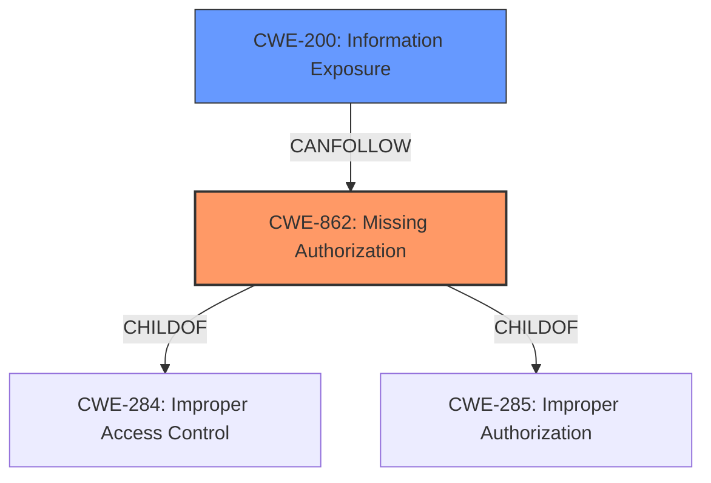

# Analysis Report for CVE-2021-0982

# Vulnerability Analysis Report: CVE-2021-0982

## Description


## Analysis (with Relationship Data)

# Summary
| CWE ID | CWE Name | Confidence | CWE Abstraction Level | CWE Vulnerability Mapping Label | CWE-Vulnerability Mapping Notes |
|---|---|---|---|---|---|
| CWE-862 | Missing Authorization | 1.0 | Class | Allowed-with-Review | Primary CWE |
| CWE-200 | Information Exposure | 0.6 | Class | Allowed-with-Review | Secondary CWE |

## Evidence and Confidence

*   **Confidence Score:** 0.8
*   **Evidence Strength:** HIGH

## Relationship Analysis
The primary CWE is CWE-862 **Missing Authorization**, which is a class-level CWE. While it would be ideal to have a more specific base-level CWE, the available information strongly points to a **missing permission check** as the root cause. CWE-862 has a child relationship to CWE-284 Improper Access Control and CWE-285 Improper Authorization. Given the information disclosure impact, CWE-200 **Information Exposure** is considered a related secondary weakness, because it can be a consequence of missing authorization.



## Vulnerability Chain
The chain of events starts with a **missing permission check** (CWE-862), leading to the disclosure of the organization name (CWE-200).

## Summary of Analysis
The primary weakness is the **missing permission check** in `getOrganizationNameForUser` of `DevicePolicyManagerService.java`. This allows unauthorized access to the organization name, resulting in information disclosure.
The analysis is based on the following evidence:
- Vulnerability Description Key Phrases: "**rootcause:** **missing permission check**"
- CVE Reference Links Content Summary: "Missing access control"
The retriever results also list CWE-862 as the top candidate.

CWE-862 is selected because the vulnerability description explicitly mentions a **missing permission check**, which aligns with the definition of missing authorization. The impact of this **missing authorization** is information disclosure (CWE-200), which is considered a secondary weakness.

Several other CWEs were considered but not chosen:

*   CWE-941: Incorrectly Specified Destination in a Communication Channel, and CWE-927: Use of Implicit Intent for Sensitive Communication: These CWEs are related to communication channels and intents, which are not the primary focus of this vulnerability. The core issue is the **missing permission check**, not the communication channel itself.
*   CWE-203: Observable Discrepancy, and CWE-205: Observable Behavioral Discrepancy: These CWEs are related to observable differences in behavior, which are not directly relevant to this vulnerability. The issue is the **missing authorization** that allows unauthorized access to information.
*   CWE-908: Use of Uninitialized Resource, and CWE-665: Improper Initialization: These CWEs are related to uninitialized resources, which are not mentioned in the vulnerability description.
*   CWE-514: Covert Channel: It doesn't relate to the described **missing permission check** issue.
*   CWE-223: Omission of Security-relevant Information: The vulnerability is not about omitting security-relevant information during logging or display, but about a **missing permission check** that allows unauthorized access to sensitive information.
*   CWE-1021: Improper Restriction of Rendered UI Layers or Frames: This is about UI-related issues like clickjacking, which aren't relevant to the described vulnerability.

The selected CWEs are at the optimal level of specificity because they directly address the root cause (**missing permission check**) and the resulting impact (information disclosure). The evidence strongly supports these classifications, and the relationship analysis provides additional context.


## CWE Relationship Analysis

Current CWEs represent these abstraction levels: .


### Vulnerability Chain Analysis

**Chain starting from CWE-862:**
- 862 (Missing Authorization) - ROOT


**Chain starting from CWE-284:**
- 284 (Improper Access Control) - ROOT


### CWE Relationship Diagram

```mermaid
graph TD
    classDef primary fill:#f96,stroke:#333,stroke-width:2px
    classDef secondary fill:#69f,stroke:#333
    classDef tertiary fill:#9e9,stroke:#333
```


*Report generated on 2025-04-02 16:06:26*
