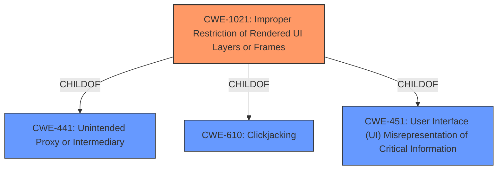

# Enhanced Analysis for CVE-2021-0992

# Summary
| CWE ID   | CWE Name                                                        | Confidence | CWE Abstraction Level | CWE Vulnerability Mapping Label | CWE-Vulnerability Mapping Notes |
| :--------- | :-------------------------------------------------------------- | :--------- | :---------------------- | :------------------------------ | :---------------------------- |
| CWE-1021 | Improper Restriction of Rendered UI Layers or Frames          | 0.95       | Base                    | Primary                         | Allowed                       |
| CWE-451 | User Interface (UI) Misrepresentation of Critical Information | 0.75       | Class                    | Secondary                         | Allowed-with-Review          |

## Evidence and Confidence

*   **Confidence Score:** 0.90
*   **Evidence Strength:** HIGH

## Relationship Analysis

The primary CWE selected is CWE-1021, which is a Base level CWE. It is related to CWE-441 (Unintended Proxy or Intermediary), CWE-610 (Clickjacking), and CWE-451 (User Interface (UI) Misrepresentation of Critical Information) as a ChildOf. The relationship with CWE-451 is important because it suggests a broader category of UI-related vulnerabilities. Given the specific nature of the vulnerability involving **tapjacking**, CWE-1021 is the more precise choice.



## Vulnerability Chain

The vulnerability chain starts with the **tapjack overlay** (**root cause**), which allows an attacker to trick a user into interacting with a dialog box that may be overlaid on top of another window. This leads to the user unintentionally changing the default payment app, which is the **impact**.

## Summary of Analysis

The primary assessment is based on the provided evidence, which explicitly mentions **tapjacking**. The "Vulnerability Description Key Phrases" section identifies "**tapjack overlay**" as the **root cause**. The CVE reference summary further supports this by stating that "The vulnerability occurs because a dialog box used in the payment settings can be overlaid on top of other windows, potentially tricking users into unintended interactions."

CWE-1021 is the most appropriate because it directly addresses the **improper restriction of rendered UI layers or frames**, which is the core issue in **tapjacking**. The Complete CWE Specifications for CWE-1021 also lists "Tapjacking" as an alternative term.

CWE-451, while related, is a more general class of **User Interface (UI) Misrepresentation of Critical Information**. While the **tapjacking** does misrepresent the UI, CWE-1021 captures the specific mechanism of the vulnerability more accurately.

The other CWEs in the Retriever Results were considered but deemed less relevant. For example, CWE-862 (Missing Authorization) does not directly address the UI overlay issue. Similarly, CWE-362 (Concurrent Execution using Shared Resource with Improper Synchronization ('Race Condition')) is not applicable because the vulnerability does not involve concurrent execution or synchronization problems.

The selection of CWE-1021 is at the optimal level of specificity because it is a Base level CWE that directly corresponds to the **tapjacking** vulnerability described in the provided information.

Relevant CWE Information:

# Enhanced Context (25 CWEs)

## CWE-366: Race Condition within a Thread
**Abstraction Level**: Base
**Similarity Score**: 0.78
**Source**: dense

**Description**:
If two threads of execution use a resource simultaneously, there exists the possibility that resources may be used while invalid, in turn making the state of execution undefined.

**Mapping Guidance**:
- Usage: Allowed
- Rationale: This CWE entry is at the Base level of abstraction, which is a preferred level of abstraction for mapping to the root causes of vulnerabilities.

## CWE-662: Improper Synchronization
**Abstraction Level**: Class
**Similarity Score**: 0.77
**Source**: dense

**Description**:
The product utilizes multiple threads or processes to allow temporary access to a shared resource that can only be exclusive to one process at a time, but it does not properly synchronize these actions, which might cause simultaneous accesses of this resource by multiple threads or processes.

**Mapping Guidance**:
- Usage: Discouraged
- Rationale: This CWE entry is a level-1 Class (i.e., a child of a Pillar). It might have lower-level children that would be more appropriate

## CWE-362: Concurrent Execution using Shared Resource with Improper Synchronization ('Race Condition')
**Abstraction Level**: Class
**Similarity Score**: 0.76
**Source**: dense

**Description**:
The product contains a concurrent code sequence that requires temporary, exclusive access to a shared resource, but a timing window exists in which the shared resource can be modified by another code sequence operating concurrently.

**Mapping Guidance**:
- Usage: Allowed-with-Review
- Rationale: This CWE entry is a Class and might have Base-level children that would be more appropriate

## CWE-667: Improper Locking
**Abstraction Level**: Class
**Similarity Score**: 0.76
**Source**: dense

**Description**:
The product does not properly acquire or release a lock on a resource, leading to unexpected resource state changes and behaviors.

**Mapping Guidance**:
- Usage: Allowed-with-Review
- Rationale: This CWE entry is a Class and might have Base-level children that would be more appropriate

## CWE-367: Time-of-check Time-of-use (TOCTOU) Race Condition
**Abstraction Level**: Base
**Similarity Score**: 0.76
**Source**: dense

**Description**:
The product checks the state of a resource before using that resource, but the resource's state can change between the check and the use in a way that invalidates the results of the check. This can cause the product to perform invalid actions when the resource is in an unexpected state.

**Mapping Guidance**:
- Usage: Allowed
- Rationale: This CWE entry is at the Base level of abstraction, which is a preferred level of abstraction for mapping to the root causes of vulnerabilities.

## CWE-368: Context Switching Race Condition
**Abstraction Level**: Base
**Similarity Score**: 0.75
**Source**: dense

**Description**:
A product performs a series of non-atomic actions to switch between contexts that cross privilege or other security boundaries, but a race condition allows an attacker to modify or misrepresent the product's behavior during the switch.

**Mapping Guidance**:
- Usage: Allowed
- Rationale: This CWE entry is at the Base level of abstraction, which is a preferred level of abstraction for mapping to the root causes of vulnerabilities.

## CWE-1021: Improper Restriction of Rendered UI Layers or Frames
**Abstraction Level**: Base
**Similarity Score**: 0.74
**Source**: dense

**Description**:
The web application does not restrict or incorrectly restricts frame objects or UI layers that belong to another application or domain, which can lead to user confusion about which interface the user is interacting with.

**Mapping Guidance**:
- Usage: Allowed
- Rationale: This CWE entry is at the Base level of abstraction, which is a preferred level of abstraction for mapping to the root causes of vulnerabilities.

## CWE-404: Improper Resource Shutdown or Release
**Abstraction Level**: Class
**Similarity Score**: 0.74
**Source**: dense

**Description**:
The product does not release or incorrectly releases a resource before it is made available for re-use.

**Mapping Guidance**:
- Usage: Allowed-with-Review
- Rationale: This CWE entry is a Class and might have Base-level children that would be more appropriate

## CWE-451: User Interface (UI) Misrepresentation of Critical Information
**Abstraction Level**: Class
**Similarity Score**: 0.74
**Source**: dense

**Description**:
The user interface (UI) does not properly represent critical information to the user, allowing the information - or its source - to be obscured or spoofed. This is often a component in phishing attacks.

**Mapping Guidance**:
- Usage: Allowed-with-Review
- Rationale: This CWE entry is a Class and might have Base-level children that would be more appropriate

## CWE-754: Improper Check for Unusual or Exceptional Conditions
**Abstraction Level**: Class
**Similarity Score**: 0.73
**Source**: dense

**Description**:
The product does not check or incorrectly checks for unusual or exceptional conditions that are not expected to occur frequently during day to day operation


## CWE Relationship Analysis

Current CWEs represent these abstraction levels: .


### Vulnerability Chain Analysis

**Chain starting from CWE-667:**
- 667 (Improper Locking) - ROOT


**Chain starting from CWE-662:**
- 662 (Improper Synchronization) - ROOT


### CWE Relationship Diagram

```mermaid
graph TD
    classDef primary fill:#f96,stroke:#333,stroke-width:2px
    classDef secondary fill:#69f,stroke:#333
    classDef tertiary fill:#9e9,stroke:#333
```