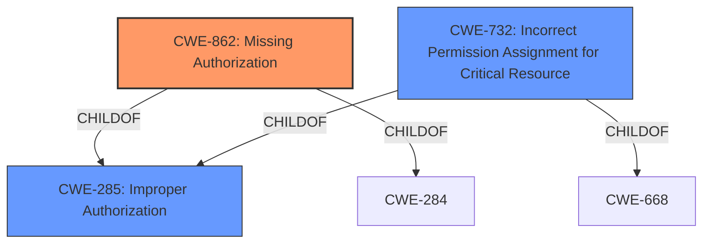

# Analysis for CVE-2021-1004

# Summary
| CWE ID | CWE Name | Confidence | CWE Abstraction Level | CWE Vulnerability Mapping Label | CWE-Vulnerability Mapping Notes |
|---|---|---|---|---|---|
| CWE-862 | Missing Authorization | 1.0 | Class | Allowed-with-Review | Primary CWE.  The product does not perform an authorization check when an actor attempts to access a resource or perform an action. |
| CWE-285 | Improper Authorization | 0.7 | Class | Discouraged | Secondary candidate. The product does not perform or incorrectly performs an authorization check when an actor attempts to access a resource or perform an action. |
| CWE-732 | Incorrect Permission Assignment for Critical Resource | 0.6 | Class | Allowed-with-Review | Secondary candidate. The product specifies permissions for a security-critical resource in a way that allows that resource to be read or modified by unintended actors. |

## Evidence and Confidence

*   **Confidence Score:** 0.9
*   **Evidence Strength:** HIGH

## Relationship Analysis
The primary CWE is CWE-862 **Missing Authorization**. It is a class-level CWE, and the guidance suggests examining its children for a more specific fit. CWE-862 is a child of both CWE-285 **Improper Authorization** and CWE-284. CWE-732 **Incorrect Permission Assignment for Critical Resource** is also related, as it is a child of CWE-285 **Improper Authorization** and CWE-668.

## Vulnerability Chain
The vulnerability chain starts with a **missing permission check** in the `getConfiguredNetworks` function of `WifiServiceImpl.java`. This **missing authorization** allows an attacker to determine whether an app is installed without the necessary permissions. The impact is a local escalation of privilege.

## Summary of Analysis
The initial assessment, based on the vulnerability description and CVE reference, points to a **missing authorization** issue. The vulnerability description key phrases mention a "**missing permission check**", and the CVE reference content summary confirms the "**Root Cause:** Missing UID to package name check in `WifiServiceImpl#getConfiguredNetworks`."

The retriever results also highlight CWE-862 **Missing Authorization** as the top candidate.

CWE-862 **Missing Authorization** is selected as the primary CWE because the vulnerability stems directly from the absence of an authorization check. The CVE summary clearly states that the root cause is a missing UID to package name check in `WifiServiceImpl#getConfiguredNetworks`. This aligns directly with the definition of CWE-862, which states, "The product does not perform an authorization check when an actor attempts to access a resource or perform an action."

CWE-285 **Improper Authorization** was considered but not selected as the primary CWE. While it is a parent of CWE-862, the description explicitly mentions that the product "does not perform or incorrectly performs an authorization check." Since the vulnerability is specifically about a **missing** check, CWE-862 is a more precise fit.

CWE-732 **Incorrect Permission Assignment for Critical Resource** was also considered but not selected. While related to permissions, the core issue is not about assigning incorrect permissions, but rather the complete absence of a check to ensure the caller has the required permissions. Therefore, CWE-862 is a more accurate representation of the vulnerability.