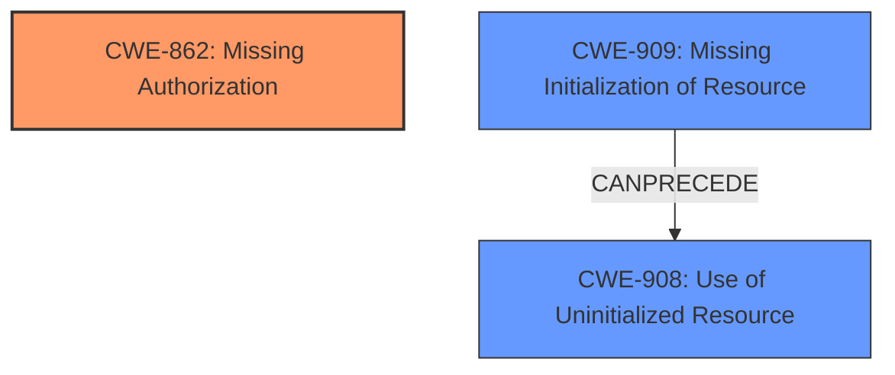

# Analysis for CVE-2021-1017

# Summary
| CWE ID | CWE Name | Confidence | CWE Abstraction Level | CWE Vulnerability Mapping Label | CWE-Vulnerability Mapping Notes |
|---|---|---|---|---|---|
| CWE-862 | Missing Authorization | 1.0 | Class | Allowed-with-Review | Primary CWE |
| CWE-909 | Missing Initialization of Resource | 0.5 | Class | Allowed-with-Review | Secondary Candidate |

## Evidence and Confidence

*   **Confidence Score:** 0.8
*   **Evidence Strength:** HIGH

## Relationship Analysis
The primary relationship that impacted my decision was the ChildOf relationship, specifically between CWE-862 and its potential base level children. While a more specific child CWE might exist, the provided information doesn't allow for a more precise selection. CWE-909 has a CanPrecede relationship with CWE-908 Use of Uninitialized Resource, indicating a potential chain if the missing initialization leads to use of an uninitialized resource.



## Vulnerability Chain
The vulnerability chain starts with the **missing permission check** (CWE-862). If initialization is also **missing** (CWE-909) this may lead to the use of uninitialized resource (CWE-908) and the final impact is disabling the bluetooth connection which leads to local escalation of privilege.
  - The root cause is the **missing permission check** in AdapterService and GattService.
  - A potential secondary weakness could be **missing initialization** or **use of uninitialized resource**.
  - The impact is disabling the Bluetooth connection, leading to a local escalation of privilege.

## Summary of Analysis
The initial analysis identified **missing permission check** as the primary weakness. The Retriever Results and the CVE Reference Links Content Summary support this assessment. The final decision to assign CWE-862 as the primary CWE is based on the provided evidence, especially the **rootcause: missing permission check** phrase. The graph relationships and the usage notes for CWE-862 (Allowed-with-Review, examine children) suggest that a more specific child CWE might exist, but the available information is insufficient to make that determination. CWE-909 is a less confident secondary finding since it could happen if the permission check had worked.

Relevant CWE Information:

# Enhanced Context (25 CWEs)
The following CWEs were identified as potentially relevant to this vulnerability:

## CWE-667: Improper Locking
**Abstraction Level**: Class
**Similarity Score**: 0.79
**Source**: dense

**Description**:
The product does not properly acquire or release a lock on a resource, leading to unexpected resource state changes and behaviors.

**Mapping Guidance**:
- Usage: Allowed-with-Review
- Rationale: This CWE entry is a Class and might have Base-level children that would be more appropriate

## Vulnerability Description
In AdapterService and GattService definition of AndroidManifest.xml, there is a possible way to disable bluetooth connection due to a **missing permission check**. This could lead to local escalation of privilege with no additional execution privileges needed. User interaction is needed for exploitation.Product AndroidVersions Android-12Android ID A-182583850

### Vulnerability Description Key Phrases
- **rootcause:** **missing permission check**
- **impact:** disable bluetooth connection
- **product:** Android
- **version:** 12
- **component:** AdapterService and GattService definition of AndroidManifest.xml

## CVE Reference Links Content Summary
```
{
  "vulnerability_details": [
    {
      "cve_id": "CVE-2021-1017",
      "root_cause": "The vulnerability lies in the Bluetooth component where AdapterService and GattService are accessed from BluetoothManagerService but were intended to be accessed only by BluetoothManagerService. This could allow 3rd party apps to bind to those services, bypassing intended access controls.",
      "weaknesses": [
        "Incorrect access control",
        "Improper restriction of API functionality"
      ],
      "impact": "Elevation of privilege. A malicious third-party application could potentially bind to Bluetooth services (AdapterService and GattService) that are intended for internal use by the BluetoothManagerService only, potentially enabling unauthorized actions or access to data.",
      "attack_vectors": [
        "Local malicious application"
      ],
      "required_capabilities": "A malicious application installed on the device."
    },
  {
      "cve_id": "CVE-2021-1017",
        "root_cause": "The vulnerability is due to the lack of a flag to prevent non-system overlays from obscuring the USB permission dialog.",
        "weaknesses": [
          "Lack of proper window overlay restrictions",
          "Inadequate permission dialog protection"
         ],
        "impact": "Elevation of Privilege. An attacker could potentially craft an overlay that mimics the USB permission dialog, tricking users into granting unintended permissions when they think they are interacting with the legitimate system UI.",
        "attack_vectors": [
          "Malicious application using window overlay"
        ],
        "required_capabilities": "A malicious application with the ability to create window overlays."
      }
  ]
}
```

The vulnerability description clearly states a **missing permission check** as the root cause. The CVE Reference Links Content Summary reinforces this by highlighting "Incorrect access control" and "Improper restriction of API functionality" as weaknesses. This aligns perfectly with CWE-862 **Missing Authorization**, which describes a situation where the product does not perform an authorization check when an actor attempts to access a resource or perform an action.

CWE-862 is a Class-level CWE, and the mapping guidance suggests examining its children for a better fit. However, without more specific information about the exact nature of the **missing permission check**, it's difficult to choose a more specific child CWE.

The impact of the vulnerability - disabling the Bluetooth connection and local escalation of privilege - is a direct consequence of the **missing authorization**. If a permission check is absent, unauthorized actors can potentially disable the Bluetooth connection, leading to a privilege escalation.

Other CWEs were considered but ultimately rejected:

*   CWE-909 **Missing Initialization of Resource**: While potentially related, the primary **rootcause** identified is the **missing permission check**, not the missing initialization of a resource.
*   CWE-362 **Concurrent Execution using Shared Resource with Improper Synchronization ('Race Condition')**: This CWE is not relevant because the vulnerability is not related to concurrent execution or synchronization issues.

The decision to assign CWE-862 as the primary CWE is based on the clear and direct evidence of a **missing permission check** in the vulnerability description and the supporting information in the CVE Reference Links Content Summary.

# Enhanced Query for CVE-2021-1017

## Vulnerability Description
In AdapterService and GattService definition of AndroidManifest.xml, there is a possible way to disable bluetooth connection due to a **missing permission check**. This could lead to local escalation of privilege with no additional execution privileges needed. User interaction is needed for exploitation.Product AndroidVersions Android-12Android ID A-182583850

### Vulnerability Description Key Phrases
- **rootcause:** **missing permission check**
- **impact:** disable bluetooth connection
- **product:** Android
- **version:** 12
- **component:** AdapterService and GattService definition of AndroidManifest.xml

## CVE Reference Links Content Summary
```
{
  "vulnerability_details": [
    {
      "cve_id": "CVE-2021-1017",
      "root_cause": "The vulnerability lies in the Bluetooth component where AdapterService and GattService are accessed from BluetoothManagerService but were intended to be accessed only by BluetoothManagerService. This could allow 3rd party apps to bind to those services, bypassing intended access controls.",
      "weaknesses": [
        "Incorrect access control",
        "Improper restriction of API functionality"
      ],
      "impact": "Elevation of privilege. A malicious third-party application could potentially bind to Bluetooth services (AdapterService and GattService) that are intended for internal use by the BluetoothManagerService only, potentially enabling unauthorized actions or access to data.",
      "attack_vectors": [
        "Local malicious application"
      ],
      "required_capabilities": "A malicious application installed on the device."
    },
  {
      "cve_id": "CVE-2021-1017",
        "root_cause": "The vulnerability is due to the lack of a flag to prevent non-system overlays from obscuring the USB permission dialog.",
        "weaknesses": [
          "Lack of proper window overlay restrictions",
          "Inadequate permission dialog protection"
         ],
        "impact": "Elevation of Privilege. An attacker could potentially craft an overlay that mimics the USB permission dialog, tricking users into granting unintended permissions when they think they are interacting with the legitimate system UI.",
        "attack_vectors": [
          "Malicious application using window overlay"
        ],
        "required_capabilities": "A malicious application with the ability to create window overlays."
      }
  ]
}
```

## Retriever Results

### Top Combined Results

| Rank | CWE ID | Name | Abstraction | Usage  | Retrievers | Individual Scores |
|------|--------|------|-------------|-------|------------|-------------------|
| 1 | 862 | Missing Authorization | Class | Allowed-with-Review | sparse | 0.470 |
| 2 | 1021 | Improper Restriction of Rendered UI Layers or Frames | Base | Allowed | sparse | 0.426 |
| 3 | 223 | Omission of Security-relevant Information | Base | Allowed | sparse | 0.373 |
| 4 | 927 | Use of Implicit Intent for Sensitive Communication | Variant | Allowed | sparse | 0.359 |
| 5 | 908 | Use of Uninitialized Resource | Base | Allowed | sparse | 0.350 |
| 6 | 925 | Improper Verification of Intent by Broadcast Receiver | Variant | Allowed | dense | 0.559 |
| 7 | 909 | Missing Initialization of Resource | Class | Allowed-with-Review | graph | 0.001 |
| 8 | 362 | Concurrent Execution using Shared Resource with Improper Synchronization ('Race Condition') | Class | Allowed-with-Review | sparse | 0.350 |
| 9 | 514 | Covert Channel | Class | Allowed-with-Review | sparse | 0.346 |
| 10 | 667 | Improper Locking | Class | Allowed-with-Review | sparse | 0.346 |


# Complete CWE Specifications


## CWE-862: Missing Authorization
**Abstraction:** Class
**Status:** Incomplete

### Description
The product does not perform an authorization check when an actor attempts to access a resource or perform an action.

### Extended Description
Not provided

### Alternative Terms
AuthZ: "AuthZ" is typically used as an abbreviation of "authorization" within the web application security community. It is distinct from "AuthN" (or, sometimes, "AuthC") which is an abbreviation of "authentication." The use of "Auth" as an abbreviation is discouraged, since it could be used for either authentication or authorization.

### Relationships
ChildOf -> CWE-285
ChildOf -> CWE-284

### Mapping Guidance
**Usage:** Allowed-with-Review
**Rationale:** This CWE entry is a Class and might have Base-level children that would be more appropriate
**Comments:** Examine children of this entry to see if there is a better fit
**Reasons:**
- Abstraction


### Additional Notes
**[Terminology]** Assuming a user with a given identity, authorization is the process of determining whether that user can access a given resource, based on the user's privileges and any permissions or other access-control specifications that apply to the resource.


### Observed Examples
- **CVE-2022-24730:** Go-based continuous deployment product does not check that a user has certain privileges to update or create an app, allowing adversaries to read sensitive repository information
- **CVE-2009-3168:** Web application does not restrict access to admin scripts, allowing authenticated users to reset administrative passwords.
- **CVE-2009-3597:** Web application stores database file under the web root with insufficient access control (CWE-219), allowing direct request.


## CWE-1021: Improper Restriction of Rendered UI Layers or Frames
**Abstraction:** Base
**Status:** Incomplete

### Description
The web application does not restrict or incorrectly restricts frame objects or UI layers that belong to another application or domain, which can lead to user confusion about which interface the user is interacting with.

### Extended Description
A web application is expected to place restrictions on whether it is allowed to be rendered within frames, iframes, objects, embed or applet elements. Without the restrictions, users can be tricked into interacting with the application when they were not intending to.

### Alternative Terms
Clickjacking
UI Redress Attack
Tapjacking: "Tapjacking" is similar to clickjacking, except it is used for mobile applications in which the user "taps" the application instead of performing a mouse click.

### Relationships
ChildOf -> CWE-441
ChildOf -> CWE-610
ChildOf -> CWE-451

### Mapping Guidance
**Usage:** Allowed
**Rationale:** This CWE entry is at the Base level of abstraction, which is a preferred level of abstraction for mapping to the root causes of vulnerabilities.
**Comments:** Carefully read both the name and description to ensure that this mapping is an appropriate fit. Do not try to 'force' a mapping to a lower-level Base/Variant simply to comply with this preferred level of abstraction.
**Reasons:**
- Acceptable-Use


### Observed Examples
- **CVE-2017-7440:** E-mail preview feature in a desktop application allows clickjacking attacks via a crafted e-mail message
- **CVE-2017-5697:** Hardware/firmware product has insufficient clickjacking protection in its web user interface
- **CVE-2017-4015:** Clickjacking in data-loss prevention product via HTTP response header.


## CWE-223: Omission of Security-relevant Information
**Abstraction:** Base
**Status:** Draft

### Description
The product does not record or display information that would be important for identifying the source or nature of an attack, or determining if an action is safe.

### Extended Description
Not provided

### Alternative Terms
None

### Relationships
ChildOf -> CWE-221

### Mapping Guidance
**Usage:** Allowed
**Rationale:** This CWE entry is at the Base level of abstraction, which is a preferred level of abstraction for mapping to the root causes of vulnerabilities.
**Comments:** Carefully read both the name and description to ensure that this mapping is an appropriate fit. Do not try to 'force' a mapping to a lower-level Base/Variant simply to comply with this preferred level of abstraction.
**Reasons:**
- Acceptable-Use


### Observed Examples
- **CVE-1999-1029:** Login attempts are not recorded if the user disconnects before the maximum number of tries.
- **CVE-2002-1839:** Sender's IP address not recorded in outgoing e-mail.
- **CVE-2000-0542:** Failed authentication attempts are not recorded if later attempt succeeds.


## CWE-927: Use of Implicit Intent for Sensitive Communication
**Abstraction:** Variant
**Status:** Incomplete

### Description
The Android application uses an implicit intent for transmitting sensitive data to other applications.

### Extended Description


Since an implicit intent does not specify a particular application to receive the data, any application can process the intent by using an Intent Filter for that intent. This can allow untrusted applications to obtain sensitive data. There are two variations on the standard broadcast intent, ordered and sticky.


Ordered broadcast intents are delivered to a series of registered receivers in order of priority as declared by the Receivers. A malicious receiver can give itself a high priority and cause a denial of service by stopping the broadcast from propagating further down the chain. There is also the possibility of malicious data modification, as a receiver may also alter the data within the Intent before passing it on to the next receiver. The downstream components have no way of asserting that the data has not been altered earlier in the chain.


Sticky broadcast intents remain accessible after the initial broadcast. An old sticky intent will be broadcast again to any new receivers that register for it in the future, greatly increasing the chances of information exposure over time. Also, sticky broadcasts cannot be protected by permissions that may apply to other kinds of intents.


In addition, any broadcast intent may include a URI that references data that the receiving component does not normally have the privileges to access. The sender of the intent can include special privileges that grant the receiver read or write access to the specific URI included in the intent. A malicious receiver that intercepts this intent will also gain those privileges and be able to read or write the resource at the specified URI.


### Alternative Terms
None

### Relationships
ChildOf -> CWE-285
ChildOf -> CWE-668

### Mapping Guidance
**Usage:** Allowed
**Rationale:** This CWE entry is at the Variant level of abstraction, which is a preferred level of abstraction for mapping to the root causes of vulnerabilities.
**Comments:** Carefully read both the name and description to ensure that this mapping is an appropriate fit. Do not try to 'force' a mapping to a lower-level Base/Variant simply to comply with this preferred level of abstraction.
**Reasons:**
- Acceptable-Use


### Observed Examples
- **CVE-2022-4903:** An Android application does not use FLAG_IMMUTABLE when creating a PendingIntent.


## CWE-908: Use of Uninitialized Resource
**Abstraction:** Base
**Status:** Incomplete

### Description
The product uses or accesses a resource that has not been initialized.

### Extended Description
When a resource has not been properly initialized, the product may behave unexpectedly. This may lead to a crash or invalid memory access, but the consequences vary depending on the type of resource and how it is used within the product.

### Alternative Terms
None

### Relationships
ChildOf -> CWE-665
ChildOf -> CWE-665

### Mapping Guidance
**Usage:** Allowed
**Rationale:** This CWE entry is at the Base level of abstraction, which is a preferred level of abstraction for mapping to the root causes of vulnerabilities.
**Comments:** Carefully read both the name and description to ensure that this mapping is an appropriate fit. Do not try to 'force' a mapping to a lower-level Base/Variant simply to comply with this preferred level of abstraction.
**Reasons:**
- Acceptable-Use


### Observed Examples
- **CVE-2019-9805:** Chain: Creation of the packet client occurs before initialization is complete (CWE-696) resulting in a read from uninitialized memory (CWE-908), causing memory corruption.
- **CVE-2008-4197:** Use of uninitialized memory may allow code execution.
- **CVE-2008-2934:** Free of an uninitialized pointer leads to crash and possible code execution.


## CWE-925: Improper Verification of Intent by Broadcast Receiver
**Abstraction:** Variant
**Status:** Incomplete

### Description
The Android application uses a Broadcast Receiver that receives an Intent but does not properly verify that the Intent came from an authorized source.

### Extended Description
Certain types of Intents, identified by action string, can only be broadcast by the operating system itself, not by third-party applications. However, when an application registers to receive these implicit system intents, it is also registered to receive any explicit intents. While a malicious application cannot send an implicit system intent, it can send an explicit intent to the target application, which may assume that any received intent is a valid implicit system intent and not an explicit intent from another application. This may lead to unintended behavior.

### Alternative Terms
Intent Spoofing

### Relationships
ChildOf -> CWE-940

### Mapping Guidance
**Usage:** Allowed
**Rationale:** This CWE entry is at the Variant level of abstraction, which is a preferred level of abstraction for mapping to the root causes of vulnerabilities.
**Comments:** Carefully read both the name and description to ensure that this mapping is an appropriate fit. Do not try to 'force' a mapping to a lower-level Base/Variant simply to comply with this preferred level of abstraction.
**Reasons:**
- Acceptable-Use


### Additional Notes
**[Maintenance]** This entry will be made more comprehensive in later CWE versions.


## CWE-909: Missing Initialization of Resource
**Abstraction:** Class
**Status:** Incomplete

### Description
The product does not initialize a critical resource.

### Extended Description
Many resources require initialization before they can be properly used. If a resource is not initialized, it could contain unpredictable or expired data, or it could be initialized to defaults that are invalid. This can have security implications when the resource is expected to have certain properties or values.

### Alternative Terms
None

### Relationships
ChildOf -> CWE-665
ChildOf -> CWE-665
CanPrecede -> CWE-908

### Mapping Guidance
**Usage:** Allowed-with-Review
**Rationale:** This CWE entry is a Class and might have Base-level children that would be more appropriate
**Comments:** Examine children of this entry to see if there is a better fit
**Reasons:**
- Abstraction


### Observed Examples
- **CVE-2020-20739:** A variable that has its value set in a conditional statement is sometimes used when the conditional fails, sometimes causing data leakage
- **CVE-2005-1036:** Chain: Bypass of access restrictions due to improper authorization (CWE-862) of a user results from an improperly initialized (CWE-909) I/O permission bitmap


## CWE-362: Concurrent Execution using Shared Resource with Improper Synchronization ('Race Condition')
**Abstraction:** Class
**Status:** Draft

### Description
The product contains a concurrent code sequence that requires temporary, exclusive access to a shared resource, but a timing window exists in which the shared resource can be modified by another code sequence operating concurrently.

### Extended Description


A race condition occurs within concurrent environments, and it is effectively a property of a code sequence. Depending on the context, a code sequence may be in the form of a function call, a small number of instructions, a series of program invocations, etc.


A race condition violates these properties, which are closely related:


  - Exclusivity - the code sequence is given exclusive access to the shared resource, i.e., no other code sequence can modify properties of the shared resource before the original sequence has completed execution.

  - Atomicity - the code sequence is behaviorally atomic, i.e., no other thread or process can concurrently execute the same sequence of instructions (or a subset) against the same resource.

A race condition exists when an "interfering code sequence" can still access the shared resource, violating exclusivity.

The interfering code sequence could be "trusted" or "untrusted." A trusted interfering code sequence occurs within the product; it cannot be modified by the attacker, and it can only be invoked indirectly. An untrusted interfering code sequence can be authored directly by the attacker, and typically it is external to the vulnerable product.


### Alternative Terms
Race Condition

### Relationships
ChildOf -> CWE-691
CanPrecede -> CWE-416
CanPrecede -> CWE-476

### Mapping Guidance
**Usage:** Allowed-with-Review
**Rationale:** This CWE entry is a Class and might have Base-level children that would be more appropriate
**Comments:** Examine children of this entry to see if there is a better fit
**Reasons:**
- Abstraction


### Additional Notes
**[Maintenance]** The relationship between race conditions and synchronization problems (CWE-662) needs to be further developed. They are not necessarily two perspectives of the same core concept, since synchronization is only one technique for avoiding race conditions, and synchronization can be used for other purposes besides race condition prevention.

**[Research Gap]** Race conditions in web applications are under-studied and probably under-reported. However, in 2008 there has been growing interest in this area.

**[Research Gap]** Much of the focus of race condition research has been in Time-of-check Time-of-use (TOCTOU) variants (CWE-367), but many race conditions are related to synchronization problems that do not necessarily require a time-of-check.

**[Research Gap]** From a classification/taxonomy perspective, the relationships between concurrency and program state need closer investigation and may be useful in organizing related issues.


### Observed Examples
- **CVE-2022-29527:** Go application for cloud management creates a world-writable sudoers file that allows local attackers to inject sudo rules and escalate privileges to root by winning a race condition.
- **CVE-2021-1782:** Chain: improper locking (CWE-667) leads to race condition (CWE-362), as exploited in the wild per CISA KEV.
- **CVE-2021-0920:** Chain: mobile platform race condition (CWE-362) leading to use-after-free (CWE-416), as exploited in the wild per CISA KEV.


## CWE-514: Covert Channel
**Abstraction:** Class
**Status:** Incomplete

### Description
A covert channel is a path that can be used to transfer information in a way not intended by the system's designers.

### Extended Description
Typically the system has not given authorization for the transmission and has no knowledge of its occurrence.

### Alternative Terms
None

### Relationships
ChildOf -> CWE-1229

### Mapping Guidance
**Usage:** Allowed-with-Review
**Rationale:** This CWE entry is a Class and might have Base-level children that would be more appropriate
**Comments:** Examine children of this entry to see if there is a better fit
**Reasons:**
- Abstraction


### Additional Notes
**[Theoretical]** A covert channel can be thought of as an emergent resource, meaning that it was not an originally intended resource, however it exists due the application's behaviors.

**[Maintenance]** As of CWE 4.9, members of the CWE Hardware SIG are working to improve CWE's coverage of transient execution weaknesses, which include issues related to Spectre, Meltdown, and other attacks that create or exploit covert channels. As a result of that work, this entry might change in CWE 4.10.


## CWE-667: Improper Locking
**Abstraction:** Class
**Status:** Draft

### Description
The product does not properly acquire or release a lock on a resource, leading to unexpected resource state changes and behaviors.

### Extended Description


Locking is a type of synchronization behavior that ensures that multiple independently-operating processes or threads do not interfere with each other when accessing the same resource. All processes/threads are expected to follow the same steps for locking. If these steps are not followed precisely - or if no locking is done at all - then another process/thread could modify the shared resource in a way that is not visible or predictable to the original process. This can lead to data or memory corruption, denial of service, etc.


### Alternative Terms
None

### Relationships
ChildOf -> CWE-662
ChildOf -> CWE-662
ChildOf -> CWE-662
ChildOf -> CWE-662

### Mapping Guidance
**Usage:** Allowed-with-Review
**Rationale:** This CWE entry is a Class and might have Base-level children that would be more appropriate
**Comments:** Examine children of this entry to see if there is a better fit
**Reasons:**
- Abstraction


### Additional Notes
**[Maintenance]** Deeper research is necessary for synchronization and related mechanisms, including locks, mutexes, semaphores, and other mechanisms. Multiple entries are dependent on this research, which includes relationships to concurrency, race conditions, reentrant functions, etc. CWE-662 and its children - including CWE-667, CWE-820, CWE-821, and others - may need to be modified significantly, along with their relationships.


### Observed Examples
- **CVE-2021-1782:** Chain: improper locking (CWE-667) leads to race condition (CWE-362), as exploited in the wild per CISA KEV.
- **CVE-2009-0935:** Attacker provides invalid address to a memory-reading function, causing a mutex to be unlocked twice
- **CVE-2010-4210:** function in OS kernel unlocks a mutex that was not previously locked, causing a panic or overwrite of arbitrary memory.

