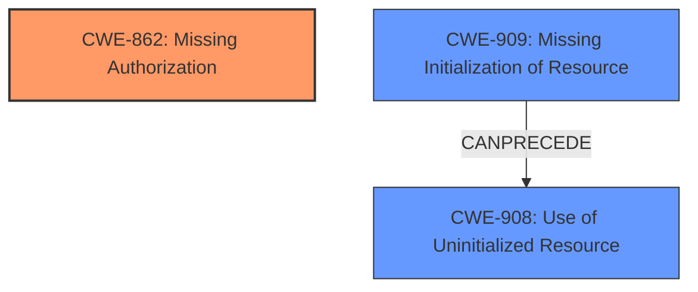

# Analysis Report for CVE-2021-1017

# Vulnerability Analysis Report: CVE-2021-1017

## Description


## Analysis (with Relationship Data)

# Summary
| CWE ID | CWE Name | Confidence | CWE Abstraction Level | CWE Vulnerability Mapping Label | CWE-Vulnerability Mapping Notes |
|---|---|---|---|---|---|
| CWE-862 | Missing Authorization | 1.0 | Class | Allowed-with-Review | Primary CWE |
| CWE-909 | Missing Initialization of Resource | 0.5 | Class | Allowed-with-Review | Secondary Candidate |

## Evidence and Confidence

*   **Confidence Score:** 0.8
*   **Evidence Strength:** HIGH

## Relationship Analysis
The primary relationship that impacted my decision was the ChildOf relationship, specifically between CWE-862 and its potential base level children. While a more specific child CWE might exist, the provided information doesn't allow for a more precise selection. CWE-909 has a CanPrecede relationship with CWE-908 Use of Uninitialized Resource, indicating a potential chain if the missing initialization leads to use of an uninitialized resource.



## Vulnerability Chain
The vulnerability chain starts with the **missing permission check** (CWE-862). If initialization is also **missing** (CWE-909) this may lead to the use of uninitialized resource (CWE-908) and the final impact is disabling the bluetooth connection which leads to local escalation of privilege.
  - The root cause is the **missing permission check** in AdapterService and GattService.
  - A potential secondary weakness could be **missing initialization** or **use of uninitialized resource**.
  - The impact is disabling the Bluetooth connection, leading to a local escalation of privilege.

## Summary of Analysis
The initial analysis identified **missing permission check** as the primary weakness. The Retriever Results and the CVE Reference Links Content Summary support this assessment. The final decision to assign CWE-862 as the primary CWE is based on the provided evidence, especially the **rootcause: missing permission check** phrase. The graph relationships and the usage notes for CWE-862 (Allowed-with-Review, examine children) suggest that a more specific child CWE might exist, but the available information is insufficient to make that determination. CWE-909 is a less confident secondary finding since it could happen if the permission check had worked.

Relevant CWE Information:

# Enhanced Context (25 CWEs)
The following CWEs were identified as potentially relevant to this vulnerability:

## CWE-667: Improper Locking
**Abstraction Level**: Class
**Similarity Score**: 0.79
**Source**: dense

**Description**:
The product does not properly acquire or release a lock on a resource, leading to unexpected resource state changes and behaviors.

**Mapping Guidance**:
- Usage: Allowed-with-Review
- Rationale: This CWE entry is a Class and might have Base-level children that would be more appropriate

## Vulnerability Description
In AdapterService and GattService definition of AndroidManifest.xml, there is a possible way to disable bluetooth connection due to a **missing permission check**. This could lead to local escalation of privilege with no additional execution privileges needed. User interaction is needed for exploitation.Product AndroidVersions Android-12Android ID A-182583850

### Vulnerability Description Key Phrases
- **rootcause:** **missing permission check**
- **impact:** disable bluetooth connection
- **product:** Android
- **version:** 12
- **component:** AdapterService and GattService definition of AndroidManifest.xml

## CVE Reference Links Content Summary
```
{
  "vulnerability_details": [
    {
      "cve_id": "CVE-2021-1017",
      "root_cause": "The vulnerability lies in the Bluetooth component where AdapterService and GattService are accessed from BluetoothManagerService but were intended to be accessed only by BluetoothManagerService. This could allow 3rd party apps to bind to those services, bypassing intended access controls.",
      "weaknesses": [
        "Incorrect access control",
        "Improper restriction of API functionality"
      ],
      "impact": "Elevation of privilege. A malicious third-party application could potentially bind to Bluetooth services (AdapterService and GattService) that are intended for internal use by the BluetoothManagerService only, potentially enabling unauthorized actions or access to data.",
      "attack_vectors": [
        "Local malicious application"
      ],
      "required_capabilities": "A malicious application installed on the device."
    },
  {
      "cve_id": "CVE-2021-1017",
        "root_cause": "The vulnerability is due to the lack of a flag to prevent non-system overlays from obscuring the USB permission dialog.",
        "weaknesses": [
          "Lack of proper window overlay restrictions",
          "Inadequate permission dialog protection"
         ],
        "impact": "Elevation of Privilege. An attacker could potentially craft an overlay that mimics the USB permission dialog, tricking users into granting unintended permissions when they think they are interacting with the legitimate system UI.",
        "attack_vectors": [
          "Malicious application using window overlay"
        ],
        "required_capabilities": "A malicious application with the ability to create window overlays."
      }
  ]
}
```

The vulnerability description clearly states a **missing permission check** as the root cause. The CVE Reference Links Content Summary reinforces this by highlighting "Incorrect access control" and "Improper restriction of API functionality" as weaknesses. This aligns perfectly with CWE-862 **Missing Authorization**, which describes a situation where the product does not perform an authorization check when an actor attempts to access a resource or perform an action.

CWE-862 is a Class-level CWE, and the mapping guidance suggests examining its children for a better fit. However, without more specific information about the exact nature of the **missing permission check**, it's difficult to choose a more specific child CWE.

The impact of the vulnerability - disabling the Bluetooth connection and local escalation of privilege - is a direct consequence of the **missing authorization**. If a permission check is absent, unauthorized actors can potentially disable the Bluetooth connection, leading to a privilege escalation.

Other CWEs were considered but ultimately rejected:

*   CWE-909 **Missing Initialization of Resource**: While potentially related, the primary **rootcause** identified is the **missing permission check**, not the missing initialization of a resource.
*   CWE-362 **Concurrent Execution using Shared Resource with Improper Synchronization ('Race Condition')**: This CWE is not relevant because the vulnerability is not related to concurrent execution or synchronization issues.

The decision to assign CWE-862 as the primary CWE is based on the clear and direct evidence of a **missing permission check** in the vulnerability description and the supporting information in the CVE Reference Links Content Summary.


## CWE Relationship Analysis

Current CWEs represent these abstraction levels: .


### Vulnerability Chain Analysis

**Chain starting from CWE-667:**
- 667 (Improper Locking) - ROOT


**Chain starting from CWE-862:**
- 862 (Missing Authorization) - ROOT


### CWE Relationship Diagram

```mermaid
graph TD
    classDef primary fill:#f96,stroke:#333,stroke-width:2px
    classDef secondary fill:#69f,stroke:#333
    classDef tertiary fill:#9e9,stroke:#333
```


*Report generated on 2025-04-02 00:03:08*
