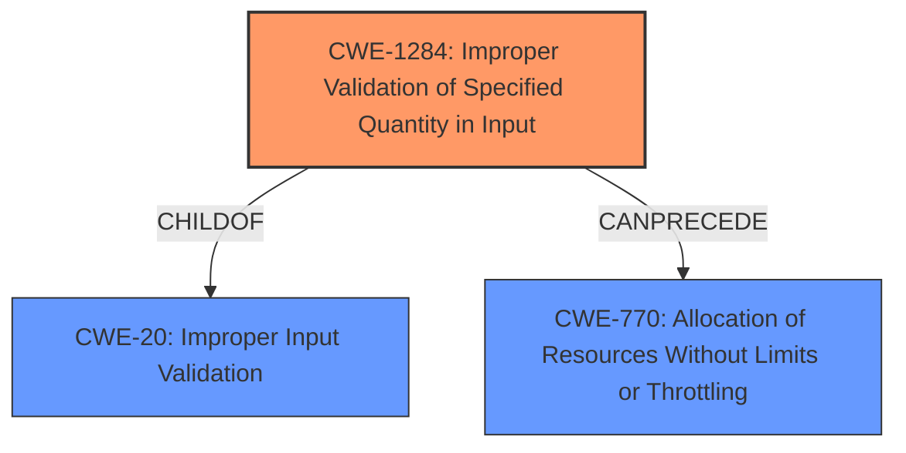

# Analysis Report for CVE-2021-1084

# Vulnerability Analysis Report: CVE-2021-1084

## Description


## Analysis (with Relationship Data)

# Summary
| CWE ID  | CWE Name                                          | Confidence | CWE Abstraction Level | CWE Vulnerability Mapping Label | CWE-Vulnerability Mapping Notes |
| :-------- | :------------------------------------------------ | :--------- | :---------------------- | :------------------------------ | :------------------------------ |
| CWE-1284 | Improper Validation of Specified Quantity in Input | 0.9        | Base                    | Primary                         | Allowed                       |
| CWE-20   | Improper Input Validation                         | 0.7        | Class                   | Secondary                       | Discouraged                   |
| CWE-770  | Allocation of Resources Without Limits or Throttling          | 0.6       | Base                    | Secondary                         | Allowed                       |

## Evidence and Confidence

*   **Confidence Score:** 0.9
*   **Evidence Strength:** HIGH

## Relationship Analysis
The primary CWE, CWE-1284, is a child of CWE-20, indicating a more specific type of input validation issue. CWE-770 is related as the lack of validation can lead to resource allocation issues. The relationships influenced the decision to prioritize CWE-1284 as the most specific and relevant root cause, while acknowledging CWE-20 as a broader classification and CWE-770 as a potential consequence.



## Vulnerability Chain
The vulnerability chain starts with the **improper validation of input length** (CWE-1284). This **lack of validation** can then lead to information disclosure, data tampering, or denial of service. A potential chain could be: **Missing Input Length Validation** (CWE-1284) -> **Excessive Resource Allocation** (CWE-770) -> **Denial of Service**.

## Summary of Analysis
The initial analysis focused on the vulnerability description and the key phrase "**an input length is not validated**". This directly points to a problem with input validation. The Retriever Results and the provided CWEs for similar CVE Descriptions both strongly suggested CWE-1284 (Improper Validation of Specified Quantity in Input) as the primary candidate.

The evidence from the vulnerability description is clear: "NVIDIA vGPU driver contains a vulnerability... in which **an input length is not validated**...". The "CVE Reference Links Content Summary" reinforces this: "**Root cause of vulnerability:** The NVIDIA vGPU driver has a vulnerability... where input length is not validated."

CWE-1284 is a Base level CWE that directly addresses the identified weakness, so it's the optimal choice. CWE-20 (Improper Input Validation) is a more general Class-level CWE, and while applicable, it is less specific than CWE-1284. The mapping guidance for CWE-20 discourages its use when a more specific CWE is available. CWE-770 (Allocation of Resources Without Limits or Throttling) could be a secondary consequence if the missing length validation leads to excessive resource allocation, potentially resulting in a denial-of-service.

Therefore, the primary mapping is CWE-1284, with CWE-20 and CWE-770 considered as secondary, related weaknesses.

Relevant CWE Information:

# Enhanced Context (25 CWEs)
The following CWEs were identified as potentially relevant to this vulnerability:

## CWE-226: Sensitive Information in Resource Not Removed Before Reuse
**Abstraction Level**: Base
**Similarity Score**: 0.76
**Source**: dense

**Description**:
The product releases a resource such as memory or a file so that it can be made available for reuse, but it does not clear or "zeroize" the information contained in the resource before the product performs a critical state transition or makes the resource available for reuse by other entities.

**Mapping Guidance**:
- Usage: Allowed
- Rationale: This CWE entry is at the Base level of abstraction, which is a preferred level of abstraction for mapping to the root causes of vulnerabilities.

*This CWE is not applicable as there is no mention of resource reuse in the description.*

## CWE-404: Improper Resource Shutdown or Release
**Abstraction Level**: Class
**Similarity Score**: 0.76
**Source**: dense

**Description**:
The product does not release or incorrectly releases a resource before it is made available for re-use.

**Mapping Guidance**:
- Usage: Allowed-with-Review
- Rationale: This CWE entry is a Class and might have Base-level children that would be more appropriate

*This CWE is not applicable as there is no mention of resource release issues.*

## CWE-805: Buffer Access with Incorrect Length Value
**Abstraction Level**: Base
**Similarity Score**: 0.75
**Source**: dense

**Description**:
The product uses a sequential operation to read or write a buffer, but it uses an incorrect length value that causes it to access memory that is outside of the bounds of the buffer.

**Mapping Guidance**:
- Usage: Allowed
- Rationale: This CWE entry is at the Base level of abstraction, which is a preferred level of abstraction for mapping to the root causes of vulnerabilities.

*This could be a consequence of CWE-1284, but there isn't enough information to say the buffer access uses an incorrect length value.*

## CWE-131: Incorrect Calculation of Buffer Size
**Abstraction Level**: Base
**Similarity Score**: 0.75
**Source**: dense

**Description**:
The product does not correctly calculate the size to be used when allocating a buffer, which could lead to a buffer overflow.

**Mapping Guidance**:
- Usage: Allowed
- Rationale: This CWE entry is at the Base level of abstraction, which is a preferred level of abstraction for mapping to the root causes of vulnerabilities.

*This CWE is not the primary weakness. CWE-1284 is more directly related to the root cause.*

## CWE-191: Integer Underflow (Wrap or Wraparound)
**Abstraction Level**: Base
**Similarity Score**: 0.75
**Source**: dense

**Description**:
The product subtracts one value from another, such that the result is less than the minimum allowable integer value, which produces a value that is not equal to the correct result.

**Mapping Guidance**:
- Usage: Allowed
- Rationale: This CWE entry is at the Base level of abstraction, which is a preferred level of abstraction for mapping to the root causes of vulnerabilities.

*This CWE is not applicable as there's no subtraction mentioned.*

## CWE-125: Out-of-bounds Read
**Abstraction Level**: Base
**Similarity Score**: 0.75
**Source**: dense

**Description**:
The product reads data past the end, or before the beginning, of the intended buffer.

**Mapping Guidance**:
- Usage: Allowed
- Rationale: This CWE entry is at the Base level of abstraction, which is a preferred level of abstraction for mapping to the root causes of vulnerabilities.

*This is an impact, but the root cause is CWE-1284.*

## CWE-667: Improper Locking
**Abstraction Level**: Class
**Similarity Score**: 0.75
**Source**: dense

**Description**:
The product does not properly acquire or release a lock on a resource, leading to unexpected resource state changes and behaviors.

**Mapping Guidance**:
- Usage: Allowed-with-Review
- Rationale: This CWE entry is a Class and might have Base-level children that would be more appropriate

*This CWE is not applicable as there's no mention of locking mechanisms.*

## CWE-126: Buffer Over-read
**Abstraction Level**: Variant
**Similarity Score**: 0.75
**Source**: dense

**Description**:
The product reads from a buffer using buffer access mechanisms such as indexes or pointers that reference memory locations after the targeted buffer.

**Mapping Guidance**:
- Usage: Allowed
- Rationale: This CWE entry is at the Variant level of abstraction, which is a preferred level of abstraction for mapping to the root causes of vulnerabilities.

*This could be an impact, but the root cause is CWE-1284.*

## CWE-789: Memory Allocation with Excessive Size Value
**Abstraction Level**: Variant
**Similarity Score**: 0.75
**Source**: dense

**Description**:
The product allocates memory based on an untrusted, large size value, but it does not ensure that the size is within expected limits, allowing arbitrary amounts of memory to be allocated.

**Mapping Guidance**:
- Usage: Allowed
- Rationale: This CWE entry is at the Variant level of abstraction, which is a preferred level of abstraction for mapping to the root causes of vulnerabilities.

*This CWE could be related, but the primary issue is the **lack of validation


## CWE Relationship Analysis

Current CWEs represent these abstraction levels: .


### Vulnerability Chain Analysis

**Chain starting from CWE-667:**
- 667 (Improper Locking) - ROOT


**Chain starting from CWE-805:**
- 805 (Buffer Access with Incorrect Length Value) - ROOT


### CWE Relationship Diagram

```mermaid
graph TD
    classDef primary fill:#f96,stroke:#333,stroke-width:2px
    classDef secondary fill:#69f,stroke:#333
    classDef tertiary fill:#9e9,stroke:#333
```


*Report generated on 2025-04-01 21:40:26*
