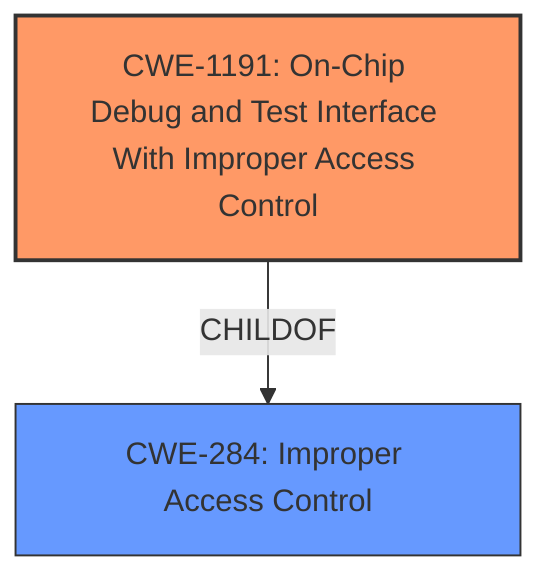

# Analysis Report for CVE-2021-1088

# Vulnerability Analysis Report: CVE-2021-1088

## Description


## Analysis (with Relationship Data)

# Summary
| CWE ID | CWE Name | Confidence | CWE Abstraction Level | CWE Vulnerability Mapping Label | CWE-Vulnerability Mapping Notes |
|---|---|---|---|---|---|
| CWE-1191 | On-Chip Debug and Test Interface With Improper Access Control | 1.0 | Base | Allowed | Primary CWE. This CWE directly addresses the **insufficient access control** on the debug interface. |
| CWE-284 | Improper Access Control | 0.7 | Pillar | Discouraged | Secondary CWE. While generally applicable, it's too abstract. CWE-1191 provides a more specific classification.|

## Evidence and Confidence

*   **Confidence Score:** 1.0
*   **Evidence Strength:** HIGH

## Relationship Analysis
The primary relationship impacting the decision is:
  - CWE-1191 **CHILDOF** CWE-284

This indicates that CWE-1191 is a more specific instance of the general **improper access control** weakness. Choosing CWE-1191 provides greater detail about the specific vulnerability.



## Vulnerability Chain
The vulnerability chain consists of the following:
  - **Root Cause:** **Insufficient access control** on the on-chip debug interface (CWE-1191)
  - **Impact:** Information disclosure

## Summary of Analysis
The initial analysis focused on identifying the **root cause** of the vulnerability, which is the **insufficient access control** of debug mechanisms in the internal microcontroller. The primary CWE match, CWE-1191 "On-Chip Debug and Test Interface With Improper Access Control," directly corresponds to this **root cause**.

Evidence from the vulnerability description and CVE reference links supports this choice:

*   **Vulnerability Description Key Phrases:** "**insufficient access control**"
*   **CVE Reference Links Content Summary:** "It stems from **insufficient access control** for debug mechanisms."

CWE-284 "Improper Access Control" was considered but deemed too abstract. While it accurately describes the general issue, CWE-1191 provides a more specific and appropriate classification for the **root cause**, aligning with the goal of identifying the most precise weakness.

The selection of CWE-1191 is based on the provided evidence and the hierarchical relationship between CWE-1191 and CWE-284. CWE-1191 is at the optimal level of specificity because it directly addresses the debug interface **access control** issue, while CWE-284 is a more general category.

Relevant CWE Information:

# Enhanced Context (25 CWEs)
The following CWEs were identified as potentially relevant to this vulnerability:

## CWE-653: Improper Isolation or Compartmentalization
**Abstraction Level**: Class
**Similarity Score**: 0.77

## CWE-131: Incorrect Calculation of Buffer Size
**Abstraction Level**: Base
**Similarity Score**: 0.76

## CWE-667: Improper Locking
**Abstraction Level**: Class
**Similarity Score**: 0.76

## CWE-119: Improper Restriction of Operations within the Bounds of a Memory Buffer
**Abstraction Level**: Class
**Similarity Score**: 0.76

## CWE-404: Improper Resource Shutdown or Release
**Abstraction Level**: Class
**Similarity Score**: 0.76

## CWE-125: Out-of-bounds Read
**Abstraction Level**: Base
**Similarity Score**: 0.75

## CWE-805: Buffer Access with Incorrect Length Value
**Abstraction Level**: Base
**Similarity Score**: 0.75

## CWE-691: Insufficient Control Flow Management
**Abstraction Level**: Pillar
**Similarity Score**: 0.75

## CWE-226: Sensitive Information in Resource Not Removed Before Reuse
**Abstraction Level**: Base
**Similarity Score**: 0.75

## CWE-274: Improper Handling of Insufficient Privileges
**Abstraction Level**: Base
**Similarity Score**: 0.75

## CWE-916: Use of Password Hash With Insufficient Computational Effort
**Abstraction Level**: Base
**Similarity Score**: 8390.43

## CWE-863: Incorrect Authorization
**Abstraction Level**: Class
**Similarity Score**: 8187.15

## CWE-923: Improper Restriction of Communication Channel to Intended Endpoints
**Abstraction Level**: Class
**Similarity Score**: 8099.58

## CWE-22: Improper Limitation of a Pathname to a Restricted Directory ('Path Traversal')
**Abstraction Level**: Base
**Similarity Score**: 8040.24

## CWE-639: Authorization Bypass Through User-Controlled Key
**Abstraction Level**: Base
**Similarity Score**: 8037.48

## CWE-41: Improper Resolution of Path Equivalence
**Abstraction Level**: base
**Similarity Score**: 5.03

## CWE-190: Integer Overflow or Wraparound
**Abstraction Level**: base
**Similarity Score**: 4.33

## CWE-73: External Control of File Name or Path
**Abstraction Level**: base
**Similarity Score**: 4.33

## CWE-22: Improper Limitation of a Pathname to a Restricted Directory ('Path Traversal')
**Abstraction Level**: base
**Similarity Score**: 4.33

## CWE-770: Allocation of Resources Without Limits or Throttling
**Abstraction Level**: base
**Similarity Score**: 4.33

## CWE-787: Out-of-bounds Write
**Abstraction Level**: base
**Similarity Score**: 3.89

## CWE-942: Permissive Cross-domain Policy with Untrusted Domains
**Abstraction Level**: variant
**Similarity Score**: 3.88

## CWE-266: Incorrect Privilege Assignment
**Abstraction Level**: base
**Similarity Score**: 3.64

## CWE-79: Improper Neutralization of Input During Web Page Generation ('Cross-site Scripting')
**Abstraction Level**: base
**Similarity Score**: 3.49

## CWE-843: Access of Resource Using Incompatible Type ('Type Confusion')
**Abstraction Level**: base
**Similarity Score**: 3.44


## CWE Relationship Analysis

Current CWEs represent these abstraction levels: .


### Vulnerability Chain Analysis

**Chain starting from CWE-691:**
- 691 (Insufficient Control Flow Management) - ROOT


**Chain starting from CWE-787:**
- 787 (Out-of-bounds Write) - ROOT


### CWE Relationship Diagram

```mermaid
graph TD
    classDef primary fill:#f96,stroke:#333,stroke-width:2px
    classDef secondary fill:#69f,stroke:#333
    classDef tertiary fill:#9e9,stroke:#333
```


*Report generated on 2025-04-02 06:31:50*
