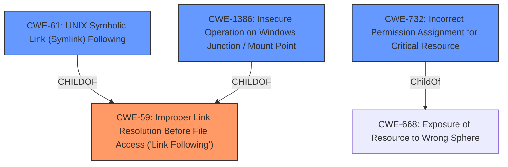

# Raw Analyzer Response for CVE-2021-1092

# Summary
| CWE ID  | CWE Name                                                                 | Confidence | CWE Abstraction Level | CWE Vulnerability Mapping Label | CWE-Vulnerability Mapping Notes |
| ------- | ------------------------------------------------------------------------ | ---------- | --------------------- | ------------------------------- | ----------------------------- |
| CWE-59  | Improper Link Resolution Before File Access ('Link Following')          | 0.9        | Base                  | Primary                         | Allowed                       |
| CWE-732 | Incorrect Permission Assignment for Critical Resource                   | 0.7        | Class                 | Secondary                       | Allowed-with-Review         |
| CWE-61  | UNIX Symbolic Link (Symlink) Following                                 | 0.6        | Compound              | Secondary                       | Allowed                       |
| CWE-1386 | Insecure Operation on Windows Junction / Mount Point | 0.6        | Base                  | Secondary                       | Allowed                       |

## Evidence and Confidence

*   **Confidence Score:** 0.8
*   **Evidence Strength:** HIGH

## Relationship Analysis
The primary CWE is CWE-59, which describes the root cause of the vulnerability, which is that the application does not properly prevent a filename from identifying a link or shortcut that resolves to an unintended resource. The relationships between CWE-59 and its related CWEs, such as CWE-61 (a Compound weakness that includes CWE-59) and CWE-1386 (a specific case of link following on Windows), helped refine the selection. CWE-732 represents an incorrect permission assignment for a critical resource, which is often associated with link following attacks. These relationships highlight the complexity of the vulnerability.

## Vulnerability Chain
The vulnerability chain starts with the **improper handling of symbolic links (CWE-59)** by the NVIDIA Control Panel application. This allows an unprivileged attacker to create a symbolic link that points to a privileged file. When the application attempts to access or modify the file through the symbolic link, it **overwrites the privileged file**. This leads to a **denial of service or data loss**.

## Summary of Analysis
The initial assessment identified CWE-59 as the primary weakness, supported by the description of the symbolic link attack and the ability to overwrite privileged files.

*   The vulnerability description states that the NVIDIA Control Panel application is "**susceptible to a Windows file system symbolic link attack where an unprivileged attacker can cause the applications to overwrite privileged files, resulting in potential denial of service or data loss**". This directly aligns with the description of **CWE-59: Improper Link Resolution Before File Access ('Link Following')**, which states that "The product attempts to access a file based on the filename, but it does not properly prevent that filename from identifying a link or shortcut that resolves to an unintended resource."

The retriever results also support CWE-59 as the most relevant, with a high similarity score. CWE-61, CWE-732, and CWE-1386 were considered as secondary weaknesses due to their relationships with link following and permission issues.

The final decision is based on the evidence of a symbolic link attack leading to the overwriting of privileged files. CWE-59 is the most specific and accurate representation of this weakness.

Relevant CWE Information:

# Enhanced Context (25 CWEs)

## CWE-59: Improper Link Resolution Before File Access ('Link Following')
**Abstraction Level**: Base
**Similarity Score**: 0.82
**Source**: dense

**Description**:
The product attempts to access a file based on the filename, but it does not properly prevent that filename from identifying a link or shortcut that resolves to an unintended resource.

**Mapping Guidance**:
- Usage: Allowed
- Rationale: This CWE entry is at the Base level of abstraction, which is a preferred level of abstraction for mapping to the root causes of vulnerabilities.

## CWE-61: UNIX Symbolic Link (Symlink) Following
**Abstraction Level**: Compound
**Similarity Score**: 0.78
**Source**: dense

**Description**:
The product, when opening a file or directory, does not sufficiently account for when the file is a symbolic link that resolves to a target outside of the intended control sphere. This could allow an attacker to cause the product to operate on unauthorized files.

**Mapping Guidance**:
- Usage: Allowed
- Rationale: This is a well-known Composite of multiple weaknesses that must all occur simultaneously, although it is attack-oriented in nature.

## CWE-41: Improper Resolution of Path Equivalence
**Abstraction Level**: Base
**Similarity Score**: 0.78
**Source**: dense

**Description**:
The product is vulnerable to file system contents disclosure through path equivalence. Path equivalence involves the use of special characters in file and directory names. The associated manipulations are intended to generate multiple names for the same object.

**Mapping Guidance**:
- Usage: Allowed
- Rationale: This CWE entry is at the Base level of abstraction, which is a preferred level of abstraction for mapping to the root causes of vulnerabilities.

## CWE-668: Exposure of Resource to Wrong Sphere
**Abstraction Level**: Class
**Similarity Score**: 0.77
**Source**: dense

**Description**:
The product exposes a resource to the wrong control sphere, providing unintended actors with inappropriate access to the resource.

**Mapping Guidance**:
- Usage: Discouraged
- Rationale: CWE-668 is high-level and is often misused as a catch-all when lower-level CWE IDs might be applicable. It is sometimes used for low-information vulnerability reports [REF-1287]. It is a level-1 Class (i.e., a child of a Pillar). It is not useful for trend analysis.

## CWE-667: Improper Locking
**Abstraction Level**: Class
**Similarity Score**: 0.77
**Source**: dense

**Description**:
The product does not properly acquire or release a lock on a resource, leading to unexpected resource state changes and behaviors.

**Mapping Guidance**:
- Usage: Allowed-with-Review
- Rationale: This CWE entry is a Class and might have Base-level children that would be more appropriate

## CWE-73: External Control of File Name or Path
**Abstraction Level**: Base
**Similarity Score**: 0.76
**Source**: dense

**Description**:
The product allows user input to control or influence paths or file names that are used in filesystem operations.

**Mapping Guidance**:
- Usage: Allowed
- Rationale: This CWE entry is at the Base level of abstraction, which is a preferred level of abstraction for mapping to the root causes of vulnerabilities.

## CWE-23: Relative Path Traversal
**Abstraction Level**: Base
**Similarity Score**: 0.76
**Source**: dense

**Description**:
The product uses external input to construct a pathname that should be within a restricted directory, but it does not properly neutralize sequences such as ".." that can resolve to a location that is outside of that directory.

**Mapping Guidance**:
- Usage: Allowed
- Rationale: This CWE entry is at the Base level of abstraction, which is a preferred level of abstraction for mapping to the root causes of vulnerabilities.

## CWE-1289: Improper Validation of Unsafe Equivalence in Input
**Abstraction Level**: Base
**Similarity Score**: 0.76
**Source**: dense

**Description**:
The product receives an input value that is used as a resource identifier or other type of reference, but it does not validate or incorrectly validates that the input is equivalent to a potentially-unsafe value.

**Mapping Guidance**:
- Usage: Allowed
- Rationale: This CWE entry is at the Base level of abstraction, which is a preferred level of abstraction for mapping to the root causes of vulnerabilities.

## CWE-125: Out-of-bounds Read
**Abstraction Level**: Base
**Similarity Score**: 0.76
**Source**: dense

**Description**:
The product reads data past the end, or before the beginning, of the intended buffer.

**Mapping Guidance**:
- Usage: Allowed
- Rationale: This CWE entry is at the Base level of abstraction, which is a preferred level of abstraction for mapping to the root causes of vulnerabilities.

## CWE-754: Improper Check for Unusual or Exceptional Conditions
**Abstraction Level**: Class
**Similarity Score**: 0.76
**Source**: dense

**Description**:
The product does not check or incorrectly