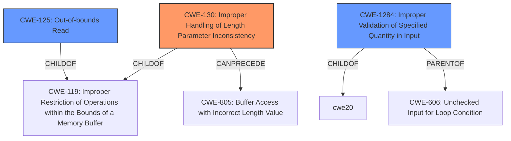

# Analysis for CVE-2021-1097

# Summary
| CWE ID  | CWE Name                                       | Confidence | CWE Abstraction Level | CWE Vulnerability Mapping Label | CWE-Vulnerability Mapping Notes |
| :-------- | :--------------------------------------------- | :--------- | :---------------------- | :------------------------------ | :------------------------------ |
| CWE-130 | Improper Handling of Length Parameter Inconsistency | 0.95      | Base                    | Allowed                       | Primary CWE                     |
| CWE-1284 | Improper Validation of Specified Quantity in Input | 0.75      | Base                    | Allowed                       | Secondary Candidate             |
| CWE-125  | Out-of-bounds Read                              | 0.60       | Base                    | Allowed                       | Secondary Candidate             |

## Evidence and Confidence

*   **Confidence Score:** 0.80
*   **Evidence Strength:** HIGH

## Relationship Analysis
The primary CWE is CWE-130, which deals with **improper handling of length parameter inconsistency**. This relates to CWE-119 (Improper Restriction of Operations within the Bounds of a Memory Buffer) because incorrect length handling can lead to buffer overflows. It can also precede CWE-805 (Buffer Access with Incorrect Length Value). CWE-1284 (Improper Validation of Specified Quantity in Input) is a parent of CWE-606 (Unchecked Input for Loop Condition). CWE-125 (Out-of-bounds Read) is related to CWE-119 and can be a consequence of improper length validation. These relationships helped refine the classification and understand the potential vulnerability chain.

## Vulnerability Chain
The vulnerability chain starts with the guest sending a request with an **inconsistent length field**. The Virtual GPU Manager **improperly validates this length field** (CWE-130), potentially leading to information disclosure, data tampering, or denial of service. This improper validation can lead to accessing memory outside the intended buffer (CWE-125).

## Summary of Analysis
The initial analysis focused on the **improper validation of the length field** as the root cause. The retriever results suggested CWE-1284 (Improper Validation of Specified Quantity in Input), CWE-130 (Improper Handling of Length Parameter Inconsistency), and CWE-125 (Out-of-bounds Read) as potential candidates.

The final decision favors CWE-130 as the primary weakness because the vulnerability description specifically mentions **improper validation of the length field**, which aligns directly with CWE-130's description: "The product parses a formatted message or structure, but it does not handle or incorrectly handles a length field that is inconsistent with the actual length of the associated data." This is supported by the "Vulnerability Description Key Phrases" which identifies "**improperly validates the length field**" as the rootcause. The "CVE Reference Links Content Summary" also confirms that the root cause is that the "Virtual GPU Manager (vGPU plugin) improperly validates the length field in a request from a guest."

CWE-1284 (Improper Validation of Specified Quantity in Input) was considered since a length field is a quantity, but CWE-130 is more specific to the **length parameter inconsistency**, making it a better fit.

CWE-125 (Out-of-bounds Read) is a potential consequence of the improper length handling, but it's not the root cause, hence it's a secondary candidate.

The selected CWEs are at the optimal level of specificity because they accurately represent the **improper validation of the length field** and its potential consequences, based on the evidence available.

Relevant CWE Information:
- **CWE-130: Improper Handling of Length Parameter Inconsistency**
- **CWE-1284: Improper Validation of Specified Quantity in Input**
- **CWE-125: Out-of-bounds Read**