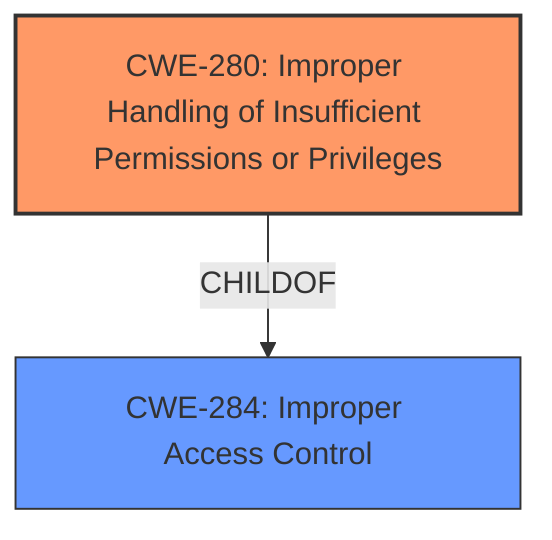

# Raw Analyzer Response for CVE-2021-1107

# Summary
| CWE ID | CWE Name | Confidence | CWE Abstraction Level | CWE Vulnerability Mapping Label | CWE-Vulnerability Mapping Notes |
|---|---|---|---|---|---|
| CWE-280 | Improper Handling of Insufficient Permissions or Privileges | 0.9 | Base | Allowed | Primary CWE |
| CWE-284 | Improper Access Control | 0.6 | Pillar | Discouraged | Secondary Candidate |

## Evidence and Confidence

*   **Confidence Score:** 0.9
*   **Evidence Strength:** HIGH

## Relationship Analysis
The primary relationship influencing the decision is the hierarchical relationship between CWE-284 (Improper Access Control) and its child CWE-280 (Improper Handling of Insufficient Permissions or Privileges). CWE-280 is a base level CWE, which is preferred and provides a more specific classification than the higher-level pillar CWE-284.

## Vulnerability Chain
The vulnerability chain starts with **improper access controls**, leading to potential code execution, denial of service, and compromised system integrity.

## Summary of Analysis
The initial analysis identified **improper access controls** as the root cause of the vulnerability in the NVIDIA Linux kernel distributions. The CVE description explicitly states "**improper access controls** in `nvmap` `NVMAP_IOC_WRITE*` paths." The "CVE Reference Links Content Summary" also highlights "Improper access control" as a weakness.

The Retriever Results listed CWE-280 (Improper Handling of Insufficient Permissions or Privileges) and CWE-284 (Improper Access Control) as potential candidates.

CWE-284 is a Pillar-level CWE and is discouraged for use according to its Mapping Guidance: "CWE-284 is extremely high-level, a Pillar... It is not useful for trend analysis." The guidance suggests using more specific descendants of CWE-284.

CWE-280 (Improper Handling of Insufficient Permissions or Privileges) is a Base-level CWE, which is a preferred level of abstraction. The description of CWE-280, "The product does not handle or incorrectly handles when it has insufficient privileges to access resources or functionality as specified by their permissions," closely aligns with the vulnerability description's **improper access controls** in the `nvmap` paths.

Therefore, CWE-280 is the selected primary CWE because it provides a more specific and accurate representation of the vulnerability's root cause than the more general CWE-284. The evidence supports this selection, and the chosen CWE is at the optimal level of specificity.

Relevant CWE Information:

# Enhanced Context (25 CWEs)
The following CWEs were identified as potentially relevant to this vulnerability:

## CWE-274: Improper Handling of Insufficient Privileges
**Abstraction Level**: Base
**Similarity Score**: 0.79
**Source**: dense

**Description**:
The product does not handle or incorrectly handles when it has insufficient privileges to perform an operation, leading to resultant weaknesses.

**Mapping Guidance**:
- Usage: Discouraged
- Rationale: This CWE entry could be deprecated in a future version of CWE.

*This CWE was considered but not selected because CWE-280 and CWE-274 are considered very similar, and CWE-274 is likely to be deprecated in the future.*

## CWE-280: Improper Handling of Insufficient Permissions or Privileges 
**Abstraction Level**: Base
**Similarity Score**: 0.78
**Source**: dense

**Description**:
The product does not handle or incorrectly handles when it has insufficient privileges to access resources or functionality as specified by their permissions. This may cause it to follow unexpected code paths that may leave the product in an invalid state.

**Mapping Guidance**:
- Usage: Allowed
- Rationale: This CWE entry is at the Base level of abstraction, which is a preferred level of abstraction for mapping to the root causes of vulnerabilities.

*This CWE was selected because it is at the Base level of abstraction, which is a preferred level of abstraction for mapping to the root causes of vulnerabilities. It also closely aligns with the **improper access controls** described in the vulnerability.*

## CWE-653: Improper Isolation or Compartmentalization
**Abstraction Level**: Class
**Similarity Score**: 0.77
**Source**: dense

**Description**:
The product does not properly compartmentalize or isolate functionality, processes, or resources that require different privilege levels, rights, or permissions.

**Mapping Guidance**:
- Usage: Allowed
- Rationale: This CWE entry is at the Base level of abstraction, which is a preferred level of abstraction for mapping to the root causes of vulnerabilities.

*This CWE was considered but not selected because it focuses on the lack of isolation, which is not the primary issue described in the vulnerability. The vulnerability focuses more on the **improper** handling of existing access controls.*

## CWE-266: Incorrect Privilege Assignment
**Abstraction Level**: Base
**Similarity Score**: 0.77
**Source**: dense

**Description**:
A product incorrectly assigns a privilege to a particular actor, creating an unintended sphere of control for that actor.

**Mapping Guidance**:
- Usage: Allowed
- Rationale: This CWE entry is at the Base level of abstraction, which is a preferred level of abstraction for mapping to the root causes of vulnerabilities.

*This CWE was considered but not selected because the root cause doesn't seem to be an incorrect assignment of privileges, but rather an **improper** handling of access controls related to privileges or permissions.*

## CWE-667: Improper Locking
**Abstraction Level**: Class
**Similarity Score**: 0.76
**Source**: dense

**Description**:
The product does not properly acquire or release a lock on a resource, leading to unexpected resource state changes and behaviors.

**Mapping Guidance**:
- Usage: Allowed-with-Review
- Rationale: This CWE entry is a Class and might have Base-level children that would be more appropriate

*This CWE was considered but not selected because the vulnerability description does not suggest any locking issues. It is more related to the access control weaknesses.*

## CWE-281: Improper Preservation of Permissions
**Abstraction Level**: Base
**Similarity Score**: 0.76
**Source**: dense

**Description**:
The product does not preserve permissions or incorrectly preserves permissions when copying, restoring, or sharing objects, which can cause them to have less restrictive permissions than intended.

**Mapping Guidance**:
- Usage: Allowed
- Rationale: This CWE entry is at the Base level of abstraction, which is a preferred level of abstraction for mapping to the root causes of vulnerabilities.

*This CWE was considered but not selected because the vulnerability description doesn't indicate any permission preservation issues.*

## CWE-664: Improper Control of a Resource Through its Lifetime
**Abstraction Level**: Pillar
**Similarity Score**: 0.76
**Source**: dense

**Description**:
The product does not maintain or incorrectly maintains control over a resource throughout its lifetime of creation, use, and release.

**Mapping Guidance**:
- Usage: Discouraged
- Rationale: This CWE entry is high-level when lower-level children are available.

*This CWE was considered but not selected because it is a high-level CWE, and more specific CWEs are available to represent the access control issue.*

## CWE-1220: Insufficient Granularity of Access Control
**Abstraction Level**: Base
**Similarity Score**: 0.76
**Source**: dense

**Description**:
The product implements access controls via a policy or other feature with the intention to disable or restrict accesses (reads and/or writes) to assets in a system from untrusted agents. However, implemented access controls lack required granularity, which renders the control policy too broad because it allows accesses from unauthorized agents to the security-sensitive assets.

**Mapping Guidance**:
- Usage: Allowed
- Rationale: This CWE entry is at the Base level of abstraction, which is a preferred level of abstraction for mapping to the root causes of vulnerabilities.

*This CWE was considered but not selected because the vulnerability description mentions **improper access controls**, not necessarily a lack of granularity. While granularity could be a factor, it's not explicitly stated.*

## CWE-404: Improper Resource Shutdown or Release
**Abstraction Level**: Class
**Similarity Score**: 0.76
**Source**: dense

**Description**:
The product does not release or incorrectly releases a resource before it is made available for re-use.

**Mapping Guidance**:
- Usage: Allowed-with-Review
- Rationale: This CWE entry is a Class and might have Base-level children that would be more appropriate

*This CWE was considered but not selected because resource shutdown or release isn't related to the described vulnerability.*

## CWE-267: Privilege Defined With Unsafe Actions
**Abstraction Level**: Base
**Similarity Score**: 0.