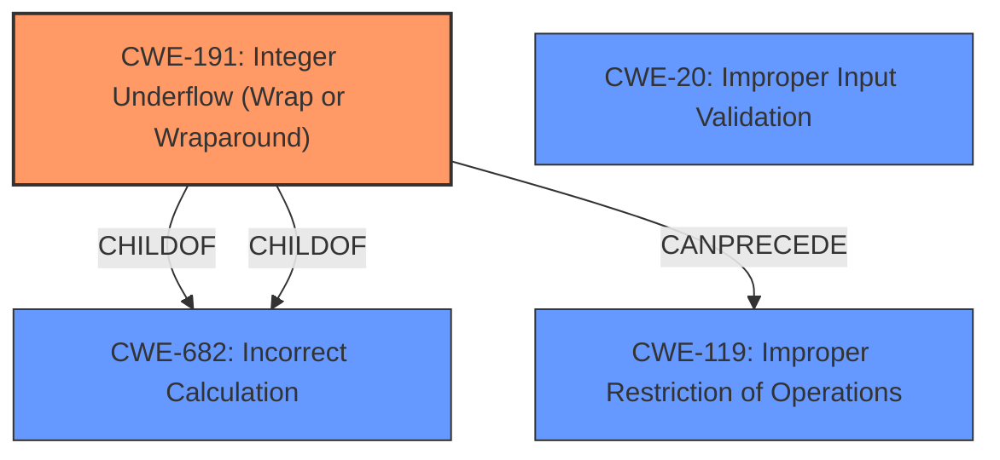

# Enhanced Analysis for CVE-2021-1108

# Summary
| CWE ID | CWE Name | Confidence | CWE Abstraction Level | CWE Vulnerability Mapping Label | CWE-Vulnerability Mapping Notes |
|---|---|---|---|---|---|
| CWE-191 | Integer Underflow (Wrap or Wraparound) | 1.0 | Base | Allowed | Primary CWE |

## Evidence and Confidence

*   **Confidence Score:** 1.0
*   **Evidence Strength:** HIGH

## Relationship Analysis
The primary CWE selected is CWE-191, which is a Base level CWE. The retriever results and the vulnerability description clearly point to an integer underflow. The other CWEs considered, like CWE-1284, CWE-179, CWE-1284, and CWE-119, relate to validation issues or improper handling of buffer operations but are not as directly relevant as CWE-191 to the identified root cause.



## Vulnerability Chain
The vulnerability chain starts with the **integer underflow** due to the **lack of input validation**. This leads to a complete denial of service, partial integrity violation, and confidentiality loss.

## Summary of Analysis
The initial analysis correctly identifies CWE-191 as the primary weakness. The vulnerability description explicitly states "**integer underflow** due to **lack of input validation** may lead to complete denial of service, partial integrity, and serious confidentiality loss for all processes in the system."

The evidence provided in "CVE Reference Links Content Summary" confirms this:

```json
{
  "CVE-2021-1108": {
    "description": "NVIDIA Linux kernel distributions contain a vulnerability in FuSa Capture (VI/ISP), where integer underflow due to lack of input validation may lead to complete denial of service, partial integrity, and serious confidentiality loss for all processes in the system.",
    "root_cause": "Integer underflow due to lack of input validation in FuSa Capture (VI/ISP).",
    "vulnerabilities": [
      "Integer underflow",
      "Lack of input validation"
    ],
    "impact": "Complete denial of service, partial integrity loss, and serious confidentiality loss for all processes in the system.",
    "attack_vectors": "Local access.",
    "attacker_capabilities": "A local user is required to exploit this vulnerability."
  }
}
```

The selection of CWE-191 is at the optimal level of specificity because it directly addresses the **root cause** described in the vulnerability. While **lack of input validation** is also present, the **integer underflow** is the more specific and direct cause of the problem. Other CWEs were considered but are less specific to this case.

Relevant CWE Information:

# Enhanced Context (25 CWEs)
The following CWEs were identified as potentially relevant to this vulnerability:

## CWE-124: Buffer Underwrite ('Buffer Underflow')
**Abstraction Level**: Base
**Similarity Score**: 0.82
**Source**: dense

**Description**:
The product writes to a buffer using an index or pointer that references a memory location prior to the beginning of the buffer.

**Mapping Guidance**:
- Usage: Allowed
- Rationale: This CWE entry is at the Base level of abstraction, which is a preferred level of abstraction for mapping to the root causes of vulnerabilities.

**Why Not Used:** This CWE describes a buffer underwrite, which is not explicitly mentioned in the vulnerability description. The root cause is an integer underflow that *may* lead to a buffer underwrite, but this is not directly stated.

## CWE-191: Integer Underflow (Wrap or Wraparound)
**Abstraction Level**: Base
**Similarity Score**: 0.81
**Source**: dense

**Description**:
The product subtracts one value from another, such that the result is less than the minimum allowable integer value, which produces a value that is not equal to the correct result.

**Mapping Guidance**:
- Usage: Allowed
- Rationale: This CWE entry is at the Base level of abstraction, which is a preferred level of abstraction for mapping to the root causes of vulnerabilities.

**Why Used:** This is the primary CWE. The vulnerability description explicitly mentions "**integer underflow**" as the root cause.

## CWE-127: Buffer Under-read
**Abstraction Level**: Variant
**Similarity Score**: 0.77
**Source**: dense

**Description**:
The product reads from a buffer using buffer access mechanisms such as indexes or pointers that reference memory locations prior to the targeted buffer.

**Mapping Guidance**:
- Usage: Allowed
- Rationale: This CWE entry is at the Variant level of abstraction, which is a preferred level of abstraction for mapping to the root causes of vulnerabilities.

**Why Not Used:** The vulnerability description does not mention a buffer under-read.

## CWE-805: Buffer Access with Incorrect Length Value
**Abstraction Level**: Base
**Similarity Score**: 0.77
**Source**: dense

**Description**:
The product uses a sequential operation to read or write a buffer, but it uses an incorrect length value that causes it to access memory that is outside of the bounds of the buffer.

**Mapping Guidance**:
- Usage: Allowed
- Rationale: This CWE entry is at the Base level of abstraction, which is a preferred level of abstraction for mapping to the root causes of vulnerabilities.

**Why Not Used:** The vulnerability description does not mention incorrect length values for buffer access.

## CWE-131: Incorrect Calculation of Buffer Size
**Abstraction Level**: Base
**Similarity Score**: 0.76
**Source**: dense

**Description**:
The product does not correctly calculate the size to be used when allocating a buffer, which could lead to a buffer overflow.

**Mapping Guidance**:
- Usage: Allowed
- Rationale: This CWE entry is at the Base level of abstraction, which is a preferred level of abstraction for mapping to the root causes of vulnerabilities.

**Why Not Used:** The vulnerability description does not mention incorrect calculation of buffer size.

## CWE-680: Integer Overflow to Buffer Overflow
**Abstraction Level**: Compound
**Similarity Score**: 0.75
**Source**: dense

**Description**:
The product performs a calculation to determine how much memory to allocate, but an integer overflow can occur that causes less memory to be allocated than expected, leading to a buffer overflow.

**Mapping Guidance**:
- Usage: Discouraged
- Rationale: This CWE entry is a named chain, which combines multiple weaknesses.

**Why Not Used:** Although integer issues are involved, it is specifically an underflow, not an overflow, and there is no direct mention of a buffer overflow.

## CWE-197: Numeric Truncation Error
**Abstraction Level**: Base
**Similarity Score**: 0.75
**Source**: dense

**Description**:
Truncation errors occur when a primitive is cast to a primitive of a smaller size and data is lost in the conversion.

**Mapping Guidance**:
- Usage: Allowed
- Rationale: This CWE entry is at the Base level of abstraction, which is a preferred level of abstraction for mapping to the root causes of vulnerabilities.

**Why Not Used:** The vulnerability description does not mention numeric truncation errors.

## CWE-786: Access of Memory Location Before Start of Buffer
**Abstraction Level**: Base
**Similarity Score**: 0.75
**Source**: dense

**Description**:
The product reads or writes to a buffer using an index or pointer that references a memory location prior to the beginning of the buffer.

**Mapping Guidance**:
- Usage: Discouraged
- Rationale: The CWE entry might be misused when lower-level CWE entries might be available. It also overlaps existing CWE entries and might be deprecated in the future.

**Why Not Used:** While this could be a consequence of the integer underflow, the description focuses on the integer underflow as the **root cause**, not the memory access.

## CWE-681: Incorrect Conversion between Numeric Types
**Abstraction Level**: Base
**Similarity Score**: 0.75
**Source**: dense

**Description**:
When converting from one data type to another, such as long to integer, data can be omitted or translated in a way that produces unexpected values. If the resulting values are used in a sensitive context, then dangerous behaviors may occur.

**Mapping Guidance**:
- Usage: Allowed
- Rationale: This CWE entry is at the Base level of abstraction, which is a preferred level of abstraction for mapping to


## CWE Relationship Analysis

Current CWEs represent these abstraction levels: .


### Vulnerability Chain Analysis

**Chain starting from CWE-680:**
- 680 (Integer Overflow to Buffer Overflow) - ROOT


**Chain starting from CWE-805:**
- 805 (Buffer Access with Incorrect Length Value) - ROOT


### CWE Relationship Diagram

```mermaid
graph TD
    classDef primary fill:#f96,stroke:#333,stroke-width:2px
    classDef secondary fill:#69f,stroke:#333
    classDef tertiary fill:#9e9,stroke:#333
```