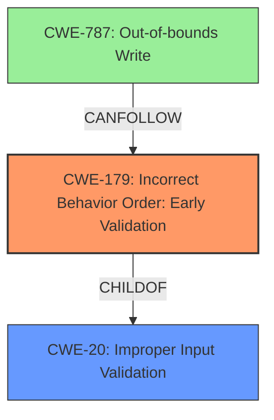

# Analysis for CVE-2021-1110

# Summary
| CWE ID    | CWE Name                                                               | Confidence | CWE Abstraction Level | CWE Vulnerability Mapping Label | CWE-Vulnerability Mapping Notes |
| --------- | ---------------------------------------------------------------------- | ---------- | ----------------------- | ------------------------------- | ------------------------------- |
| CWE-179   | Incorrect Behavior Order: Early Validation                             | 0.85       | Base                    | Allowed                         |                                 |
| CWE-787 | Out-of-bounds Write                                                               | 0.50       | Base                    | Allowed                         |                                 |

  - The Primary CWE should be first and noted as the Primary CWEs
  - The secondary candidate CWEs should be next and noted as secondary candidates.
  - The confidence is a confidence score 0 to 1 to rate your confidence in your assessment for that CWE.
  - The CWE Abstraction Level as one of these values: Base, Variant, Pillar, Class, Compound
  - The Mapping Notes Usage as one of these values: Allowed, Allowed-with-Review, Prohibited, Discouraged

## Evidence and Confidence

*   **Confidence Score:** 0.75
*   **Evidence Strength:** HIGH

## Relationship Analysis
The primary relationship influencing the decision is the parent-child relationship between CWE-20 (Improper Input Validation) and CWE-179 (Incorrect Behavior Order: Early Validation). CWE-179 is a specific type of input validation issue where validation occurs too early in the process, before necessary modifications or cleansing. The vulnerability description explicitly mentions that input data can be changed after validation, directly aligning with CWE-179.

Note: The Mermaid diagram should be enclosed in triple backticks with "mermaid" as the language specifier, but do NOT use "markdown" as a language specifier anywhere in your response.

## Vulnerability Chain
The vulnerability chain starts with the **bypass of input validation** (CWE-179), which allows a user to change input data. This, in turn, can lead to denial of service and data corruption. There is a potential that this could lead to **Out-of-bounds Write (CWE-787)** because of the data corruption.
  - Initial Flaw: **Incorrect Behavior Order: Early Validation (CWE-179)**
  - Consequence: Potential **Out-of-bounds Write (CWE-787)** leading to data corruption

## Summary of Analysis
The initial analysis strongly pointed towards CWE-179 (Incorrect Behavior Order: Early Validation) due to the vulnerability description highlighting that user input can be modified after validation. The "Vulnerability Description Key Phrases" and "CVE Reference Links Content Summary" both confirm the **bypass input validation** as the **rootcause**.

The retriever results also listed CWE-179 as the top combined result which supports the conclusion.

While Denial of Service and Data Corruption are impacts, the root cause is the improper timing of the validation process.

CWE-20 (Improper Input Validation) was considered but deemed too general. CWE-179 provides a more specific classification, aligning with the base level of abstraction.

CWE-787 (Out-of-bounds Write) was considered as a possible result of the data corruption.

The final decision to select CWE-179 is based on the direct evidence from the vulnerability description, the retriever results and its specific alignment with the concept of early validation. CWE-787 is considered as an impact of the initial flaw and a likely result of the data corruption.

Relevant CWE Information:

# Enhanced Context (25 CWEs)
The following CWEs were identified as potentially relevant to this vulnerability:

## CWE-274: Improper Handling of Insufficient Privileges
**Abstraction Level**: Base
**Similarity Score**: 0.79
**Source**: dense

**Description**:
The product does not handle or incorrectly handles when it has insufficient privileges to perform an operation, leading to resultant weaknesses.

**Mapping Guidance**:
- Usage: Discouraged
- Rationale: This CWE entry could be deprecated in a future version of CWE.

## CWE-280: Improper Handling of Insufficient Permissions or Privileges 
**Abstraction Level**: Base
**Similarity Score**: 0.78
**Source**: dense

**Description**:
The product does not handle or incorrectly handles when it has insufficient privileges to access resources or functionality as specified by their permissions. This may cause it to follow unexpected code paths that may leave the product in an invalid state.

**Mapping Guidance**:
- Usage: Allowed
- Rationale: This CWE entry is at the Base level of abstraction, which is a preferred level of abstraction for mapping to the root causes of vulnerabilities.

## CWE-1289: Improper Validation of Unsafe Equivalence in Input
**Abstraction Level**: Base
**Similarity Score**: 0.78
**Source**: dense

**Description**:
The product receives an input value that is used as a resource identifier or other type of reference, but it does not validate or incorrectly validates that the input is equivalent to a potentially-unsafe value.

**Mapping Guidance**:
- Usage: Allowed
- Rationale: This CWE entry is at the Base level of abstraction, which is a preferred level of abstraction for mapping to the root causes of vulnerabilities.

## CWE-664: Improper Control of a Resource Through its Lifetime
**Abstraction Level**: Pillar
**Similarity Score**: 0.77
**Source**: dense

**Description**:
The product does not maintain or incorrectly maintains control over a resource throughout its lifetime of creation, use, and release.

**Mapping Guidance**:
- Usage: Discouraged
- Rationale: This CWE entry is high-level when lower-level children are available.

## CWE-73: External Control of File Name or Path
**Abstraction Level**: Base
**Similarity Score**: 0.77
**Source**: dense

**Description**:
The product allows user input to control or influence paths or file names that are used in filesystem operations.

**Mapping Guidance**:
- Usage: Allowed
- Rationale: This CWE entry is at the Base level of abstraction, which is a preferred level of abstraction for mapping to the root causes of vulnerabilities.

## CWE-653: Improper Isolation or Compartmentalization
**Abstraction Level**: Class
**Similarity Score**: 0.77
**Source**: dense

**Description**:
The product does not properly compartmentalize or isolate functionality, processes, or resources that require different privilege levels, rights, or permissions.

**Mapping Guidance**:
- Usage: Allowed
- Rationale: This CWE entry is at the Base level of abstraction, which is a preferred level of abstraction for mapping to the root causes of vulnerabilities.

## CWE-691: Insufficient Control Flow Management
**Abstraction Level**: Pillar
**Similarity Score**: 0.77
**Source**: dense

**Description**:
The code does not sufficiently manage its control flow during execution, creating conditions in which the control flow can be modified in unexpected ways.

**Mapping Guidance**:
- Usage: Discouraged
- Rationale: This CWE entry is extremely high-level, a Pillar. However, classification research is limited for weaknesses of this type, so there can be gaps or organizational difficulties within CWE that force use of this weakness, even at such a high level of abstraction.

## CWE-667: Improper Locking
**Abstraction Level**: Class
**Similarity Score**: 0.77
**Source**: dense

**Description**:
The product does not properly acquire or release a lock on a resource, leading to unexpected resource state changes and behaviors.

**Mapping Guidance**:
- Usage: Allowed-with-Review
- Rationale: This CWE entry is a Class and might have Base-level children that would be more appropriate

## CWE-807: Reliance on Untrusted Inputs in a Security Decision
**Abstraction Level**: Base
**Similarity Score**: 0.77
**Source**: dense

**Description**:
The product uses a protection mechanism that relies on the existence or values of an input, but the input can be modified by an untrusted actor in a way that bypasses the protection mechanism.

**Mapping Guidance**:
- Usage: Allowed
- Rationale: This CWE entry is at the Base level of abstraction, which is a preferred level of abstraction for mapping to the root causes of vulnerabilities.

## CWE-41: Improper Resolution of Path Equivalence
**Abstraction Level**: Base
**Similarity Score**: 0.77
**Source**: dense

**Description**:
The product is vulnerable to file system contents disclosure through path equivalence. Path equivalence involves the use of special characters in file and directory names. The associated manipulations are